- [让EQ-BDS面板接入iPanel网页面板](#让eq-bds面板接入ipanel网页面板)
  - [0.更新面板到最新版本](#0更新面板到最新版本)
  - [1.下载iPanel\_Host](#1下载ipanel_host)
  - [2.修改iPanel配置](#2修改ipanel配置)
  - [3.面板上开启自动启动iPanel插件](#3面板上开启自动启动ipanel插件)
  - [4.配置iPanel插件](#4配置ipanel插件)
  - [5.配置iPanel](#5配置ipanel)
  - [6.配置完成](#6配置完成)
- [让Serein面板接入iPanel网页面板](#让serein面板接入ipanel网页面板)
  - [1.下载iPanel\_Host](#1下载ipanel_host-1)
  - [2.修改iPanel配置](#2修改ipanel配置-1)
  - [3.安装iPanel-Serein插件](#3安装ipanel-serein插件)
  - [4.配置iPanel](#4配置ipanel)
  - [5.配置Serein](#5配置serein)
  - [6.配置完成](#6配置完成-1)
- [利用iPanel插件让EQ-BDS面板开java服](#利用ipanel插件让eq-bds面板开java服)
- [让iPanel插件脱离EQ-BDS面板而独立运行](#让ipanel插件脱离eq-bds面板而独立运行)

# 让EQ-BDS面板接入iPanel网页面板

## 0.更新面板到最新版本

## 1.下载iPanel_Host

去EQ面板网盘下载[https://wwzv.lanzoue.com/b03j2esyb](https://wwzv.lanzoue.com/b03j2esyb)

密码:h3ik

下载``适用于Windows的iPanel_2.3.1.7z``

## 2.修改iPanel配置

解压后打开``iPanel_2.3.1_win-x64\setting.json``，第三行`instancePassword`后面的双引号中间写入你自己的密码

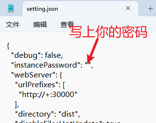

注意：这个密码**不需要**记忆，随便打一串随机数字字母即可

本教程以123456789为例(自己配置时千万不要写这种简单的密码)

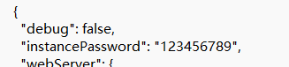

然后启动``iPanel.exe``

## 3.面板上开启自动启动iPanel插件

面板上可以开启自动启动iPanel插件的功能

然后我们是第一次使用，需要手动去打开面板目录下的``iPanel插件.exe``，后面这个插件会随面板启动

## 4.配置iPanel插件

修改好密码，也就是粘贴之前我们在``setting.json``里面乱打的那一串`instancePassword`

## 5.配置iPanel

先启动iPanel

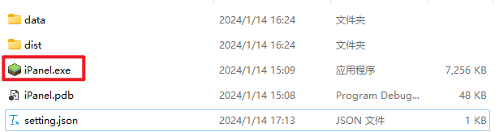

输入``user create``，然后按下回车

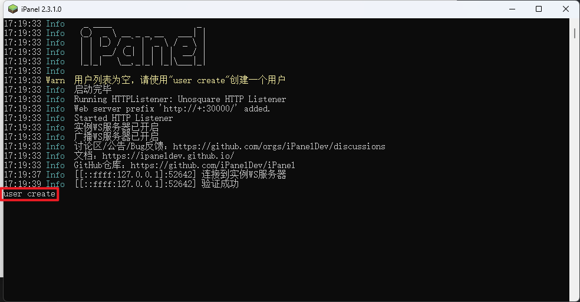

按照提示创建一个账户

用户权限这里需要你用键盘的上下箭头选择，按回车键或空格确认选择

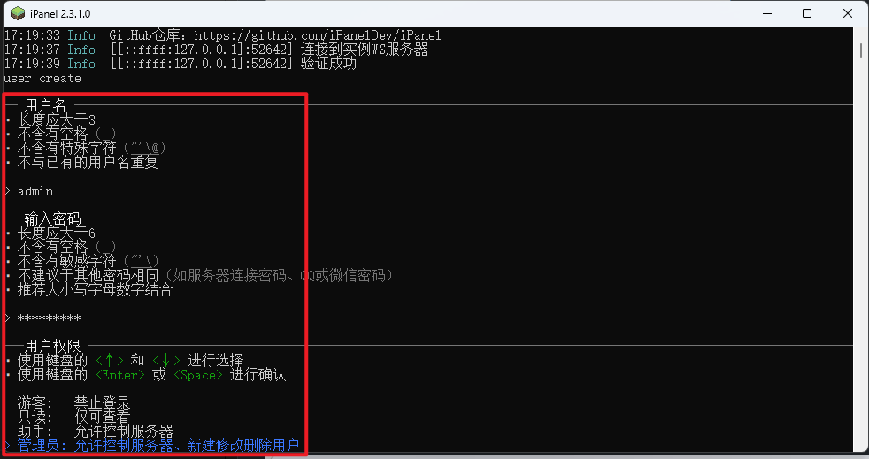

描述直接按回车键跳过，可以看到我们成功创建了个账户

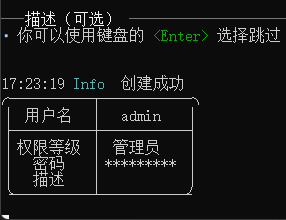

## 6.配置完成

打开服务器上的浏览器访问[http://127.0.0.1:30000/](http://127.0.0.1:30000/)即可体验

输入我们上一步创建的账号密码，然后您就能在网页上控制EQ-BDS面板了

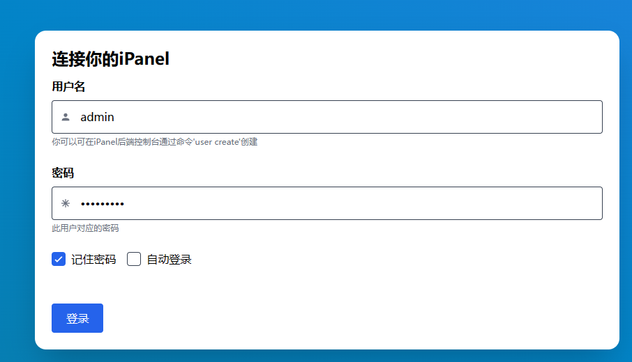

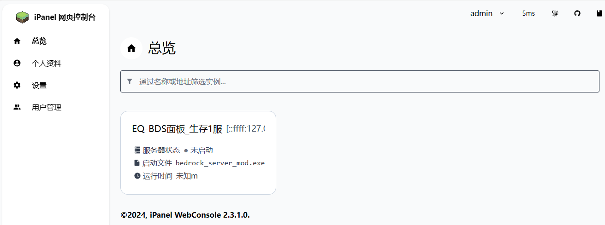

# 让Serein面板接入iPanel网页面板

## 1.下载iPanel_Host

这个步骤和EQ面板对应的步骤一样

[1.下载iPanel\_Host](#1下载ipanel_host)

## 2.修改iPanel配置

这个步骤和EQ面板对应的步骤配置一样

[2.修改iPanel配置](#2修改ipanel配置)

## 3.安装iPanel-Serein插件

到[这里](https://github.com/iPanelDev/iPanel-Serein/releases)下载插件，然后粘贴到``Serein\plugins``目录下

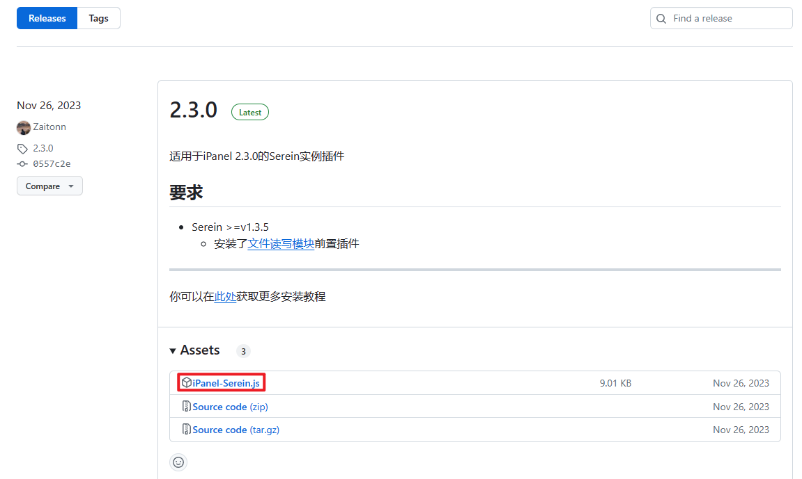

然后到[这里](https://market.serein.cc/resources/stdio)下载前置插件，然后粘贴到``Serein\plugins\modules``目录下

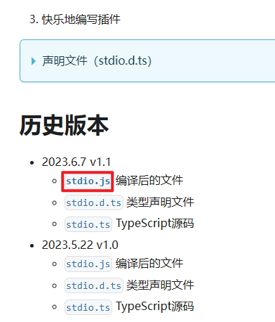

然后如果您的Serein正在运行，请停服重启Serein

## 4.配置iPanel

这个步骤和EQ面板对应的步骤一样

[配置iPanel](#5配置ipanel)

## 5.配置Serein

我们还需要修改配置，进入``Serein\plugins\iPanel-Serein``，打开``config.json``

把第四行`password`后面的双引号中间写入第二步设置的`instancePassword`密码

把第六行`customName`后面的双引号中间写入``Serein``，这个名称可以自定义，您也可写其它内容，这个内容会显示在网页控制端的列表上

这样子就配置完成了

右键Serein的插件列表，选``重新加载所有插件``

进入js插件页面，看到这个``[iPanel] [Host] 验证通过``就说明成功了

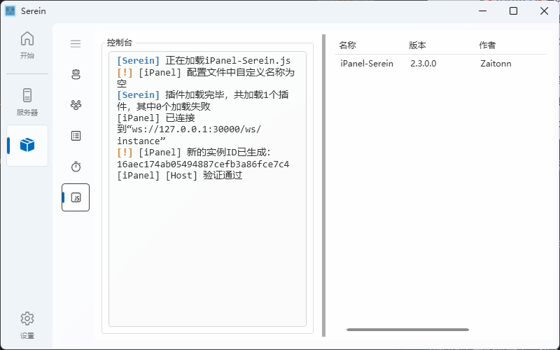

## 6.配置完成

打开服务器上的浏览器访问[http://127.0.0.1:30000/](http://127.0.0.1:30000/)即可体验

输入我们上一步创建的账号密码，然后您就能在网页上控制Serein面板了

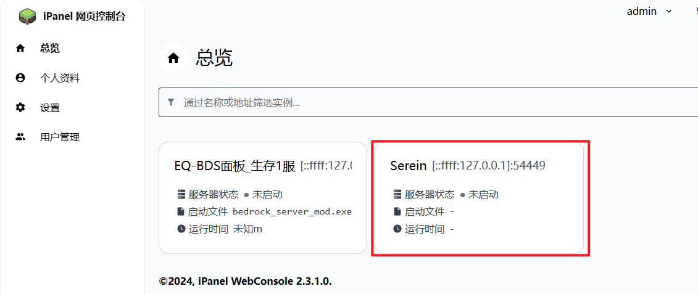

# 利用iPanel插件让EQ-BDS面板开java服

如图，您可以修改iPanel上启动进程的路径，自定义到java服的启动bat

这个时候在网页上启动的服务器是您自定义路径下的，而EQ-BDS面板启动的则是BDS目录下的，您可以开启面板功能设置里面的``接管面板``，这样子面板启动的文件路径也是您自定义的路径

> **⚠注意：如果您在自定义文件路径到其它程序的情况下使用面板的备份、白名单、回档等专为BDS设计的功能，会导致危险的、不可预知的结果！**

您也可以不启动EQ-BDS面板，只运行``iPanel插件.exe``，这样子也能使用网页面板实现控制

# 让iPanel插件脱离EQ-BDS面板而独立运行

您可以单独创建一个文件夹，然后只复制``iPanel插件.exe``、``BDS启动器.exe``和``HPSocket4C.dll``，这样子就能实现一个可以接入iPanel网页面板的实例，完全脱离EQ-BDS面板而存在

当然，你需要修改启动路径为自定义，除此之外并不需要额外工作

> 注意：起名时不能和面板的名字相同！

