# EQ-BDS面板用户手册


感谢您选择EQ-BDS面板，本手册将详细地介绍面板的所有功能。

如果您遇到了问题，建议您进入我们的QQ群：[1072180746](https://jq.qq.com/?_wv=1027&k=pxTeVQFu)，大家会尽可能回答您的问题。

- [EQ-BDS面板用户手册](#eq-bds面板用户手册)
  - [一、面板的安装](#一面板的安装)
    - [1.解决Windows Defender误报问题](#1解决windows-defender误报问题)
    - [2.了解面板目录下的程序](#2了解面板目录下的程序)
    - [3.部署QQ机器人](#3部署qq机器人)
  - [二、面板的基本结构](#二面板的基本结构)
    - [文件夹结构](#文件夹结构)
  - [三、面板的基本控制](#三面板的基本控制)
    - [1.BDS启停控制](#1bds启停控制)
    - [2.面板状态指示](#2面板状态指示)
    - [3.其他](#3其他)
  - [四、BDS配置](#四bds配置)
    - [1.基础BDS配置](#1基础bds配置)
    - [2.BDS性能配置](#2bds性能配置)
    - [3.BDS地图与文件配置](#3bds地图与文件配置)
  - [五、玩家数据](#五玩家数据)
  - [六、玩家管理(查熊篇)](#六玩家管理查熊篇)
    - [1.在线玩家分析](#1在线玩家分析)
    - [2.玩家行为数据库提取(已弃用)](#2玩家行为数据库提取已弃用)
  - [六、玩家管理(白名单篇)](#六玩家管理白名单篇)
    - [1.从json导入白名单](#1从json导入白名单)
    - [2.导出白名单为JSON](#2导出白名单为json)
    - [3.查找](#3查找)
    - [4.加白名单](#4加白名单)
    - [5.修改选中项](#5修改选中项)
    - [6.删除选中项](#6删除选中项)
    - [7.封禁选中项](#7封禁选中项)
    - [8.查看封禁列表](#8查看封禁列表)
  - [七、日志与命令行](#七日志与命令行)
    - [1.运行日志](#1运行日志)
    - [2.命令行](#2命令行)
  - [八、函数管理(几乎用不上了，时代的眼泪)](#八函数管理几乎用不上了时代的眼泪)
    - [1.扫描函数](#1扫描函数)
    - [2.读入函数](#2读入函数)
    - [3.保存函数](#3保存函数)
    - [4.新建函数](#4新建函数)
    - [5.导入函数](#5导入函数)
    - [6.删除函数](#6删除函数)
  - [九、功能设置](#九功能设置)
    - [1.整点报时](#1整点报时)
    - [2.备份大小限制](#2备份大小限制)
    - [3.备份白名单和权限文件](#3备份白名单和权限文件)
    - [4.FTP](#4ftp)
    - [5.热备份](#5热备份)
    - [6.高速函数任务](#6高速函数任务)
    - [7.空闲备份](#7空闲备份)
    - [8.云黑](#8云黑)
    - [9.玩家行为数据库大小限制](#9玩家行为数据库大小限制)
  - [十、计划任务](#十计划任务)
    - [1.定时任务\_仅一次](#1定时任务_仅一次)
    - [2.定时任务\_循环](#2定时任务_循环)
    - [3.周期任务](#3周期任务)
  - [十一、QQ机器人](#十一qq机器人)
    - [1.部署](#1部署)
    - [2.聊天转发(群服互通)](#2聊天转发群服互通)
    - [3.主群群号](#3主群群号)
    - [4.管理群号](#4管理群号)
    - [5.私聊权限配置](#5私聊权限配置)
    - [6.私聊指令头](#6私聊指令头)
    - [7.自助白名单](#7自助白名单)
  - [十二、QQ机器人指令](#十二qq机器人指令)
    - [获得QQ机器人命令帮助](#获得qq机器人命令帮助)
    - [启动服务器](#启动服务器)
    - [关闭服务器](#关闭服务器)
    - [重启服务器](#重启服务器)
    - [获取在线玩家与服务器状态](#获取在线玩家与服务器状态)
    - [获得今日玩家在线排行榜](#获得今日玩家在线排行榜)
    - [获取BDS的配置(server.properties)](#获取bds的配置serverproperties)
    - [修改BDS的配置(server.properties)](#修改bds的配置serverproperties)
    - [查看worlds下的存档列表](#查看worlds下的存档列表)
    - [获取面板的功能设置信息](#获取面板的功能设置信息)
    - [修改面板的功能设置信息](#修改面板的功能设置信息)
    - [备份存档](#备份存档)
    - [获取面板自动备份的文件列表](#获取面板自动备份的文件列表)
    - [自动从面板的备份列表恢复存档](#自动从面板的备份列表恢复存档)
    - [检测更新并自动升级面板](#检测更新并自动升级面板)
    - [执行BDS控制台的命令](#执行bds控制台的命令)
    - [设置是否转发BDS控制台的信息](#设置是否转发bds控制台的信息)
    - [查找指定时间段的在线玩家](#查找指定时间段的在线玩家)
    - [查找白名单里面是否有指定的玩家](#查找白名单里面是否有指定的玩家)
    - [查找某QQ绑定的白名单](#查找某qq绑定的白名单)
    - [把玩家加入白名单内](#把玩家加入白名单内)
    - [把玩家从白名单中移除](#把玩家从白名单中移除)
    - [删除并禁止某玩家加入白名单](#删除并禁止某玩家加入白名单)
    - [删除并禁止某QQ加入白名单](#删除并禁止某qq加入白名单)
    - [解禁某玩家加入白名单](#解禁某玩家加入白名单)
    - [解禁某QQ加入白名单](#解禁某qq加入白名单)
  - [十三、同机器多面板支持](#十三同机器多面板支持)
  - [十四、正则命令](#十四正则命令)
    - [1.在BDS命令行中执行命令](#1在bds命令行中执行命令)
    - [2.发送私聊消息](#2发送私聊消息)
    - [3.发送群聊消息](#3发送群聊消息)
    - [4.作为QQ机器人指令执行](#4作为qq机器人指令执行)
    - [5.执行远程正则命令](#5执行远程正则命令)
    - [6.执行js命令](#6执行js命令)

## 一、面板的安装

### 1.解决Windows Defender误报问题

Windows Defender会随机把EQ面板认为是病毒然后删除，我们需要禁用它。

之所以一定要禁用它，是因为Windows Defender一开始不会报毒，在面板运行时会突然杀死面板，导致您即使恢复了EQ-BDS面板，还是得手动清除残留的BDS进程，相当于定时炸弹。

**⚠注意：必须先安装杀毒软件再禁用Windows Defender，否则会存在无杀软的空档期，存在安全隐患。**

个人推荐安装火绒安全，面板所有组件都不会被火绒安全报毒。

当然，您也可以安装其他杀毒软件，记得给面板所在文件夹添加信任，否则您通过QQ机器人检查更新会受影响。

安装杀毒软件后需要重启Windows，打开Windows的设置


进入Windows安全中心


如果您发现界面如下图所示，请按下图指示点击``管理设置``。如果没有``管理设置``按钮，那么说明Windows Defender禁用成功，您可以跳过下面的设置步骤。


点击``添加或删除排除项``


点击``添加排除项``，选择``文件类型``


扩展名填``exe``，然后点击``添加``


这样子我们就手动完成了Windows Defender的禁用

### 2.了解面板目录下的程序


启动面板后会让您输入面板名称，这个配置非常重要，面板名称是面板的标识

⚠不能出现同一台机器里面有两个名字相同面板的情况！

面板名字要尽可能简短，名字过长可能会导致程序出错


如果面板后面开启了聊天转发(群服互通)功能，每一条转发的信息前都会自动加上面板名称如下图：


比较适合用您服务器的简称做面板名称，或者使用编号法：生存1服、生存2服、小游戏1服、创造1服。

### 3.部署QQ机器人

部署QQ机器人的教程详见QQ机器人整合包中的"部署QQ机器人.pdf"

您可以点击👉[这里](./[go-cqhttp整合包]部署QQ机器人.md)👈在线查看go-cqhttp整合包的部署教程

您可以先阅读下一节"面板的基本结构"，有助于您了解面板分为哪几部分，更好地部署QQ机器人。

## 二、面板的基本结构

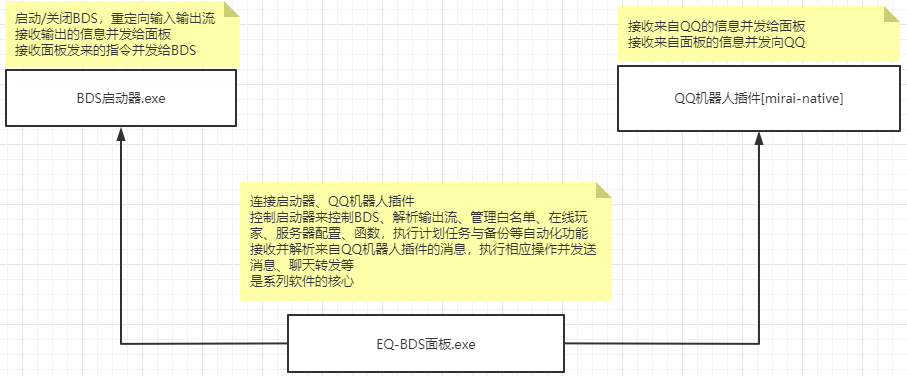

面板采用分体式架构，相比一体化设计，稳定性更强。各模块间使用TCP组件进行连接

启动器与面板的连接是本机通讯，全自动完成连接

QQ机器人插件和面板间支持跨主机通讯，采用自研加密算法加密，因此需要手动输入IP和token(您可以把token理解成密码)

除了mirai框架的QQ机器人，我们还支持go-cqhttp框架(更简便)，默认提供的整合包内置了go-cqhttp框架的QQ机器人

### 文件夹结构

1."BDS"文件夹：顾名思义，存放着BDS和LiteLoaderBDS

面板不附带BDS，您可以把您以前用的端复制进去

如果您以前使用的端没有安装LiteLoaderBDS，您需要去下载安装👉[LiteLoaderBDS](https://www.minebbs.com/liteloader/)👈

如果您是纯小白，您需要先下载👉[BDS](https://www.minebbs.com/bds/)👈，再安装👉[LiteLoaderBDS](https://www.minebbs.com/liteloader/)👈

⚠注意：**BDS版本和LiteLoaderBDS的版本要相匹配，否则会崩服**

如果这一步遇到了问题，欢迎进入👉[QQ群](https://jq.qq.com/?_wv=1027&k=jPV9ohWe)👈提问


复制完端后，可以看到以下目录结构


>"allowlist.json"是白名单文件，该文件已经完全由面板接管，因此不重要。要修改白名单请用面板。

>"permissions.json"是OP信息文件，要添加OP可以在面板内使用指令"op <玩家名>"，要注意玩家必须在线。如果您要升级BDS版本，不要忘记了备份该文件。

>"server.properties"是BDS的配置文件，您可以在面板的"BDS配置"界面查看并修改它(不要忘记了点保存按钮)。如果您要升级BDS版本，不要忘记了备份该文件。

>"bedrock_server.exe""bedrock_server_mod.exe"由面板接管，请不要运行它们。

您可以进入里面的"worlds"文件夹手动备份存档、放入您的存档

(如果您要导入自己的存档，记得进入面板修改BDS配置中的"欲载入的地图名称"，修改成您地图的名称，然后点击保存)


"plugins"文件夹内是LiteLoaderBDS的插件，您可以放入您想要加载的LiteLoader插件。

里面有"EQ_MCMODDLL_query.js""EQbase64command.js"，千万不能删除它们，它们是保障面板正常工作的组件，用于修复官方写的中文乱码BUG和监控玩家行为及聊天转发。

如果您要升级BDS版本，不要忘记了备份该文件夹。


"behavior_packs"文件夹内存放着函数文件(.mcfunction文件)，在"behavior_packs\vanilla\functions"里面

2."DLL"文件夹：这里面存放着DLL插件，在三年前非常流行，但是现在基本上见不到了。如果需要加载DLL插件，放入此文件夹，重启BDS后面板会自动加载。

不要和LL插件的DLL版本搞混，如果你实在不知道自己的DLL插件是什么版本的，放``BDS\plugins``下即可


3."存档备份"文件夹：保存EQ面板自动备份的存档，均为zip格式,您可以用里面的备份回档，如果配置好了QQ机器人，也可以用QQ机器人回档。

4."面板文件"文件夹：保存EQ面板的各项文件

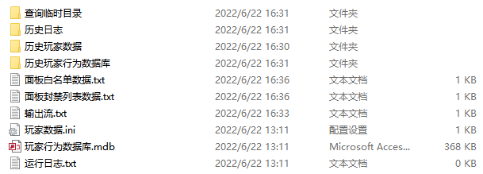

>"输出流.txt"中保存着命令行的输出，如果文件大于5MB，会自动切片放入"历史日志"文件夹，"运行日志.txt"同理。

>"玩家数据.ini"中保存着当天在线的玩家信息，可以通过面板的在线玩家分析功能调出指定时间在线的玩家，该文件以日为单位，每过一天都会把前一天的文件重命名并放入"历史玩家数据"文件夹内。

>"玩家行为数据库.mdb"中保存着玩家的所有行为信息\
包括破坏方块、放置方块、操作物品(使用物品，比如说放方块，点火)、置箱子物品(往哪里的箱子的哪一个槽位放入多少个哪一种物品)、取空物品(从箱子里面拿东西，比如说偷东西)、聊天信息(公开的、悄悄话都记录)、有名字的实体死亡(比如说玩家死亡、被命名牌命名的生物死亡)\
可用于查熊

>"面板白名单数据.txt"中保存着白名单列表，您可以直接打开并且复制粘贴到WPS/Excel表格内进行编辑，编辑后复制粘贴回去。如果您要手动修改，需要先关闭面板，否则您的修改不会被识别，甚至可能会被面板的自动保存替换。

>"面板封禁列表数据.txt"中保存着封禁列表，您可以通过面板查看修改封禁列表。

>"查询临时目录"文件夹存放的是查熊(玩家行为数据库查询)时的临时文件，您完全可以忽略它。

## 三、面板的基本控制


### 1.BDS启停控制

点击"启动BDS"即可启动BDS服务器，在启动前您可以修改下面两个选择框的选中状态。

勾上"崩服重启"后，一旦检测到服务器崩溃，那么会自动重启BDS

勾上"是否启动LiteLoader"后，会加载LiteLoader。

⚠注意：如果取消勾选此项，所有包含中文的BDS指令会全部乱码(面板踢人理由也会乱码，但是聊天转发和关服警告经过特别优化不会乱码)。

### 2.面板状态指示

显示BDS的单次运行时长、面板名称、各组件连接状态

### 3.其他


+ "显示启动器"：启动器在已经连接上面板的状态下默认是隐藏的，本按钮可以显示启动器窗口(本功能没什么用，仅方便排查故障)

+ "关闭面板"：点击右上角的"X"只能最小化面板到托盘，本按钮能真正地关闭面板，两个都选"是"即可

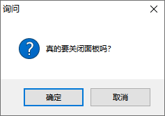

+ "打开BDS目录"：该按钮相当于一个快捷方式，让您可以快速进入BDS文件夹。

+ "关于"：显示本面板的相关信息。

+ "检查更新"：检查面板是否有新版本，如下图

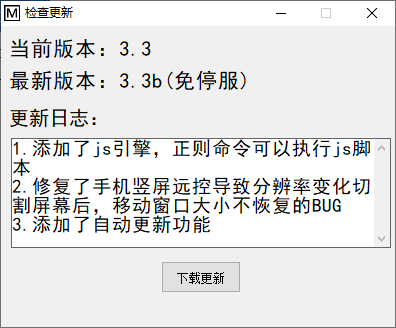

您也可以通过QQ机器人完成升级，设置权限后输入“#检查更新”，详见[这里](#检测更新并自动升级面板)


+ "背景图片设置"：在面板目录下放一个叫``1.jpg``或``1.png``的图片，重启面板后面板就会载入背景图片


> ⚠注意：面板会缩放图片到面板大小，而且不是等比例缩放，长比宽尽可能为1.5。\
> 上图演示的背景图片是1920:1080的尺寸(564KB)，尽可能不要使用太大的图片，图片太大没有意义并且浪费性能。

点击背景图片状态显示旁边的``设置``按钮，可以设置透明度，透明度范围``1``至``100``，点击``保存并应用设置``后设置立即生效


## 四、BDS配置


本界面可以修改BDS的配置文件"server.properties"

### 1.基础BDS配置

**默认生存模式：**
这个是玩家一进入服务器的游戏模式，除非您有特殊需求，一般设置为生存即可。

**游戏难度：**
顾名思义，游戏存档的难度，如果您不了解建议自行上网查询和平、简单、普通、困难的区别，生存服建议设置困难。

**正版验证：**
实际上这玩意开不开都要验证Xbox账号，如果关闭了可能会引发一系列问题，所以说保持它开启。

**白名单验证：**
尽量开启它，不然的话任何人都能进服务器。为了管理玩家、封杀熊孩子，务必开启它。

本面板也设计了大量白名单管理的功能，可以让您的管理更加高效、自动化。

建议和功能设置界面中的同时开启，这样子就可以在加白名单的时候由面板自动判断它是否在云黑数据库里面

(云黑简介：云黑是一个完全免费的联合封禁项目，联合了大量服务器共享熊孩子信息，并且有专人审核，可以在一定程度上预防您遇到熊孩子。云黑官方网站：https://blackbe.xyz/)

**作弊：**
按需求开启，这个选项会影响能否获得成就，一般情况都不会开启(不开启后台依然可以执行指令)

**强制使用材质包：**
您可以百度查询如何为服务器添加材质包，或者进群讨论。如果开启这一项，那么在服务器有材质包的情况下，就会强制玩家下载材质包而不是询问是否加载材质包。

**玩家默认权限：**
玩家一进服务器的权限，除非您有特殊需求，否则请确保这一项是\"成员\"

**ipv4端口号：**
决定了BDS的端口号，默认为19132，一般不用修改。

**ipv6端口号：**
现在都是ipv4，用不上，一般不用修改。

如果您同一台主机上有多个BDS服务器，请务必确保它们的ipv4端口号和ipv6端口号用的都是不同的，否则会互相冲突开服失败。

**BDS欢迎文本：**
就是在玩家的服务器列表里面看到的服务器名称下面的小字，您可以自定义一个，比如说：§6XY生存1服迎您

### 2.BDS性能配置

**玩家最大视距：**
默认即可，不要修改，除非您真的对您的服务器CPU性能非常有信心。

**挂机踢人时间\[秒\]：**
BDS检测到玩家在挂机后踢人的等待时间，一般默认即可。

**玩家周围加载区块数：**
默认即可，不要修改，除非您真的对您的服务器CPU性能非常有信心。

**BDS最大线程数：**
一般情况不要改，除非您的CPU足够强劲且BDS已经开始卡顿，不然不要增大\
如果真的要增大，一般设置成核心数量X2+2。

**BDS玩家上限：**
这个决定了您的服务器最多允许多少玩家同时在线，一般情况保持默认。如果人太多并且您的服务器性能充足，可以适当增大.

### 3.BDS地图与文件配置

**欲载入的地图名称：**
本选项决定了服务器加载BDS的worlds目录下的哪个地图文件夹，如果地图不存在，就会开新存档。如果您要移植您的地图，在启动BDS前务必设置好这一项。

**地图种子：**
如果您在欲载入的地图名称中填了个不存在的地图名称，那么BDS将根据这里填写的种子生成地图。

## 五、玩家数据


本界面显示今日在线玩家及其今日的累计在线时间，也可以查看在线玩家和玩家单次在线时间。

选中一个在线玩家，右键可以弹出上图的菜单，快速执行踢人、设置管理员、取消管理员权限等

默认情况下不会对今日在线玩家进行排序，如果您想以在线时长对玩家列表进行排序，请点击"在线时长排序"按钮

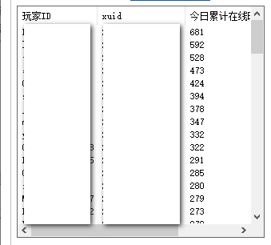

## 六、玩家管理(查熊篇)

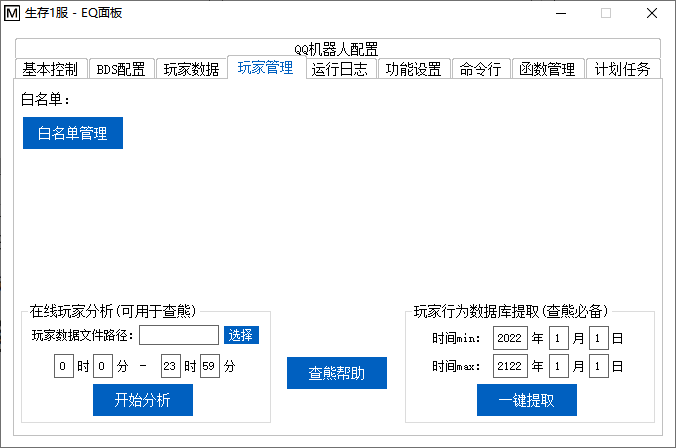

本界面可以打开白名单管理，操作玩家行为分析、玩家行为数据库提取

### 1.在线玩家分析

本功能可以获取某个时间段的在线玩家，首先您得选择一个玩家数据文件，点击"选择"按钮

先进入面板的目录，进入"面板文件"文件夹，里面的\"玩家数据.ini\"就是当天的玩家数据文件了，如下图①。

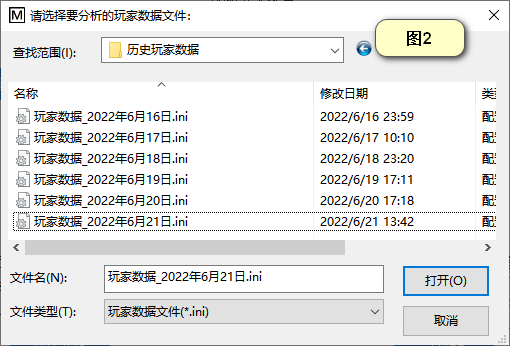

玩家数据文件以天为单位保存，如果您要查询以前的玩家数据文件，可以进一步进入"历史玩家数据"文件夹，您可以看到里面全是玩家数据文件，每一个文件后面就是其日期，如上图②。

假设您需要获取2022年6月21日0:00到23:02的在线玩家，那么您就需要先选中2022年6月21日的玩家数据文件，如上图②，然后输入时间范围，点击开始分析按钮，最后就能看到结果。

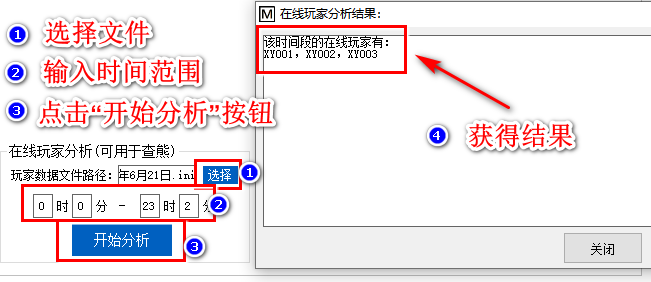

您也可以利用本功能，一个一个时间段的尝试来确定某一玩家不在线的时间。

### 2.玩家行为数据库提取(已弃用)

> 很遗憾，由于该部分代码过于古老，已经跟不上时代了，所以已经被弃用。未来会给出替代解决方案

本功能是查熊的主力，使用本面板会自动加载玩家行为记录插件，面板会自动解析内容并且保存到数据库

会记录的玩家行为包括：破坏方块、放置方块、操作物品(使用物品，比如说放方块，点火)

置箱子物品(往哪里的箱子的哪一个槽位放入多少个哪一种物品)、取空物品(从箱子里面拿东西，比如说偷东西)

聊天信息(公开的、悄悄话都记录)、有名字的实体死亡(比如说玩家死亡、被命名牌命名的生物死亡)

输入时间范围后点击"一键提取"就会自动把时间范围内的玩家行为数据库提取到\"面板文件\\查询临时目录\"下，并且自动打开查熊工具。下面是一个实际例子的展示：

假如，玩家XY0791报告他在2022/6/24 11:30下线了，然后11:40回来，发现自己箱子里面的钻石块、铁块、下界合金锭都不见了。

首先我们进入游戏，查看该玩家指出的事发地点，取左下角和右上角的坐标

如果您服务器的"显示坐标"无法开启，请输入指令"/gamerule showcoordinates true"


假如测得的坐标值为(-56,107,108)(-48,112,116)

我们记录下这个坐标。

然后我们输入时间范围，由于这个事件的作案时间段是2022/6/24 11:30到2022/6/24 11:40，都在2022/6/24当天，所以说我们都填2022年6月24日。

如果是2022/6/24 11:30到2022/6/25 11:40，那么时间min就填2022年6月24日，时间max就填2022年6月25日，其他情况依此类推。


选好日期后我们点击一键提取按钮，等待一段时间，面板会自动打开玩家行为数据库分析程序：


我们先输入时间范围，本示例的案发时间是2022/6/24 11:30到2022/6/24 11:40，所以我们就填上去

案件是有人偷了东西，所以说我们选择"取空物品"

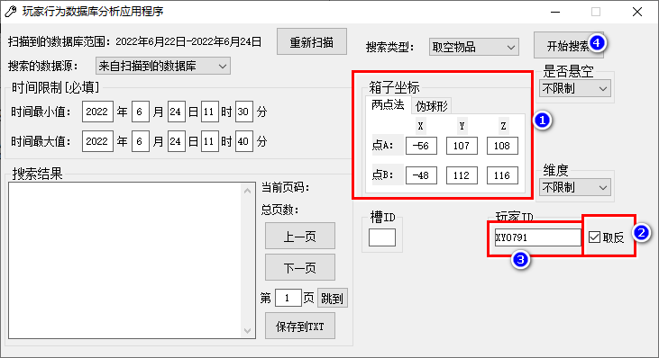我们先输入之前记录的坐标范围

然后我们要排除这个箱子拥有者"XY0791"的操作，看看其他人是否有取空箱子的行为，因此我们输入箱子拥有者的名字，勾上取反。

最后我们点击"开始搜索"

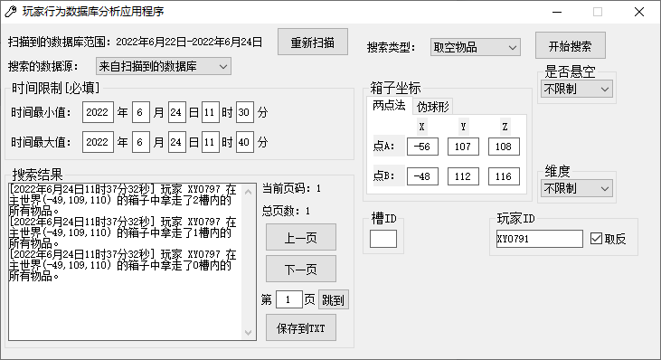

我们可以看到，是玩家"XY0797"偷走了东西，查熊结束。

如果搜索结果过多，您可以进一步排除玩家，比如说玩家"XY0792"是他小号，我们要进一步排除他：

如图，先选择数据源为"来自上一次的搜索结果"，然后输入"XY0792"，勾上取反以排除他，最后点击"开始搜索"，这样子就能进一步缩小搜索范围。


如果您要查询其他信息，依次类推。

## 六、玩家管理(白名单篇)

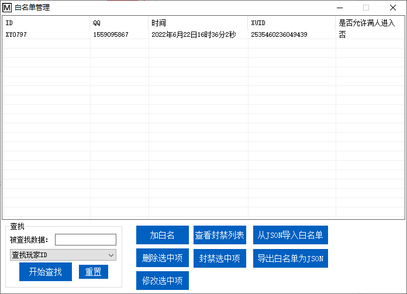

我们点击"玩家管理"选项卡内的"白名单管理"按钮后，可以打开白名单管理界面。

### 1.从json导入白名单

如果您原本就有白名单，您可以点击"从JSON导入白名单"

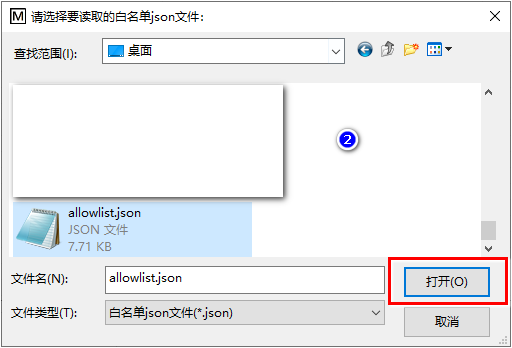

这些导入的白名单项没有QQ号，因此您需要逐个选中，然后单击"修改选中项"以绑定QQ号。


您也可以等1分钟(等待自动保存)，然后关闭面板，进入"面板文件\\面板白名单数据.txt"，复制文件内的内容，粘贴到WPS表格或Excel表格进行编辑。

⚠注意：粘贴前请全选表格内容，设置为文本类型，否则XUID这一栏会被转化为科学计数法！

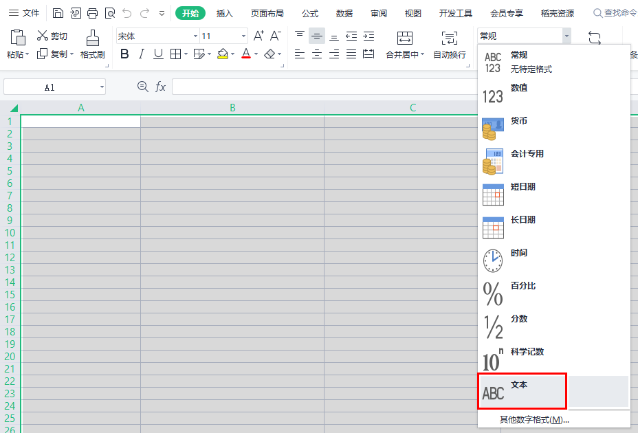


编辑完成后，全选表格内容，复制并粘贴回"面板白名单数据.txt"中，这样子也能完成QQ绑定。


### 2.导出白名单为JSON

顾名思义，把白名单数据库导出成json，一般用不上。

### 3.查找


先选择您要查询什么,再输入您要查询的数据，然后点击"开始查找"，面板会弹出查询结果

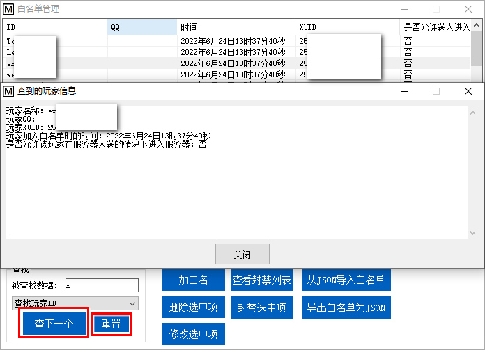

如果您要查询下一个，点击"查下一个"，如果您要查询其他信息，请点击"重置"

### 4.加白名单

在介绍加白名单之前，建议您开启云黑功能，这样子在加白名前面板会自动在云黑中查询，从而减少遇到熊孩子的概率。


(云黑简介：云黑是一个完全免费的联合封禁项目，联合了大量服务器共享熊孩子信息，并且有专人审核，可以在一定程度上预防您遇到熊孩子。云黑官方网站：https://blackbe.xyz/)

点击"加白名"后，会弹出白名单添加窗口，输入玩家信息后点击"加入"按钮即可完成白名单的加入


如果您开启了云黑功能，可能会看到以下窗口，您可以点击"确定"键查看相关细节


根据云黑数据库内的详细信息，您可以自己做出决定，放弃加入或忽略云黑数据库信息加入

如果您要忽略云黑数据库信息加入，先关闭提示框，回到添加白名单的界面，会多出"暂时忽略云黑数据库"的选项

勾上后就能忽略这一次的云黑数据库查询结果，将该玩家加入白名单。

### 5.修改选中项

先在上面的表格中选中一个白名单项，然后点击这个按钮就修改选中的白名单。本选项一般用于补充玩家的QQ信息，或者修改加白名时输入错误的内容。

### 6.删除选中项

先在上面的表格中选中一个白名单项，然后点击这个按钮就能删除您选中的白名单项

### 7.封禁选中项

先在上面的表格中选中一个白名单项，然后点击这个按钮就能封禁您选中的白名单

### 8.查看封禁列表

点击本按钮可以打开本地封禁列表的查看编辑界面

您可以选中其中一项，然后点击"取消封禁选中项"就能解封

您也可以点击"加入一项"来手动封禁玩家(甚至是不在白名单列表的玩家)

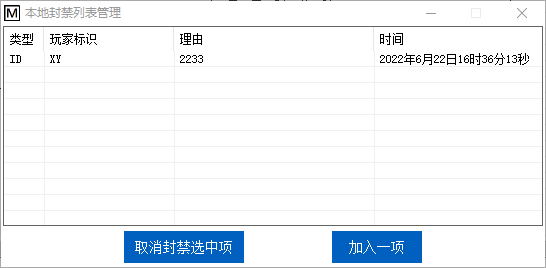

## 七、日志与命令行


### 1.运行日志

这里显示面板运行时的日志，比如服务器启动、服务器崩溃、DLL插件加载失败

### 2.命令行

这里是手动操作的区域，您可以通过本界面直接输入BDS指令，按回车或"向服务器输入"按钮输入命令。

命令行会存储您上一次输入的内容，可以通过键盘的"上箭头"键直接调出您上一次输入的内容

如果服务器未开始，除了去基本控制区，您也可以输入start启动服务器，相应的，stop也能停止服务器

输入save可以让面板自动关服备份

此外，您可以通过上面的"输入命令后是否清空输入框内容"来设置您的输入喜好，默认是像命令行一样，输入命令后就会清空输入框。

"清空""滚至底部"的作用顾名思义，这里不赘述。

**暂停输出框刷新：**当输出框在不断刷新您又想停下来看历史输出流时，可以点击本按钮。再点击一次可以恢复显示

## 八、函数管理(几乎用不上了，时代的眼泪)


函数：就是".mcfunction"文件。如果您从未听说这种文件，可以阅读下面的简介。

(mcfunction文件：存储一系列命令方块代码的文件，文件名是区分函数文件的唯一标识，在游戏内输入以下指令就能执行mcfunction文件的内容：function <函数文件名>。每个function中的指令都按顺序执行，仅需一个命令方块就可以执行原本需要大量命令方块的命令(使用本面板甚至可以不需要命令方块)，可以缓解命令方块过多带来的卡顿)

### 1.扫描函数

使用本功能前需要先点击本按钮，否则即使有函数，左侧列表也不会有任何内容

### 2.读入函数

您选中了左边的一项后，为了防止误操作，面板并不会读入内容，需要您点击本按钮才能载入

### 3.保存函数

您修改了函数后，为了防止误操作，面板并不会自动保存，需要您手动点击本按钮才能应用您的更改

### 4.新建函数

如果您要新建一个函数，首先在右边的编辑框输入您想放入新函数的内容，然后点击本按钮，输入函数名称后就能新建一个函数了

### 5.导入函数

如果您之前已经做了一些函数文件，点击本按钮，选中函数文件，就会自动复制您的函数文件到函数目录内(支持多选)

### 6.删除函数

在左侧选中您想要删除的函数，点击本按钮即可删除这个函数

## 九、功能设置

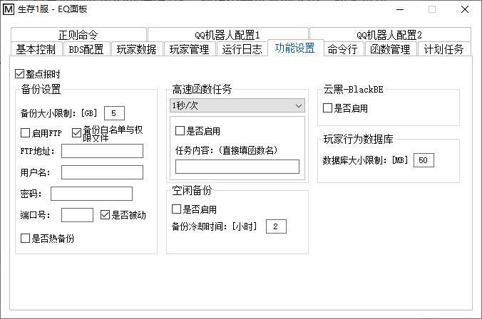

### 1.整点报时

开启本功能后，会根据服务器上的系统时间，到整点后提醒用户

### 2.备份大小限制

存档文件的文件夹大小上限，如果超过限制，将自动删除最旧的存档(这一项请不要设置的太小，如果备份大小限制小于存档大小，那么将自动删除备份好的存档！)

### 3.备份白名单和权限文件

开启这一项将自动备份白名单及权限文件(记录服务器OP的文件)，如下图


### 4.FTP

如果启用并且设置了FTP，那么备份完成后将自动上传备份好的存档到服务器

### 5.热备份

**建议开启，开启本功能后，就可以在不停服的情况下完成存档备份。配合面板的计划任务，可以实现按一定周期自动备份**

### 6.高速函数任务

如果您有函数想由服务器后台以较高频率(1秒/次)执行，那么只需要选择对应频率，输入函数名，勾上"是否启用"，重启BDS后应用将生效。如果要定时执行或更慢频率(比1分钟/次更慢)执行，那么可以使用面板计划任务中的"定时任务_循环""周期任务"执行function指令。

### 7.空闲备份

(如果您开启了热备份，请不要开启空闲备份)开启本功能后，面板将在无人情况持续3分钟且不在冷却时间时自动备份，建议根据服务器情况设置不同的冷却时间。个人认为小服4小时，大服8小时比较好。

### 8.云黑

白名单部分有介绍，控制服务器是否启用云黑检查。

### 9.玩家行为数据库大小限制

控制单个玩家行为数据库的文件大小，如果超过这个大小，将会分出不同的数据库文件保存。这么做的好处是：避免数据库文件过大导致查熊时间过长

## 十、计划任务


计划任务可以让面板定时为您执行指令，下面讲解计划任务的三个种类及选择器的用法：

### 1.定时任务_仅一次

**这种计划任务定时执行，且执行完一次后自动删除。**

2022年表示限制在2022年执行，*年表示年份不限

6月表示限制在6月份执行，*月表示月份不限

其他依次类推，当"年月日时分秒"的条件均满足时，计划任务就会被执行

### 2.定时任务_循环

**这种计划任务大体与"定时任务_仅一次"一样，但是执行完一次后不会删除，能反复执行。**

执行周期和执行时间的填写方法与"定时任务_仅一次"中的一样

当"年月日时分秒"的条件均满足时，计划任务就会被执行

### 3.周期任务

**当时间满足时，按一定周期执行计划任务**

执行限制部分的填写方法与"定时任务_仅一次"中的一样，当"年月日"的条件均满足时才会按周期执行

周期就是执行计划任务的间隔，按照需要选择。

比如说：执行限制保持\*年\*月\*日不变，执行周期填60，任务内容填save，那么面板就会每隔1小时自动备份一次(推荐在"功能设置"里面开启)

## 十一、QQ机器人

EQ-BDS面板的QQ机器人是分体式设计，mirai框架上的插件负责接收和发送信息，EQ-BDS面板负责处理mirai插件接收到的信息并且把要发送的信息发给mirai插件。

同时面板也支持了go-cqhttp框架，go-cqhttp框架的操作更简便

关于mirai框架和go-cqhttp框架如果有问题欢迎加入QQ群提问：1072180746

得益于分体式设计，多个EQ-BDS面板可以共享同一个QQ机器人


### 1.部署

mirai框架或go-cqhttp框架的部署，详见我们的图文教程"部署QQ机器人.pdf"。

关于QQ机器人框架如果有问题欢迎加入QQ群提问：1072180746

### 2.聊天转发(群服互通)

启用该功能后，QQ机器人会把游戏内玩家说的话转发到所有聊天转发群，同时所有聊天转发群的消息都会转发到游戏内，效果如下图

群里面说话：

游戏里看得到：

游戏里说话：

群里面看得到：

使用``#``分割多个群号，例如：``12345#678910``表示``12345``和``678910``两个群

### 3.主群群号

主群就是全体玩家都在的QQ群，使用#号分割多个群号。

与主群相关的功能目前只有两个：

一：QQ机器人配置2的管理群号上面有一个选择框"启用退主群封禁白名单"，启用该功能后如果有玩家从主群退出，那么就会根据玩家的QQ吊销其所有白名单，避免玩家其脱离管理。


二：QQ机器人配置1的私聊指令头上面有一个编辑框"主群查服命令"，您可以自定义玩家发送什么查询服务器状态

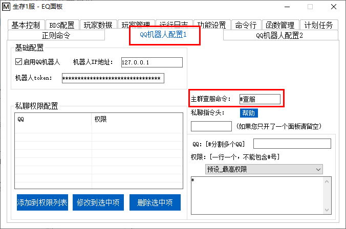

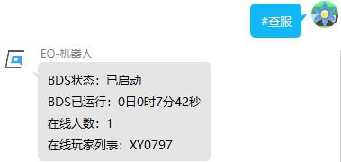

### 4.管理群号

QQ机器人只会解析在管理群内的指令，使用#号分割多个群号。


默认情况下管理群内只有群管理员才能执行所有指令，其他成员需要检测其私聊权限才能执行命令。


推荐独立建个指令群，然后面板里面设置它为管理群，然后群内输入"#输出流"开启回显，这样子就能在显示回显的同时尽可能减少对其他管理的打扰。(开服的1分钟内不会发送输出流，避免刷屏现象)

如果您设置了多个管理群，输出流只会被发到第一个管理群，这么设计是为了减少打扰


如果要实现精确的权限控制，请使用私聊权限设置功能，然后开启(默认开启的)。

如果您不想给管理员最高权限，想要自己配置，请在保持开启的同时，关闭。

如果您想给管理群内所有成员最高权限，只需要关闭即可。

### 5.私聊权限配置

管理群内的成员可以执行所有指令，为了更精确地控制权限，设计了本功能


在右侧输入QQ号、权限，您可以选择一些预设，或者自定义权限。"#"可以分割多个QQ，用于给多个QQ赋予同样的权限

自定义权限：不需要输入命令的"#"前缀，一个命令一行，"\*"代表最高权限，一般给能进服务器后台的管理员，"%"表示所有的BDS指令(就是give一类的游戏内指令)，一般给游戏内的op

### 6.私聊指令头

**如果您有多个EQ-BDS面板共享一个机器人**，那么为了区分信息发给哪个面板，需要给指令加个头(指令头最多两个字,可以是英文、数字、中文的任意一项或多项组合)

正常情况下输入"#""%"就能执行命令和BDS指令，假设您指定了私聊指令头为"1"，那么您就必须输入"1#""1%"才能在这个服务器执行命令和BDS指令

例如，您设置私聊指令头为，那么私聊情况下必须输入"1#取在线情况"才能获取服务器的在线情况，私聊情况下必须输入"1%op XY0797"才能给XY0797一个op权限

⚠注意：管理群不受私聊指令头的影响，如果您的一个机器人下只有一个EQ-BDS面板，留空即可

### 7.自助白名单


开启本功能后，玩家只需要直接在群里发送"#申请白名"，即可自助完成白名单添加

如果玩家名字有空格，也不需要加双引号括起来

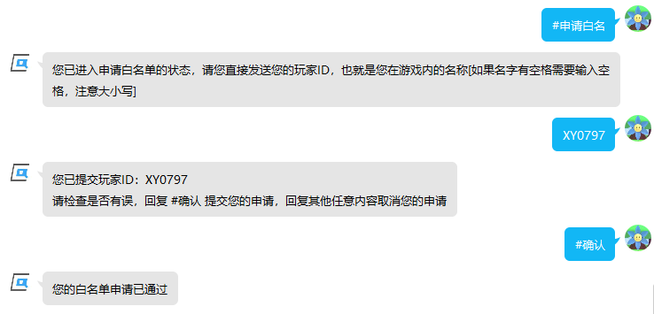

管理群：


如果您使用的go-cqhttp，为了防止封号，框架默认是禁止临时对话的，所以说您可以开启这个自动同意好友请求，这样子就能方便玩家自助申请白名单


⚠注意：无论是谁，都会同意申请(您可以开启，这样子就会拒绝云黑内的玩家)

如果您要管理员人工审核，请
**不要**
开启本功能

## 十二、QQ机器人指令

(添加权限后，私聊发送#?，或者在管理群发送#?也可获取)

命令列表：

### 获得QQ机器人命令帮助

``#?``

获取命令列表,如果您对下面的带参数的命令有疑问,只需要输入命令头即可

比如说您对 #加白名 有疑问,只需要输入"#加白名"就能获得详细的解释


### 启动服务器

``#开服``

输入本命令可以启动BDS

⚠注意：运行日志是发到管理群的，不会发到私聊里面


``#自定义开服 <是否崩服重启|是否> <是否启动LiteLoader|是否>``

自定义开服的参数,会同步修改面板上的选择框状态,本命令仅供特殊情况使用,一般情况下用 #开服 就可以了

参数内容:

><是否崩服重启>顾名思义,填"是""否"

><是否启动LiteLoader>顾名思义,填"是""否".如果没有安装LiteLoader您却填了是,那么会启动原版服.

命令使用示例:

``#自定义开服 是 是``


``#自定义开服 否 是``


``#自定义开服 是 否``

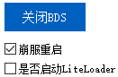

``#自定义开服 否 否``

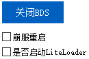

### 关闭服务器

``#关服``

输入本命令可以关闭BDS


### 重启服务器

``#重启``

输入本命令可以重启BDS(不是重启电脑)


### 获取在线玩家与服务器状态

``#查服``

获取BDS是否启动,如果BDS启动会同时提供运行时间、在线玩家列表


### 获得今日玩家在线排行榜

``#取在线情况[ <页码>]``

获取今日进过服务器的玩家以及在线时长

>参数<页码>不是必须的，省略<页码>即为默认其为1

例如：

``#取在线情况``

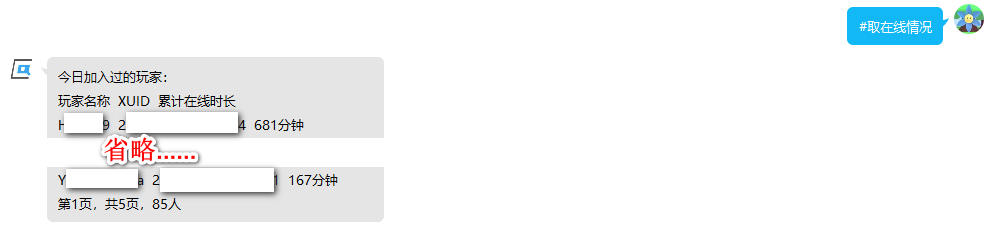

``#取在线情况 1``


``#取在线情况 2``


### 获取BDS的配置(server.properties)

``#取BDS配置``

获取BDS的配置(比如说默认游戏模式、ipv4端口)


### 修改BDS的配置(server.properties)

``#改BDS配置 <配置项|文本> <内容|文本>``

修改BDS配置,建议先执行 #取BDS配置 再使用本指令

参数内容:

><配置项>就是 #取BDS配置 获取到的配置名字,比如说"默认游戏模式""游戏难度""欲载入的地图名称"之类的

><内容>就是您想修改成的内容,如果 #取BDS配置 显示的是"开""关",那么这里就必须输入"开""关"

命令使用示例:

``#改BDS配置 BDS玩家上限 20``


``#改BDS配置 BDS欢迎文本 "欢迎来到xx服 S5"``

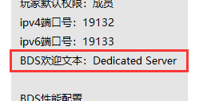

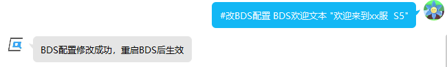

``#改BDS配置 作弊 开``


### 查看worlds下的存档列表

``#查看存档列表``

获取worlds目录下的文件夹,方便用 #改BDS配置 修改BDS当前加载的存档


### 获取面板的功能设置信息

``(只能私聊发送)#取功能设置状态``

获取面板的各项设置(比如说整点报时是否开启、备份大小限制)


### 修改面板的功能设置信息

``(只能私聊发送)#修改功能设置 <设置项名称|文本> <内容|文本>``

修改面板的各项功能,建议使用前先执行 #取功能设置状态

参数内容:

><设置项名称>#取功能设置状态 获得的设置项名称,比如说:"整点报时""备份大小限制"

><内容>就是您想修改成的内容,如果 #取功能设置状态 显示的是"开""关",那么这里就必须输入"开""关"

命令使用示例:

``#修改功能设置 整点报时 开``


``#修改功能设置 备份大小限制 6``


``#修改功能设置 FTP地址 "192.168.0.3"``

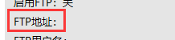


### 备份存档

``#备份``

执行关服备份


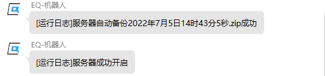

### 获取面板自动备份的文件列表

``#查看备份列表``

查看备份文件夹下的zip文件，方便使用 #回档 指令


### 自动从面板的备份列表恢复存档

``#回档 <备份名称|文本> <是否保留当前存档|是否>``

从备份列表里面恢复服务器以前的存档,请先使用 #查看备份列表 命令获取存档文件的名称

存档文件必须是压缩包，压缩包内必须是一个和地图名称一致的文件夹，有且只能有这一个文件夹

存档文件不符合要求会造成不可估计的后果！建议使用服务器自动备份的文件

参数内容:

><备份名称>备份文件名,#查看备份列表 命令显示的存档文件名

><是否保留当前存档>如果填"是",那么就会先执行一次压缩备份再删除存档文件夹,否则直接删除存档文件夹开始回档

命令使用示例:

``#回档 2022年7月5日14时43分5秒.zip 是``


``#回档 "奇奇怪怪的 手动创建的 存档备份.zip" 否``


### 检测更新并自动升级面板

``#检查更新``

检测更新，返回检查更新结果，并且等待您确认更新。检查到更新后再次输入本命令即为确认更新，然后面板会自动下载并且自动完成更新。

如果检测更新后超过5分钟不确认更新，那么就默认您放弃了更新，这时再输入本命令就会重新检测更新并要求您确认

命令使用示例:


### 执行BDS控制台的命令

``%<BDS命令>``

执行BDS指令，相当于在服务器后台输入指令，只不过需要%作为前缀

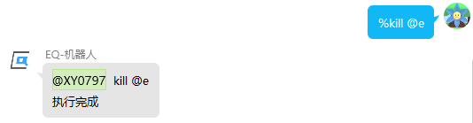


### 设置是否转发BDS控制台的信息

``#输出流 <是否订阅|是否>``

如果订阅了输出流,每当BDS后台有信息都发到管理群.就是把下面这种信息发到管理群:
```
00:05:13 INFO [Server] Player connected: playername, xuid: 22332232233223223
00:06:25 INFO [Server] Player disconnected: playername, xuid: 22332232233223223
```
参数内容:

><是否订阅>就是您想把输出流状态设置成的状态,如果您想启用,就填"是".如果您想关闭,就填"否"

命令使用示例:

``#输出流 是``


``#输出流 否``

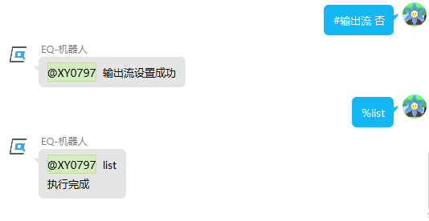


### 查找指定时间段的在线玩家

``#分析在线玩家 <日期|文本> <时间开始|文本> <时间结束|文本>``

快速锁定事发时间段在线的玩家,比如说有玩家报告自己东西被偷了,就可以通过本命令调出他不在线时间有哪些玩家在服务器里面

本命令只能查询一天内的.如果要跨天,请多次调用本命令,每一天0时0分0秒到23时59分59秒,依次查清每一天的人然后人工合并即可

参数内容:

><日期>要查询的日期,比如说"2022年6月18日""2022年6月19日"

><时间开始>当天的开始时间,比如说您要查清当天``13时12分1秒-21时0分0秒``有哪些人,这里填``13时12分1秒``即可\
\
⚠注意:时间必须以这种固定方式写入,``时 分 秒``一个都不能少\
\
一天的开始是``0时0分0秒``,一天的结束是``23时59分59秒``\
不支持12小时制,请用24小时制表示时间

><时间结束>当天的结束时间,如果是查``13时12分1秒-21时0分0秒``有哪些人,这里填``21时0分0秒``即可.

命令使用示例:

假设您的玩家在2022年6月18日报告自己在上午9点下的线,下午3点21分上线就发现东西被偷了

您就可以输入：``#分析在线玩家 2022年6月18日 9时0分0秒 15时21分0秒``

这样子就能初步排查哪些玩家是嫌疑人,后面可以结合事发地的坐标使用本面板提供的查熊功能精确锁定到底是谁偷的东西

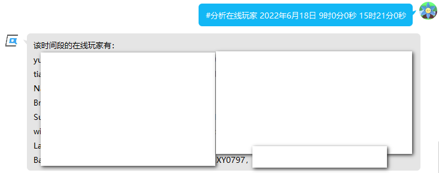

### 查找白名单里面是否有指定的玩家

``#查白名 <玩家名|文本>``

找指定的玩家在不在白名单里面，返回所有的结果

参数内容:

><玩家名>就是玩家的名字,比如说:XY0797、"XY 0797"

命令使用示例:

``#查白名 XY0797``


``#查白名 "XY 0797"``


### 查找某QQ绑定的白名单

``#QQ查白名 <QQ号|文本>``

找指定的QQ在白名单里面有哪些玩家，返回所有的结果

参数内容:

><QQ号>顾名思义,就是玩家的QQ号

命令使用示例:

``#QQ查白名 1559095867``


``#QQ查白名 22332233``


### 把玩家加入白名单内

```
#加白名 <玩家名|文本> <玩家QQ|文本>
#加白名 <玩家名|文本>
#加白名 <玩家名|文本> <是否允许满人进入|是否> <是否忽略云黑|是否>
#加白名 <玩家名|文本> <玩家QQ|文本> <是否允许满人进入|是否> <是否忽略云黑|是否>
```

添加白名单,可以按照需求选择上面的形式输入.一般情况下使用第1种形式最好.

参数内容:

><玩家名>玩家的名字,比如说:XY0797、"XY 0797"

><玩家QQ>顾名思义,就是玩家的QQ号.尽量填上QQ,这样子吊销白名单更方便

><是否允许满人进入>如果填"是",那么这个玩家就可以在服务器人满的情况下进入.除非是管理员,一般情况一律填"否".\
默认为"否"

><是否忽略云黑>如果您开启了云黑查询功能,然后有您信任的人被误报了,本参数填"是"就可以忽略云黑查询的结果.\
默认为"否"

命令使用示例:

``#加白名 XY0797 1559095867``

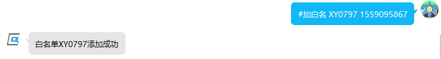

``#加白名 XY0797 1420379105 是 是``


``#加白名 XY0797``


``#加白名 XY0797 是 否``


### 把玩家从白名单中移除

``#删白名 <玩家名|文本>``

删除一个玩家的白名单.比如说不小心加错了.如果遇到熊孩子,请使用``#封QQ``或``#封号``

参数内容:

><玩家名>玩家的名字,比如说:XY0797、"XY 0797"

命令使用示例:

``#删白名 XY0797``


``#删白名 "XY 0797"``


### 删除并禁止某玩家加入白名单

```
#封号 <玩家名|文本>
#封号 <玩家名|文本> <理由|文本>
```

把指定玩家名字的玩家封禁掉,同时以后加白名会拒绝被封禁的玩家加入.个人建议用``#封QQ``,彻底封杀这个人QQ下的所有白名单

如果您加入了云黑项目,您需要手动提交证据材料,本面板不会把您封禁的玩家发给云黑团队

参数内容:

><玩家名>玩家的名字,比如说:XY0797、"XY 0797"

><理由>封禁的理由,建议用双引号括起来

命令使用示例:

``#封号 XY0797``

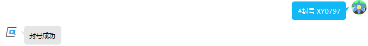

``#封号 "XY 0797" "熊服、偷东西 同时还炸服"``


### 删除并禁止某QQ加入白名单

```
#封QQ <QQ号|文本>
#封QQ <QQ号|文本> <理由|文本>
```

彻底封杀这个人QQ下的所有白名单,同时以后加白名如果附上了QQ号就会拒绝被封禁的玩家加入

如果您加入了云黑项目,您需要手动提交证据材料,本面板不会把您封禁的玩家发给云黑团队

参数内容:

><QQ号>顾名思义,就是玩家的QQ号

><理由>封禁的理由,建议用双引号括起来

命令使用示例:

``#封QQ 1559095867``


``#封QQ 1559095867 "熊服、偷东西 同时还炸服"``


### 解禁某玩家加入白名单

``#解封 <玩家名|文本>``

把被封禁的玩家名解封.如果提示未找到可以试试 #解封QQ

参数内容:

><玩家名>玩家的名字,比如说:XY0797、"XY 0797"

命令使用示例:

``#解封 XY0797``

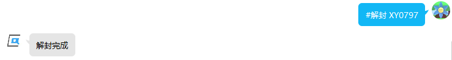

``#解封 "XY 0797"``


### 解禁某QQ加入白名单

``#解封QQ <QQ号|文本>``

把被封禁的QQ解封.如果提示未找到可以试试 #解封

参数内容:

><QQ号>顾名思义,就是玩家的QQ号

命令使用示例:

``#解封QQ 1559095867``


## 十三、同机器多面板支持

本面板支持在同一台机器上运行多个面板。再次安装面板，每次都取不同的面板名字，然后确保BDS的ipv4及ipv6端口号均不同(如果有相同的，那么会一启动就崩服)，这样子就能在同一台机器上运行多个面板。

如果您启用了QQ机器人，带EQ插件的QQ机器人不能在同一台服务器上运行多个，但是多个面板可以共享一个机器人，只需要设置好私聊指令头，然后管理群设置不同的群。


如图所示，我在同一台机器上开了四个服务器，分别是"生存1服""生存2服""生存3服""生存4服"

我把它们连接到同一台机器人上，分别设置指令头为"1""2""3""4"

那么如果我想私聊给生存1服发查服指令，只需要输入"1#查服"即可，如果在管理群内，仅需正常地发送"#查服"即可

同理，如果我想私聊给生存2服发查服指令，只需要输入"2#查服"即可，因为我的指令头设置的是这个。指令头可以自定义，私聊的"#"前加什么完全取决于您设置的指令头，因此指令头不能重复。

否则会出现给机器人发一个指令，同时下发到多个面板的情况！

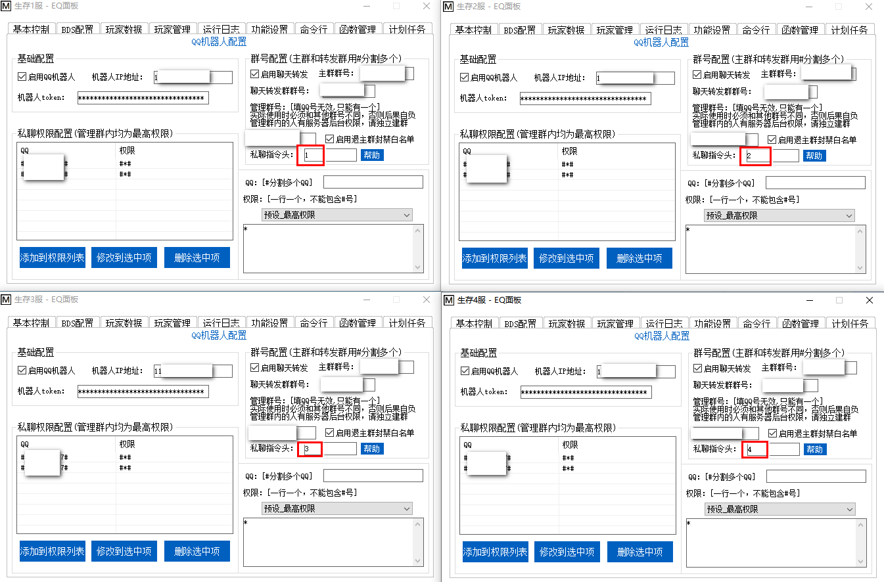

## 十四、正则命令

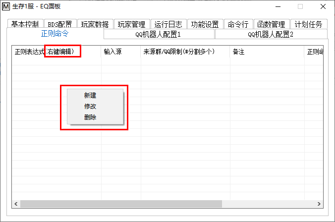

本功能为高级用户提供，其具体内容是：

您指定一个文本输入源(一共4种：禁用\|命令行\|QQ群消息\|QQ私聊消息)，并且提供正则表达式，如果匹配成功，那么将会执行您输入的正则命令。

如果正则匹配到多个结果，面板会根据"是否允许多次匹配"的设置，只对第一个匹配项执行正则命令，或者对每一个匹配项执行正则命令(默认为否，即只对第一个匹配项执行正则命令)。

正则命令遵循一定的语法，并且正则命令里面可以用``$<子匹配项索引>``引用子匹配项

也就是"()"里面的子表达式匹配到的内容

例如``$1``、``$2``分别表示第一个子匹配项和第二个子匹配项。

EQ面板的正则命令大体上遵循Serein(https://zaitonn.github.io/Serein/Command.html)的命令制式

**但是有一些增加、删除、修改**
，下面是EQ正则命令相比Serein正则命令的变化：

1. 删除了调用cmd.exe的支持，为了安全性，此高危功能不提供支持

2. 支持执行EQ面板特有的自动备份命令

3. 支持把匹配到的文本当做QQ机器人的指令执行

4. ***不支持*** Serein的环境变量(%\<变量名\>%)，所有的环境变量均可使用js脚本实现

5. 提供了js脚本执行支持，并且提供了与面板对接的API

6. 部分正则命令(实际上只有一个)提供"\$0"来代替Serein的环境变量(%\<变量名\>%)

7. 支持对"QQ群消息/QQ私聊消息"的来源限定，也就是说，您可以让面板只对某个群内(某个QQ号发送)的信息做正则匹配，大大扩展了正则命令的用途

所有命令格式为``<命令名称>|<执行内容>``或``<命令名称>:<参数>|<执行内容>``

建议先在``正则表达式测试.exe``里面进行测试，确定能匹配后再输入到面板里面

这个测试器就在面板目录里面，双击运行即可

⚠注意：

>命令的前半部分不区分大小写

>禁止输入的字符(会干扰面板保存正则命令)： （\t，即Tab键打出来的制表符)

>``|``为竖线（分隔线）（U+007C，不是中文的``丨``gǔn）

>``<>``表示参数，您实际输命令时不需要输入``<>``

关键字(这些字符有特殊含义)：``$``

跨行匹配：支持list指令的跨行匹配，值得注意的是：**换行符是``\r\n``，而不是单独的一个``\n``**，请务必使用``\r\n``去匹配

并且，匹配list的主要用途是查服，面板已经集成该功能，设置主群后，任何人都能在主群使用``#查服``命令获得服务器状态+在线玩家（您也可以自定义查服命令，面板允许您修改查服命令）

### 1.在BDS命令行中执行命令

``s|<命令>``

``server|<命令>``

在BDS命令行中执行命令

>⚠注意：\
1.若BDS未启动则不执行\
2.新增服务器内置指令：start 启动服务器(服务器未启动时才会执行)\
save 启动面板的自动备份(任意时刻均能执行)

示例：

``s|say 测试``

``s|save``

更多语法：

``s:u|<命令>``

``server:u|<命令>``

``s:unicode|<命令>``

``server:unicode|<命令>``

本命令的该语法专为聊天转发设计，会将命令中的非ASCII的字符转换为Unicode字符转义的UTF8文本(也就是usc2,例如\u0000)的输出(适用于tellraw等使用json文本的命令)，然后再执行命令

>⚠注意：\
1.若BDS未启动则不执行\
2.如果来源是群消息，那么特别提供“$0”匹配项，这里提供的$0并不是来源于正则表达式，而是代表来源QQ的昵称\
(如果有群昵称则提供群昵称，同时提供的昵称会自动去除非法字符：§k、实体选择器、CQ码)\
3.如果来源是群消息，会自动去除来源文本中的非法字符：§k、实体选择器、CQ码

示例：

QQ群输入源，填写群号限制123456#654321，正则表达式：``\.(.+?)$``

``s:u|tellraw @a {"rawtext":[{"text":"[§6聊天群§r]<$0§r> $1"}]}``

这条正则命令将把QQ群123456和QQ群654321中以“.”开头的群聊信息的第一行转义并且加上群成员名称一并发送给游戏内的玩家，您可以把该示例作为聊天转发的模板。

### 2.发送私聊消息

``p|<消息>``

``private|<消息>``

发送一条消息给触发此命令的用户

>⚠注意：\
1.以上两项只能由正则匹配到私聊或群聊消息时触发，发送对象为触发这项正则的用户\
2.若触发对象不是机器人好友或账号不存在，则可能无法发送\
3.若未连接QQ机器人则不处理

更多语法：

``p:<QQ号>|<消息>``

``private:<QQ号>|<消息>``

发送一条消息给指定用户，支持用#分割多个QQ号以同时发送给多个用户

>注意：\
1.若触发对象不是机器人好友或账号不存在，则可能无法发送\
2.若未连接QQ机器人则不处理\
3.别往参数里输入群号

示例：

命令行输入源，正则表达式：``Player connected:\s(.+?), xuid:\s(.+?)$``

``p:123456789#987654321|[服务器]玩家$1进入了服务器``

这条正则命令将在玩家进服时发送示例信息给123456789和987654321两个QQ

### 3.发送群聊消息

``g|<消息>``

``group|<消息>``

>⚠注意：\
1.当输入源是群聊消息时，发送对象为触发这条消息的群聊\
2.当输入源是私聊消息时，不发送消息，请用下面的扩展语法指定发送群号\
3.其他情况下，发送至管理群的第一项，若管理群为空则不发送\
4.若机器人未入群或被禁言则发送失败\
5.若未连接QQ机器人则不发送

更多语法：

``g:<QQ群号>|<消息>``

``group:<QQ群号>|<消息>``

发送一条消息给指定群聊，对输入源没有限制，支持用#分割多个群号以同时发送给多个QQ群

>⚠注意：\
1.若机器人未入群或被禁言则发送失败\
2.若未连接QQ机器人则不发送\
3.输入QQ号无效，必须是QQ群号

``gs:<QQ群号>|<消息>``

``groupsafe:<QQ群号>|<消息>``

本命令的该语法专为聊天转发设计，发送一条消息给指定群聊，本命令也支持用#分割多个群号以同时发送给多个QQ群。

与``g:<QQ群号>|<消息>``不同的是，该命令会自动去除消息中的非法字符：§k、实体选择器、CQ码。

>⚠注意：\
1.若机器人未入群或被禁言则发送失败\
2.若未连接QQ机器人则不发送\
3.输入QQ号无效，必须是QQ群号

示例：

控制台输入源，正则表达式：``\[Chat]\s<(.+?)>\s(.+?)$``

``gs:123456789#11121314|[生存1服]<$1>$2``

这条正则命令会匹配LL输出的聊天信息并且发送到QQ群123456和11121314，您可以把该示例作为聊天转发的模板。

如果您安装了PTitle，正则表达式换成``\[ChatCH]\s<(.+?)>\s(.+?)$``即可。

### 4.作为QQ机器人指令执行

``q|<QQ机器人命令>``

``qqcmd|<QQ机器人命令>``

把``<QQ机器人命令>``将当做拥有最高权限、处于私聊状态下发送的QQ机器人指令执行，因此可以执行例如“#加白名”一类的指令。返回值(包括报错)将发送给来源方(来自QQ群/私聊消息就发送回去)，即使未连接QQ机器人也能执行该命令。

>⚠注意：\
1.当来源是命令行时，没有返回值\
2.本命令将以最高权限运行指令，无法做到精确的权限控制\
3.如果来源是QQ群消息，那么会把``<QQ机器人命令>``将当做拥有最高权限、处于群聊状态下发送的QQ机器人指令执行\
4.⚠不要直接解析游戏内消息来执行QQ机器人命令⚠，请使用聊天解析加本机rc来带权限执行(第5节有例子)，否则非常容易被普通玩家伪造身份！\
5.``<QQ机器人命令>``不需要加上私聊指令头，直接#<命令>或%<命令>即可，如：``#查服，%kill @e[type=item]``

示例：

QQ群输入源，填写群号限制123456#654321，正则表达式：``查服$``

``q|#查服``

这样子QQ群123456和QQ群654321中的任何人只需要说包含“查服”的消息，就能获得“#查服”命令的执行结果，而且不会检查其权限。

这里只是举一个例子，我们不建议这么做，因为面板有主群查服的相关设置，您可以直接自定义不检查权限的查服指令。

更多语法：

``q:<QQ号>|<QQ机器人命令>``

``qqcmd:<QQ号>|<QQ机器人命令>``

把``<QQ机器人命令>``将当做拥有指定``<QQ号>``对应的私聊权限、处于私聊状态下发送的QQ机器人指令执行，因此可以执行例如“#加白名”一类的指令(前提是有对应权限)。返回值(包括报错)将发送给来源方(来自QQ群/私聊消息就发送回去)，未连接QQ机器人就不能执行该命令(因为没有有效的来源)。

>⚠注意：\
1.当来源是命令行时，没有返回值\
2.如果来源是QQ群消息，那么会把``<QQ机器人命令>``将当做拥有指定``<QQ号>``对应的私聊权限、处于群聊状态下发送的QQ机器人指令执行\
3.不支持用#分割多个QQ号\
4.QQ号不一定得真实存在，只要它在权限列表内即可\
5.不要直接解析游戏内消息来执行QQ机器人命令，请使用聊天解析加本机rc来带权限执行(***第5节有例子***)，否则非常容易被普通玩家伪造身份！\
6.``<QQ机器人命令>``不需要加上私聊指令头，直接#<命令>或%<命令>即可，如：``#查服``，``%kill @e[type=item]``

更多语法：

``q|Ex<QQ机器人命令>``

``qqcmd|Ex<QQ机器人命令>``

``q:<QQ号>|Ex<QQ机器人命令>``

``qqcmd:<QQ号>Ex|<QQ机器人命令>``

如果来源是命令行，执行结果将以类型聊天转发的显示发送到游戏内，其他的含义、效果与上面的完全相同

>⚠注意：\
1.“Ex”对大小写有要求，必须是严格的大写E小写x\
2.“Ex”位置必须在竖线右边，不能位于其他地方\
3.其他的注意事项和不带Ex的版本相同\
4.不要直接解析游戏内消息来执行QQ机器人命令，请使用聊天解析加本机rc来带权限执行(第5节有例子)，否则非常容易被普通玩家伪造身份！

### 5.执行远程正则命令

``rc:<面板名称>|<要执行的正则命令>``

``remotecmd:<面板名称>|<要执行的正则命令>``

本命令将会把右侧的命令进行子匹配处理后发送到其他面板上，并且尽可能模拟各方面的输入状态，就像是对应面板有这么一个正则命令一样

>⚠注意：\
1.若未连接QQ机器人则不执行\
2.指定的远程面板要处于运行状态并且连接到同一个QQ机器人\
3.面板支持多级嵌套本命令，但是需要注意时间和带宽消耗\
4.您可以面板名称填本机，这样子就能实现更复杂的参数填写，满足您的需求。填本机的情况下不需要连接QQ机器人就能执行\
5.如果该命令有执行结果要返回到默认管理群，这个默认管理群是参数里面指定的面板上的，而不是当前面板上

示例：

(假如执行本命令的面板名称为“生存1服”)

控制台输入源，正则表达式：``\[Chat]\s<(.+?)>\s(.+?)$``

``rc:生存2服|s:u|tellraw @a {"rawtext":[{"text":"[§6生存1服§r]<$1§r> $2"}]}``

这条正则命令能将本服的聊天信息转发到生存2服从而实现跨服聊天

控制台输入源，正则表达式：``\[Chat]\s<(.+?)>\s#(.+?)$``

``rc:生存1服|q:$1|Ex#$2``

这条正则命令可以在把指定玩家名当成QQ号赋予私聊权限后，将其在游戏内说的QQ机器人指令以其所拥有的权限解析并执行，返回值发回游戏内

### 6.执行js命令

点击[这里](./JS帮助.md)查看文档