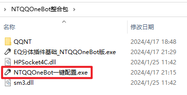
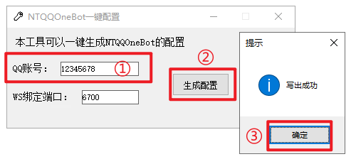
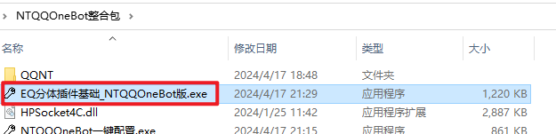
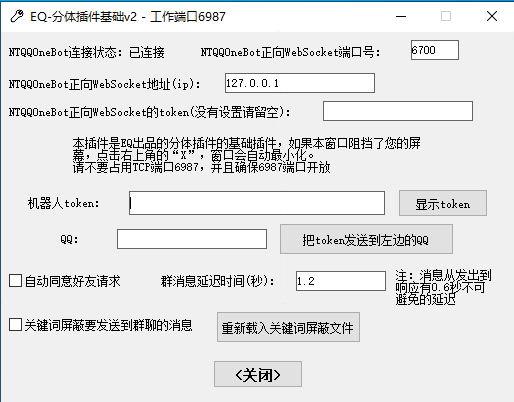
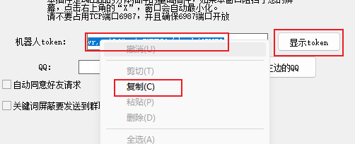
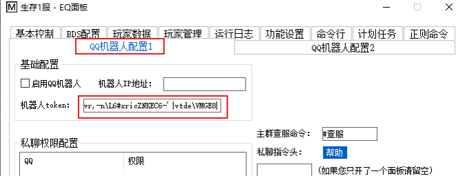
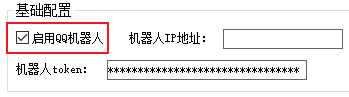
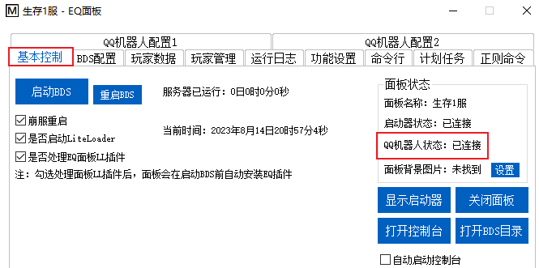
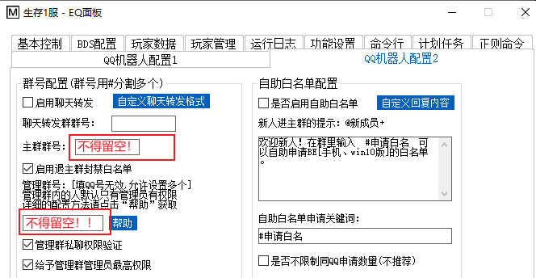
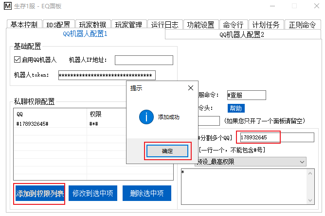

# 一、机器人配置教程

## 0.预处理

首先处理杀毒软件误报问题。在服务器上安装火绒安全

> 当然，您也可以不选择火绒，使用其他杀毒软件，到时候给插件加上信任即可

安装完成后禁用Windows Defender，详见[EQ-BDS面板用户手册](https://xy0797.github.io/EQ-BDSDtonsoleDocs/EQ-BDS%E9%9D%A2%E6%9D%BF%E7%94%A8%E6%88%B7%E6%89%8B%E5%86%8C.html)

## 1.下载然后解压压缩包

[点我](https://www.123pan.com/s/Kp3lVv-AIxXv.html)跳转到下载页面

这个网盘不需要开会员，您只需要用手机注册个号即可，登录上去就能免费不限速下载

直接解压即可，压缩包内是一个文件夹，不用担心直接解压会导致文件凌乱

## 2.运行配置程序

运行``NTQQOneBot一键配置.exe``

## 3.生成配置

输入你QQ的账号，然后点击生成配置，提示成功，就完事了

> 禁止使用主账号做机器人，永久封号后果自负！！！

## 4.运行分体插件基础

运行``EQ分体插件基础_NTQQOneBot版.exe``

它会自动打开QQ，正常扫码登录即可，重启后也是运行``EQ分体插件基础_NTQQOneBot版.exe``即可

登录成功后，可见分体插件连接成功，接下来需要让面板连接分体插件

# 二、EQ-BDS面板配置机器人教程

## 1.复制插件token

找到`插件`窗口，点击显示token，然后全选复制

## 2.设置面板连接插件

打开EQ-BDS面板，切换到`QQ机器人配置1`选项卡，粘贴token到编辑框内

如果机器人和您的面板不在同一个服务器，那么请您开放机器人所在服务器的TCP 6987端口，然后在“机器人IP地址”里面填写机器人所在服务器的IP地址

如果机器人和您的面板在同一个服务器，IP地址留空即可

如果您看不懂上述文字，IP地址留空即可

然后我们勾上``启用QQ机器人``

## 3.确认是否连接成功

切换到`基本控制`选项卡，可以看到显示机器人已连接

## 4.配置群号

切换到`QQ机器人配置2`选项卡，配置群号

如果您只有一个群，那么群号配置全部填写同一个群号。如果您有专门的管理群和聊天转发(群服互通)群，就填写到对应位置。

如图所示，`主群群号和管理群号不能留空！`

主群指的就是所有玩家都在的QQ群，管理群指的是只有服务器管理在的群。

虽然定义是这样子的，但是面板`允许管理群和主群为同一个群`，这是因为默认情况下“管理群私聊权限验证”是开启状态，只要这个开启，普通群成员就无法使用机器人命令，因此`把有玩家的群设置为管理群是安全的`。

如果您有`多个群都是`主群/聊天转发群/管理群，请用“#”分隔多个群号。比如说12451445和13467146都是主群，您填写``12451445#13467146``即可。

如果您有专门的管理群，并且想让群里面的所有成员都能使用机器人指令，请这样配置：

如果您没有专门的管理群，主群就是管理群，但是您不想让群管理员使用机器人指令，请这样配置：

## 5.权限设置

假如您的QQ为178932645，请先切换到`QQ机器人配置1`选项卡，在右下角的`QQ[#分割多个QQ]`填入您的QQ号，然后点击左边的`添加到权限列表`，这样子即可给予自己最高权限。给其它人权限依此类推。

如果您没有开启`管理群私聊权限验证`，那么所有在管理群的人，不管是不是群管，都相当于有最高权限。

如果开启了`管理群私聊权限验证`，并且开启了`给予管理群管理员最高权限`，那么管理群的群管和群主自动获得最高权限。

> 注意：私聊机器人时，不会检测您是否在管理群内有最高权限，所以说如果想私聊机器人控制服务器，您必须设置私聊权限。

# 完成