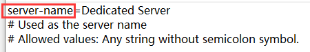

- [正则命令使用JS的语法](#正则命令使用js的语法)
- [环境变量机制](#环境变量机制)
- [API和接口](#api和接口)
  - [调试输出](#调试输出)
  - [获取日期](#获取日期)
  - [file类](#file类)
    - [读入文件](#读入文件)
    - [写入文件](#写入文件)
  - [eq类](#eq类)
    - [输出文本到控制台](#输出文本到控制台)
    - [发送QQ私聊消息](#发送qq私聊消息)
    - [发送QQ群聊消息](#发送qq群聊消息)
    - [获取操作系统名称](#获取操作系统名称)
    - [获取CPU占用率](#获取cpu占用率)
    - [获取内存占用率](#获取内存占用率)
    - [获取总内存大小](#获取总内存大小)
    - [获取已经使用的内存大小](#获取已经使用的内存大小)
    - [获取CPU名称](#获取cpu名称)
    - [获取BDS启动状态](#获取bds启动状态)
    - [获取当前加载的地图名称](#获取当前加载的地图名称)
    - [获取BDS配置项(server.properties内容)](#获取bds配置项serverproperties内容)
    - [执行BDS控制台命令](#执行bds控制台命令)
    - [执行QQ机器人命令](#执行qq机器人命令)
    - [以QQ号查询游戏名(ID)](#以qq号查询游戏名id)
    - [以游戏名(ID)查询QQ号](#以游戏名id查询qq号)
    - [获取当前在线人数](#获取当前在线人数)
    - [获取当前在线玩家列表](#获取当前在线玩家列表)
    - [获取BDS运行时间](#获取bds运行时间)
    - [保存文本到EQ剪切板](#保存文本到eq剪切板)
    - [从EQ剪切板读取文本](#从eq剪切板读取文本)
- [实战\_群签到](#实战_群签到)

# 正则命令使用JS的语法

``js|<js脚本>``

本命令将在匹配后运行js脚本

建议事先使用``mujs调试器.exe``进行调试，确认能运行后再输入到面板里面

这个调试器就在面板目录下，直接双击打开

>⚠注意：\
1.js引擎支持的语法为ES5。\
2.setInterval()setTimeout()等Window对象下的语句均不支持(因为需要尽快执行完脚本)。\
3.为了避免死循环，尽量避免使用while循环，如要使用，务必加上计数变量并且在循环的开头加上计数break的判断！\
4.换行符是``\r\n``\
5.js引擎为严格模式，每一个命令后面需要加分号，请不要使用隐式变量声明等操作，if等代码块无论多短都必须使用{}括起来。\
6.js引擎天然阻止混淆后的代码运行，请不要混淆你的js代码。

# 环境变量机制

面板会把一些信息放入js引擎内，以一个全局变量的形式存在，我们将这个称为“环境变量”

正则匹配到的文本将保存在全局文本变量``regularTxt``里面，正则匹配到的子匹配项保存在一个全局数组``regularTxtList``里面。

如果正则是由群消息触发的，那么来源群号保存在全局变量``Group``里面，发送人的QQ号保存在全局变量``QQ``里面

如果正则是由私聊消息触发的，那么发送人的QQ号保存在全局变量``QQ``里面


# API和接口

## 调试输出

``console.log``、``eq.log``，这两个命令都能将文本输出到命令行

``eq.log("hello world!");``

>⚠注意：\
输出的信息会被当成由BDS产生的信息处理，并且会被正则匹配！\
一定要注意，⚠不要形成死循环！！！

## 获取日期

见下面的示例程序
```
var t=new Date();
eq.log("日期:"+t.toLocaleDateString());
eq.log("年:"+t.getFullYear());
eq.log("月:"+t.getMonth());
eq.log("日:"+t.getDate());
eq.log("时间:"+t.toLocaleTimeString());
eq.log("星期:"+t.getDay());
eq.log("小时:"+t.getHours());
eq.log("分钟:"+t.getMinutes());
eq.log("秒:"+t.getSeconds());
eq.log("毫秒:"+t.getMilliseconds());
eq.log("13位时间戳:"+t.getTime());
```
输出结果：
```
日期:2022-07-19
年:2022
月:6
日:19
时间:12:05:03.498+08:00
星期:2
小时:12
分钟:5
秒:3
毫秒:498
13位时间戳:1658203503498
```

## file类

### 读入文件

``file.read(path);``

+ 参数：
  + path: ``String``

    文件路径，用`.`代替``面板文件``文件夹的路径，不要忘记了路径的右斜杠需要转义(也就是说，双引号里面必须写``\\``才能表示``\``)

    假设面板在``C:\Users\Administrator\EQ面板go-cqhttp整合包``里面
    
    那么``'.\\1.json'``代表``C:\Users\Administrator\EQ面板go-cqhttp整合包\面板文件\1.json``

+ 返回值：返回文件的内容，以GB2312编码模式读取成文本。找不到文件或文件内容为空则返回null。

+ 返回值类型：``String``或``Null``

### 写入文件

``file.write(path,text);``

+ 参数：
  + path: ``String``

    文件路径，用`.`代替``面板文件``文件夹的路径，不要忘记了路径的右斜杠需要转义(也就是说，双引号里面必须写``\\``才能表示``\``)

    假设面板在``C:\Users\Administrator\EQ面板go-cqhttp整合包``里面
    
    那么``'.\\1.json'``代表``C:\Users\Administrator\EQ面板go-cqhttp整合包\面板文件\1.json``
  + text: String

    要写入文件的文本，以GB2312编码保存。

+ 返回值：无

+ 返回值类型：``Null``


## eq类

### 输出文本到控制台

``eq.log(text);``

+ 参数：
  + text: ``String``

    待输出的文本

+ 返回值：无

+ 返回值类型：``Null``

### 发送QQ私聊消息

``eq.sendQQP(qqnumber,text);``

+ 参数：
  + qqnumber: String

    发送目标的QQ号文本
  + text: String
    需要发送的文本

+ 返回值：无

+ 返回值类型：``Null``

### 发送QQ群聊消息

``eq.sendQQG(groupnumber,text,atQQnumber);``

+ 参数：
  + groupnumber: ``String``

    发送目标的QQ群号文本
  + text: ``String``

    需要发送的文本
  + atQQnumber: ``String``

    需要@群成员的QQ号文本，填"0"或不填表示不@，填"-1"@全体成员(需要是群管理员才能@全体成员)

+ 返回值：无

+ 返回值类型：``Null``

### 获取操作系统名称

``eq.getOS();``

+ 参数：无

+ 返回值：返回操作系统名称，如：``Microsoft Windows 10 专业版``

+ 返回值类型：``String``或``Null``

### 获取CPU占用率

``eq.getCPUUsage();``

+ 参数：无

+ 返回值：返回CPU占用率，精确到两位小数的百分比，如：``28``

+ 返回值类型：``Integer``

### 获取内存占用率

``eq.getMemoryUsage();``

+ 参数：无

+ 返回值：返回内存占用率，整数百分比，如：``60.66``

+ 返回值类型：``Float``

### 获取总内存大小

``eq.getTotalRAM();``

+ 参数：无

+ 返回值：返回总内存大小，单位**KB**，如：``8320280``

+ 返回值类型：``Integer``

### 获取已经使用的内存大小

``eq.getUsedRAM();``

+ 参数：无

+ 返回值：返回已经使用的内存大小，单位**KB**，如：``5156176``

+ 返回值类型：``Integer``

### 获取CPU名称

``eq.getCPUName();``

+ 参数：无

+ 返回值：返回CPU的名称信息，如：``Intel(R) Core(TM) i5-9400F CPU @ 2.90GHz``

+ 返回值类型：``String``或``Null``

### 获取BDS启动状态

``eq.getStatus();``

+ 参数：无

+ 返回值：返回BDS启动状态的文本，只有两种值：``已启动/未启动``

+ 返回值类型：``String``

### 获取当前加载的地图名称

``eq.getLevelName();``

+ 参数：无

+ 返回值：返回当前加载的地图名称文本，如：``Bedrock level``

+ 返回值类型：``String``或``Null``

### 获取BDS配置项(server.properties内容)

``eq.getBDSconfig(configName);``

+ 参数：
  + configName: ``String``

    server.properties文件配置项等号左边的部分，如：``server-name``、``allow-list``、``difficulty``

    

+ 返回值：返回对应配置项的内容文本，如：``Dedicated Server``、``true``、``10``。失败返回``null``

+ 返回值类型：``String/null``

### 执行BDS控制台命令

相当于你在BDS的控制台输入指令

``eq.runcmd(cmd);``

+ 参数：

  + cmd: ``String``

    想要执行的控制台命令

+ 返回值：无

+ 返回值类型：``null``

### 执行QQ机器人命令

``eq.runQQcmd(cmd);``

+ 参数：

  + cmd: ``String``

    想要执行的QQ机器人命令,以最高权限运行

+ 返回值：返回QQ机器人命令的执行结果文本，就像私聊QQ机器人执行命令一样

+ 返回值类型：``String``或``Null``

### 以QQ号查询游戏名(ID)

``eq.qq2id(qq);``

+ 参数：

  + qq: ``String``

    玩家的QQ号

+ 返回值：返回玩家的游戏名称(玩家ID)，如果白名单里面找不到，那么返回null

+ 返回值类型：``String``或``Null``

### 以游戏名(ID)查询QQ号

``eq.id2qq(id);``

+ 参数：

  + id: ``String``

    玩家的游戏名称

+ 返回值：返回玩家的QQ号，如果白名单里面找不到，那么返回null

+ 返回值类型：``String``或``Null``

### 获取当前在线人数

``eq.getplayersNum();``

+ 参数：无

+ 返回值：返回玩家数量，如果服务器未启动则返回0

+ 返回值类型：``Integer``

### 获取当前在线玩家列表

``eq.getplayersList();``

+ 参数：无

+ 返回值：返回玩家列表文本，“、”作为分隔符。如果无玩家在线或服务器未启动，那么返回null

+ 返回值类型：``String``或``Null``

### 获取BDS运行时间

``eq.getBDSrunTime();``

+ 参数：无

+ 返回值：返回格式为“X日X时X分X秒”的文本。如果BDS未启动，那么返回null

+ 返回值类型：``String``或``Null``

### 保存文本到EQ剪切板

特别提醒：这`不是`Windows系统里面的剪切板，而是EQ面板内部给js长期保存数据的容器

``eq.writeEQclipBoard(clipBoardName,str);``

+ 参数：

  + clipBoardName: ``String``

    剪切板的名字，随便取名字即可，读取时要通过这个名字读取数据。如果没有这个名字的剪切板，那么会自动创建。如果已经有同名字的剪切板，那么会替换里面原有的内容
  + str: ``String``

    想要保存的文本数据。如果为空文本，那么会删除这个剪切板，如果没有这个名字的剪切板并且str为空文本，那么啥也不干。

+ 返回值：无

+ 返回值类型：``Null``

### 从EQ剪切板读取文本

特别提醒：这`不是`Windows系统里面的剪切板，而是EQ面板内部给js长期保存数据的容器

``eq.readEQclipBoard(clipBoardName);``

+ 参数：

  + clipBoardName: ``String``

    剪切板的名字，保存文本到EQ剪切板时指定的名字，根据这个名字取出文本数据

+ 返回值：返回文本数据。如果没有这个名字的剪切板，那么返回null

+ 返回值类型：``String``或``Null``

# 实战_群签到

我们匹配群消息“签到”，然后执行JS脚本，实现群签到功能

>第一次签到给予600单位的LLMoney，以后每次300单位的LLMoney，同时24小时内只能签到一次，所以说需要以QQ为依据保存上一次的签到时间到json文件里面，每次执行脚本时读入json。由于BDS未启动时无法给玩家加钱，所以说要检测BDS是否开启，以免浪费玩家一天一次的签到机会。签到冷却时间未到时需要显示冷却时间剩余多久，所以说要进行简单的数学运算。

下面是直接就能使用的示例：

正则表达式：``签到``

输入源：``QQ群消息``

来源群/QQ限制：``12345#67890``

>来源群限制改成您服务器的QQ群，这里假设有两个群要监听群成员签到，第一个群号为12345，第二个群号为67890。您把它改成您服务器的群号即可。

备注：``群签到JS``

正则命令：
```
js|function signGroup(){
    if(eq.getStatus()=='未启动'){
        eq.sendQQG(Group,'很抱歉，服务器没开，无法签到哦',QQ);
        return;
    }
    //读取文件
    var json=JSON.parse(file.read(".\\群签到.json"));
    //获取现在的时间
    var t=new Date();
    if (json[QQ]==undefined){
        json[QQ]=0;//第一次签到
    }
    var passedtime=t.getTime()-json[QQ];
    if(passedtime>86400000){
        //超过24小时
        var playerid=eq.qq2id(QQ);
        if(playerid==""){
            eq.sendQQG(Group,'很抱歉，您的QQ不在服务器白名单里面，无法签到哦',QQ);
            return;
        }
        if(json[QQ]==0){
            //第一次签到
            eq.runcmd('money add "'+playerid+'" 600');
            eq.sendQQG(Group,'签到成功，这是您第一次签到，金币+600，以后每次加300个金币，记得明天再来哦',QQ);
        }else{
            eq.runcmd('money add "'+playerid+'" 300');
            eq.sendQQG(Group,'签到成功，金币+300，记得明天再来哦',QQ);
        }
        json[QQ]=t.getTime();
        file.write(".\\群签到.json",JSON.stringify(json));
    }else{
        //提示用户等待时间
        passedtime=86400000-passedtime;
        var hour=Math.floor(passedtime/3600000);
        passedtime=passedtime % 3600000;
        var minute=Math.floor(passedtime/60000);
        passedtime=passedtime % 60000;
        var second=Math.floor(passedtime/1000);
        eq.sendQQG(Group,'距离上一次签到还没有满一天哦，还剩下'+hour+'时'+minute+'分'+second+'秒',QQ);
    }
}
signGroup();
```