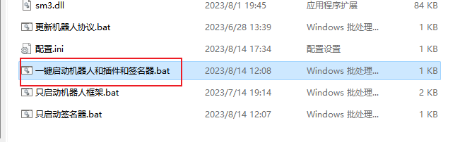

- [一、名词解释](#一名词解释)
- [二、配置教程](#二配置教程)
  - [0.预处理](#0预处理)
  - [1.解压压缩包](#1解压压缩包)
  - [2.运行配置程序](#2运行配置程序)
  - [3.生成配置](#3生成配置)
  - [4.运行启动脚本](#4运行启动脚本)
  - [5.登录账号](#5登录账号)
- [三、EQ-BDS面板配置机器人教程](#三eq-bds面板配置机器人教程)
  - [1.复制插件token](#1复制插件token)
  - [2.设置面板连接插件](#2设置面板连接插件)
  - [3.确认是否连接成功](#3确认是否连接成功)
  - [4.配置群号](#4配置群号)
  - [5.权限设置](#5权限设置)
- [后续升级机器人的方法](#后续升级机器人的方法)

# 一、名词解释

`机器人框架`指的是

`插件`指的是

签名器指的是

`机器人框架`配合`签名器`才能登录QQ号，两者必须同时运行，缺少任何一个都会导致QQ号登录不上，或者是QQ登录得上但是无法发送消息。

`插件`是连接`QQ号`和`EQ-BDS面板`的“桥梁”，没有它面板将无法对接您的QQ号

# 二、配置教程

## 0.预处理

首先处理杀毒软件误报问题。在服务器上安装火绒安全

> 当然，您也可以不选择火绒，使用其他杀毒软件，到时候给插件加上信任即可

安装完成后禁用Windows Defender，详见[EQ-BDS面板用户手册](https://xy0797.github.io/EQ-BDSDtonsoleDocs/EQ-BDS%E9%9D%A2%E6%9D%BF%E7%94%A8%E6%88%B7%E6%89%8B%E5%86%8C.html)

然后我们打开`家里面的电脑`，确保电脑和手机用的是`同一个路由器的网络！`

## 1.解压压缩包

直接解压即可，压缩包内是一个文件夹，不用担心直接解压会导致文件凌乱

## 2.运行配置程序

运行``go-cqhttp一键配置.exe``

## 3.生成配置

先输入你QQ的账号密码，然后点击生成配置，弹出询问框点击确定

> 禁止使用主账号做机器人，永久封号后果自负！！！

然后我们可以关闭``go-cqhttp一键配置.exe``

## 4.运行启动脚本

运行``一键启动机器人和插件和签名器.bat``

## 5.登录账号

我们找到机器人框架的窗口，耐心等待10秒

询问滑条验证码，请选择`自动提交`，也就是输入``1``并且按下回车键

然后我们复制链接到浏览器，完成滑条验证

然后可能会询问设备锁，我们选择`向手机xx发送短信验证码`，也就是输入``1``并且按下回车键

输入验证码后按回车键即可，看到以下信息说明登录成功：

注：在使用过程中可以经常看到机器人框架出现下图的这种报错，无视即可

# 三、EQ-BDS面板配置机器人教程

## 1.复制插件token

找到`插件`窗口，点击显示token，然后全选复制

## 2.设置面板连接插件

打开EQ-BDS面板，切换到`QQ机器人配置1`选项卡，粘贴token到编辑框内

如果机器人和您的面板不在同一个服务器，那么请您开放机器人所在服务器的TCP 6987端口，然后在“机器人IP地址”里面填写机器人所在服务器的IP地址

如果机器人和您的面板在同一个服务器，IP地址留空即可

如果您看不懂上述文字，IP地址留空即可

然后我们勾上``启用QQ机器人``

## 3.确认是否连接成功

切换到`基本控制`选项卡，可以看到显示机器人已连接

## 4.配置群号

切换到`QQ机器人配置2`选项卡，配置群号

如果您只有一个群，那么群号配置全部填写同一个群号。如果您有专门的管理群和聊天转发(群服互通)群，就填写到对应位置。

如图所示，`主群群号和管理群号不能留空！`

主群指的就是所有玩家都在的QQ群，管理群指的是只有服务器管理在的群。

虽然定义是这样子的，但是面板`允许管理群和主群为同一个群`，这是因为默认情况下“管理群私聊权限验证”是开启状态，只要这个开启，普通群成员就无法使用机器人命令，因此`把有玩家的群设置为管理群是安全的`。

如果您有`多个群都是`主群/聊天转发群/管理群，请用“#”分隔多个群号。比如说12451445和13467146都是主群，您填写``12451445#13467146``即可。

如果您有专门的管理群，并且想让群里面的所有成员都能使用机器人指令，请这样配置：

如果您没有专门的管理群，主群就是管理群，但是您不想让群管理员使用机器人指令，请这样配置：

## 5.权限设置

假如您的QQ为178932645，请先切换到`QQ机器人配置1`选项卡，在右下角的`QQ[#分割多个QQ]`填入您的QQ号，然后点击左边的`添加到权限列表`，这样子即可给予自己最高权限。给其它人权限依此类推。

如果您没有开启`管理群私聊权限验证`，那么所有在管理群的人，不管是不是群管，都相当于有最高权限。

如果开启了`管理群私聊权限验证`，并且开启了`给予管理群管理员最高权限`，那么管理群的群管和群主自动获得最高权限。

> 注意：私聊机器人时，不会检测您是否在管理群内有最高权限，所以说如果想私聊机器人控制服务器，您必须设置私聊权限。

# 后续升级机器人的方法

这里只描述大致的方法，`具体请阅读新版本附带的pdf教程`

1.在旧的机器人整合包运行`go-cqhttp一键配置.exe`，点击`导出配置`，弹出的询问框选择`确定`

完成后设置工具会提示导出完成，点击确认后设置工具会自动结束运行，注意到多出了`配置包`文件夹

我们把这个文件夹复制到新整合包的目录下

运行新整合包的一键配置工具，询问是否导入旧版本选择`是`

运行新整合包的`一键启动机器人和插件和签名器.bat`，完成QQ号的登录，这样就完成了升级，删除旧版本整合包

