<h1 align="center">EQ-BDS面板 || 一站式BDS开服解决方案</h1>

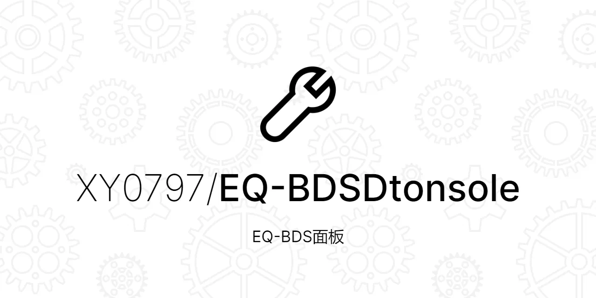

  
  
  

> ### 一个稳定、易用、扩展性强的Windows BDS面板
> ### 专为BDS打造，集成了大量功能，采用分体式架构，稳定好用

+ #### [下载最新版](#下载教程)
+ #### 👉[包含一切内容的用户手册](./EQ-BDS面板用户手册.md)👈
+ #### MineBBS帖子：https://www.minebbs.com/resources/eq-bds-3-2.4289/
+ #### QQ群：👉[1072180746](https://jq.qq.com/?_wv=1027&k=jPV9ohWe)👈

## ✨ 亮点

### 1.超高扩展性的正则命令

虽然面板的QQ机器人命令丰富到可以完全踹掉正则命令，但是本面板还是提供了类似Serein的正则命令满足您的定制化需求

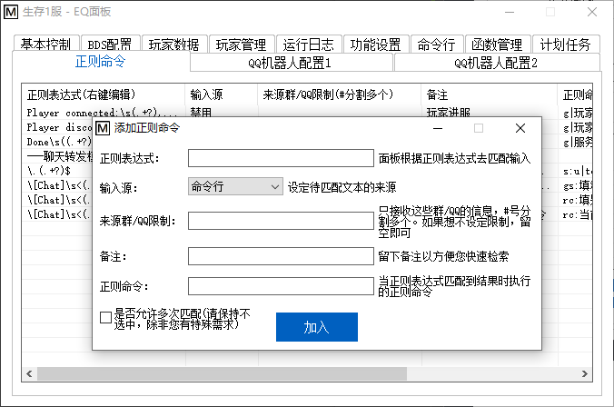

与Serein的正则命令不同的是，本面板有着独家的“远程正则命令”“正则命令执行QQ机器人指令”

*远程正则命令* 让正则命令可以跨服执行

*正则命令执行QQ机器人指令* 则让EQ面板丰富的QQ机器人命令都能与正则相结合

而且正则命令可以执行``JS脚本``，本面板提供了``EQ类``作为JS脚本与面板对接的接口

这意味这你可以使用ES5语法进行编程实现你想要的功能

同时我们还提供了``js调试器``(检查语法错误)

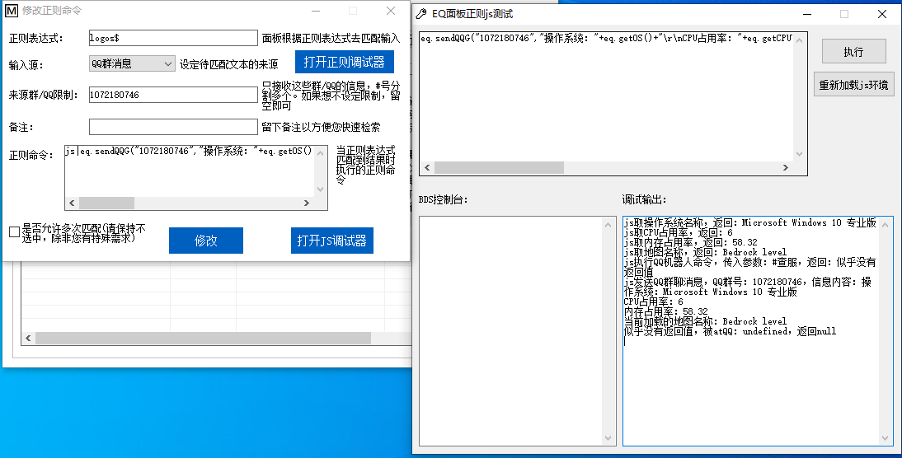

👉[用户手册](./EQ-BDS面板用户手册.md#十四正则命令)👈里面有详细的信息

### 2.丰富的QQ机器人指令

与Serein面板不同，本面板的主要自动化功能并不是依赖于正则，而是封装好的大量QQ机器人命令

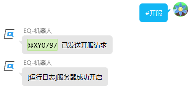

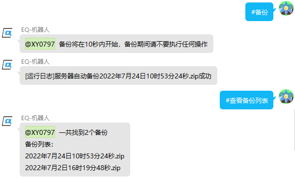

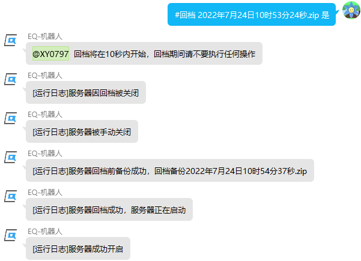

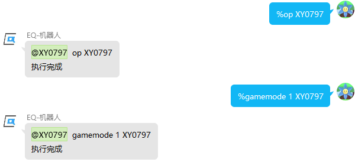

由于篇幅有限这里不可能一一展示所有的QQ机器人命令，👉[用户手册](./EQ-BDS面板用户手册.md#十二qq机器人指令)👈里面有详细的信息

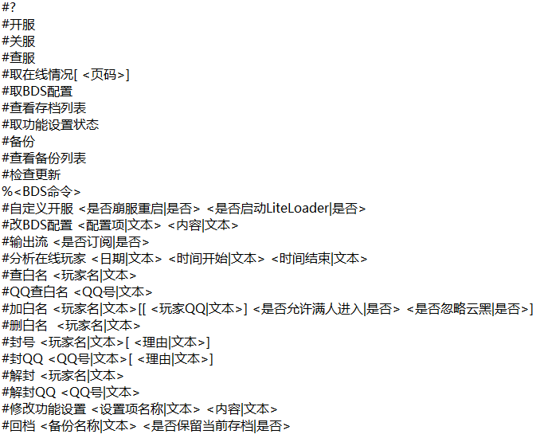

### 3.集成好的群服互通与查服命令

#### 群服互通
-------------------------
直接勾上开关，输入转发群群号，用``#``分割多个群号

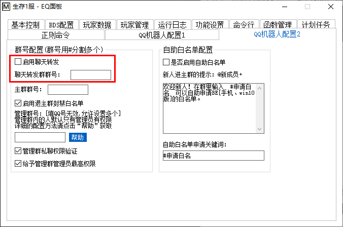

然后群内说的消息就会转发到游戏内，游戏中的内容就会转发到群内

群里面说话：

游戏里看得到：

游戏里说话：

群里面看得到：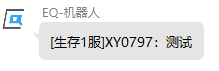

使用#号分割多个群号，例如：``12345#678910``

#### 查服命令
-------------------------
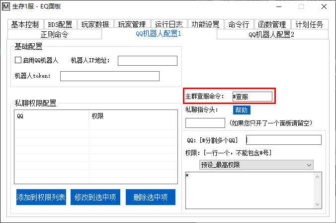

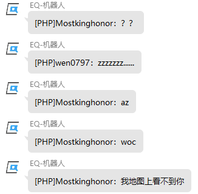

所有在您设置的主群内的玩家都能使用本命令，配置非常简便明了

### 4.免停服全自动更新

本面板现在已经支持全自动更新，无需任何操作。得益于本面板的分体式设计，本面板支持免停服更新。

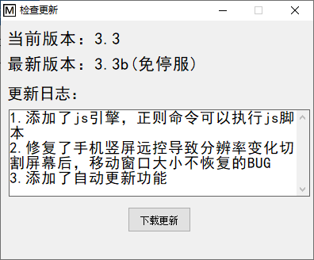

并且本面板还支持所有QQ机器人完成远程更新

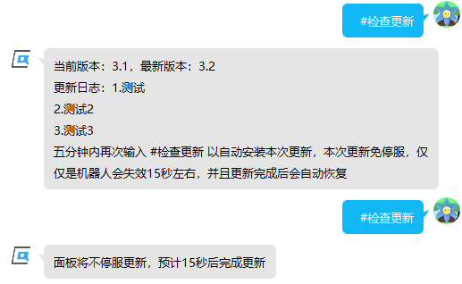

### 5.超详细的用户手册

用户手册目前接近2万字了，本人高考完的两个月都在肝面板，求支持啊😭

### 6.永久免费

本人做面板的初心就是让大家能免费获得付费级别的体验，所有的组件没有任何形式的收费或变相收费

除非您主动点击检测更新或使用命令检测更新或开启了云黑检测，否则面板不会与任何非您指定的服务器进行连接

另外认准本人QQ(1559095867)，不要被人骗了

> ⚠注意\
本人开发的go-cqhttp插件与mirai框架插件，永久免费，稳定高效\
[这个](https://blog.zeybk.cn/qq_robot/95.html)虽然写着“官方”，但是实际上并不是我写的，而是我一个朋友写的，出了问题我不负责。并且这个产品与我无资金往来，想要捐赠本项目请联系本人QQ(1559095867)。

## 🚀 下载安装

#### 下载教程：

到[这里](https://wwzv.lanzoue.com/b03j2esyb)下载``EQ面板go-cqhttp整合包.7z``，密码h3ik

如果7z打不开，请下载开源压缩解压软件``7zip``

如果没有安装微软运行库，请下载安装``微软运行库合集``

👉[用户手册](./EQ-BDS面板用户手册.md#一面板的安装)👈里面有详细的信息

## 📒 关于

### 👤 **XY0797**

- #### QQ号：1559095867

- #### e-mail：1559095867@qq.com

### QQ群：👉[1072180746](https://jq.qq.com/?_wv=1027&k=jPV9ohWe)👈