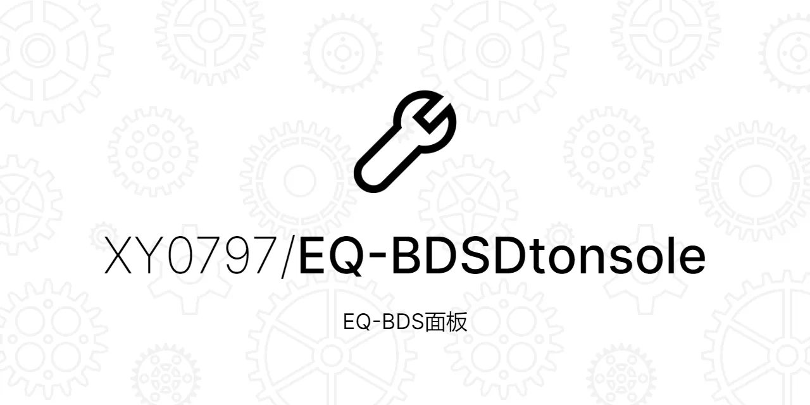

<h1 align="center">EQ-BDS面板 || 一站式BDS开服解决方案</h1>

  
  
  
  

> ### 一个稳定、易用、扩展性强的Windows BDS面板
> ### 专为BDS打造，集成了大量功能，采用分体式架构，稳定好用

+ #### 下载最新版：
+ #### [包含一切内容的用户手册](./EQ-BDS面板用户手册.md)
+ #### MineBBS帖子：https://www.minebbs.com/resources/eq-bds-3-2.4289/
+ #### QQ群：1072180746

## ✨ 特点

## 📒 关于