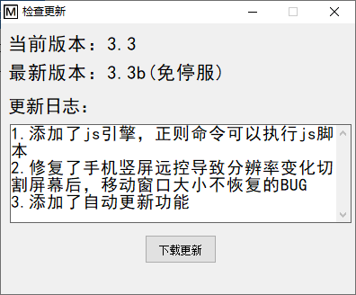
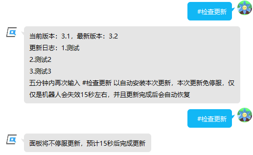
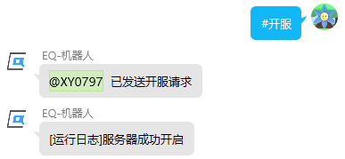
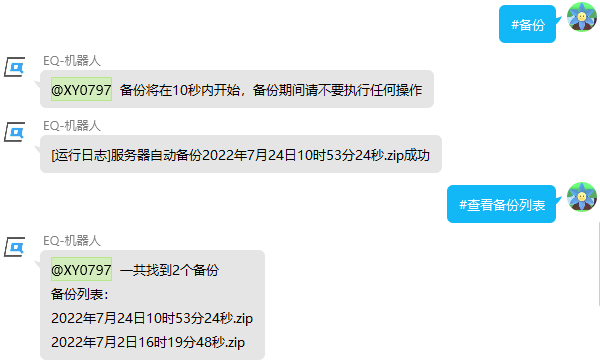
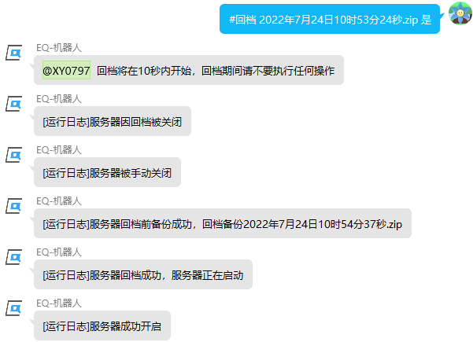
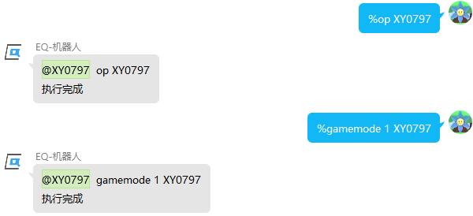
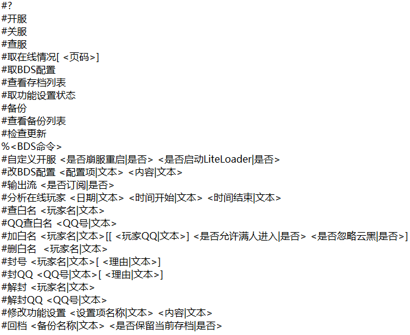

<h1 align="center">EQ-BDS面板 || 一站式BDS开服解决方案</h1>

  
  
  
  

> ### 一个稳定、易用、扩展性强的Windows BDS面板
> ### 专为BDS打造，集成了大量功能，采用分体式架构，稳定好用

+ #### 下载最新版：
+ #### 👉[包含一切内容的用户手册](./EQ-BDS面板用户手册.md)👈
+ #### MineBBS帖子：https://www.minebbs.com/resources/eq-bds-3-2.4289/
+ #### QQ群：👉[1072180746](https://jq.qq.com/?_wv=1027&k=jPV9ohWe)👈

## ✨ 亮点

### 1.免停服全自动更新

#### 本面板现在已经支持全自动更新，无需任何操作。得益于本面板的分体式设计，本面板支持免停服更新。

#### 并且本面板还支持所有QQ机器人完成远程更新

### 2.丰富的QQ机器人指令

#### 与Serein面板不同，本面板的主要自动化功能并不是依赖于正则，而是封装好的大量QQ机器人命令

#### 由于篇幅有限这里不可能一一展示所有的QQ机器人命令，👉[用户手册](./EQ-BDS面板用户手册.md#十二qq机器人指令)👈里面有详细的信息

### 3.集成好的群服互通与查服命令

### 4.超高扩展性的正则命令

#### 虽然面板的QQ机器人命令丰富到可以完全踹掉正则命令，但是我们还是提供了类似Serein的正则命令满足您的定制化需求

## 📒 关于