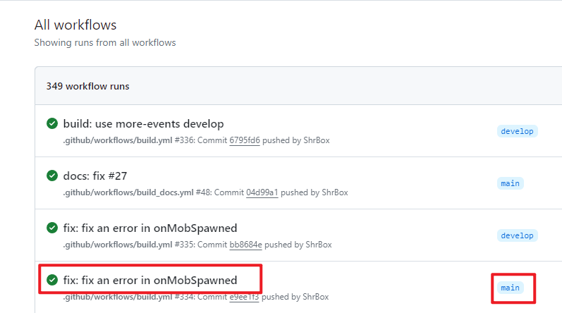
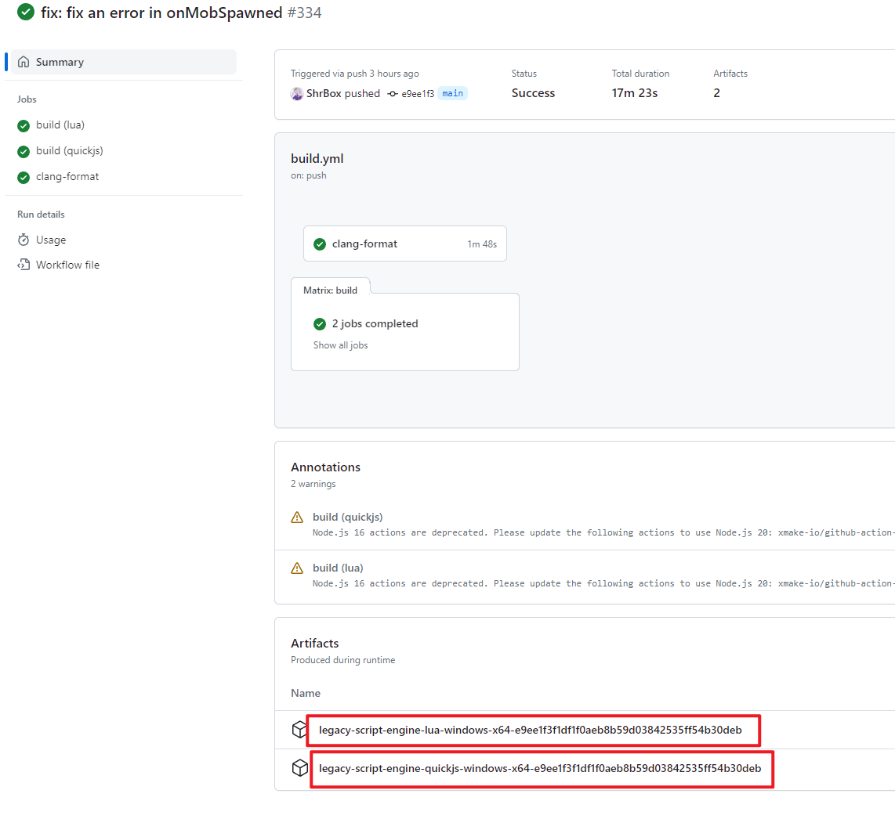
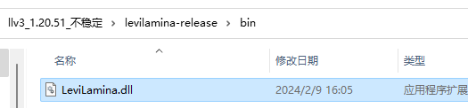
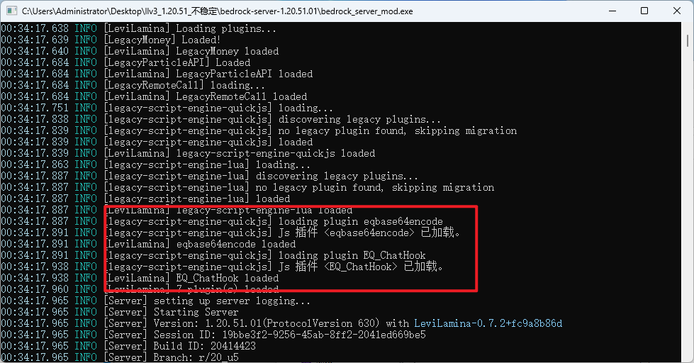

# llv3手动安装

## 1. 下载文件

安装llv3本体所需要的文件：

[LeviLamina](https://github.com/LiteLDev/LeviLamina)

[PreLoader](https://github.com/LiteLDev/PreLoader)

[PeEditor](https://github.com/LiteLDev/PeEditor)

llv3加载旧版本插件需要的文件：

[LegacyScriptEngine](https://github.com/LiteLDev/LegacyScriptEngine)

[LegacyMoney](https://github.com/LiteLDev/LegacyMoney)

[LegacyRemoteCall](https://github.com/LiteLDev/LegacyRemoteCall)

[LegacyParticleAPI](https://github.com/LiteLDev/LegacyParticleAPI)

到release里面下载最新的发行版本

其它的大同小异

也可以到action里面下载最新的开发版

但是有时候会遇到文档更新：

碰到上图这种说明是文档更新，这时候需要换一个action：

LegacyScriptEngine比较特殊，两个都要下载，其它的就是只下载一个就行

## 2. 安装

### 2.1 llv3本体

llv3需要9个文件：

先全部解压：

这三个拖入BDS文件夹：

然后像llv2一样运行这个：

跑一遍，然后stop关服：

这样子LLv3的本体就搞好了，但是不能加载插件

### 2.2 旧插件加载器

这5个文件：

放到这里：

运行一次，然后stop：

这样子插件加载器就搞定了

### 2.3 插件安装

然后把你的js/lua插件(注意！DLL插件请放弃)，一次一个的放入plugins文件夹

我这里已经确认了这几个插件能在llv3上跑，所以说同时放了两个

放入后必须运行一次，并且这一次必须加载完成就stop：

然后再运行一次，这一次插件就能加载了

然后进服务器检查功能是否正常，后台是否报错

报错或功能不正常就说明插件没用了，如果你不会开发的话就只能放弃

重复上面过程，完成插件迁徙

### 2.4 数据迁移

BDS常规的数据：

ll经济插件的数据：

至于插件的数据我还没有研究过，所以只能你们自己探索了