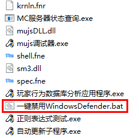
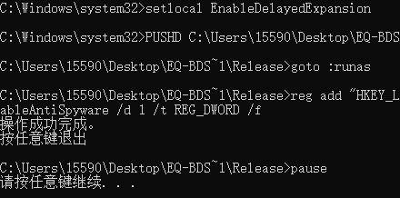
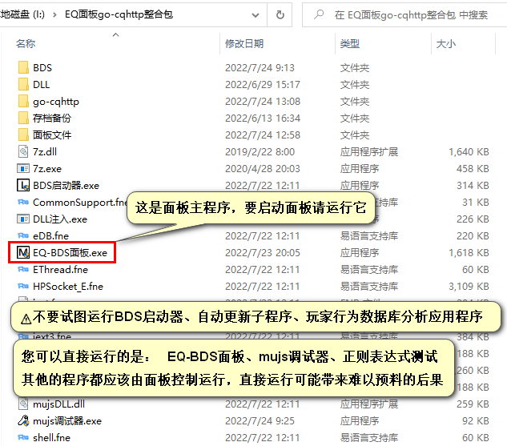
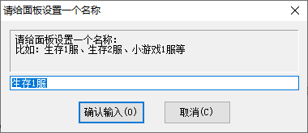
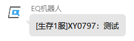

<!-- no toc -->
- [EQ-BDS面板用户手册](./旧版专用EQ面板用户手册.md)
  - [一、面板的安装](#一面板的安装)
    - [1.解决Windows Defender误报问题](#1解决windows-defender误报问题)
    - [2.了解面板目录下的程序](#2了解面板目录下的程序)
    - [3.部署QQ机器人](#3部署qq机器人)
  - [二、面板的基本结构](./二面板的基本结构.md)
  - [三、面板的基本控制](./三面板的基本控制.md)
  - [四、BDS配置](./四bds配置.md)
  - [五、玩家数据](./五玩家数据.md)
  - [六、玩家管理(查熊篇)](./六玩家管理查熊篇.md)
  - [六、玩家管理(白名单篇)](./六玩家管理白名单篇.md)
  - [七、日志与命令行](./七日志与命令行.md)
  - [八、函数管理(几乎用不上了，时代的眼泪)](./八函数管理几乎用不上了时代的眼泪.md)
  - [九、功能设置](./九功能设置.md)
  - [十、计划任务](./十计划任务.md)
  - [十一、QQ机器人](./十一qq机器人.md)
  - [十二、QQ机器人指令](./十二qq机器人指令.md)
  - [十三、同机器多面板支持](./十三同机器多面板支持.md)
  - [十四、正则命令](./十四正则命令.md)

## 一、面板的安装

### 1.解决Windows Defender误报问题

Windows Defender会随机把EQ面板认为是病毒然后删除，我们需要禁用它。

之所以一定要禁用它，是因为Windows Defender一开始不会报毒，在面板运行时会突然杀死面板，导致您即使恢复了EQ-BDS面板，还是得手动清除残留的BDS进程，相当于定时炸弹。

**⚠注意：必须先安装杀毒软件再禁用Windows Defender，否则会存在无杀软的空档期，存在安全隐患。**

个人推荐安装火绒安全，面板所有组件都不会被火绒安全报毒。

当然，您也可以安装其他杀毒软件，记得给面板所在文件夹添加信任，否则您通过QQ机器人检查更新会受影响。

先打开面板目录：

双击``一键禁用WindowsDefender.bat``，等提示``按任意键退出``后关闭窗口即可

(脚本会自动获取管理员权限)

### 2.了解面板目录下的程序

启动面板后会让您输入面板名称，这个配置非常重要，面板名称是面板的标识

⚠不能出现同一台机器里面有两个名字相同面板的情况！

面板名字要尽可能简短，名字过长可能会导致程序出错

如果面板后面开启了聊天转发(群服互通)功能，每一条转发的信息前都会自动加上面板名称如下图：

比较适合用您服务器的简称做面板名称，或者使用编号法：生存1服、生存2服、小游戏1服、创造1服。

### 3.部署QQ机器人

部署QQ机器人的教程详见QQ机器人整合包中的"部署QQ机器人.pdf"

您可以先阅读下一节"面板的基本结构"，有助于您了解面板分为哪几部分，更好地部署QQ机器人。

## 下一节
[二、面板的基本结构](./二面板的基本结构.md)

## 上一节
[目录](./旧版专用EQ面板用户手册.md)