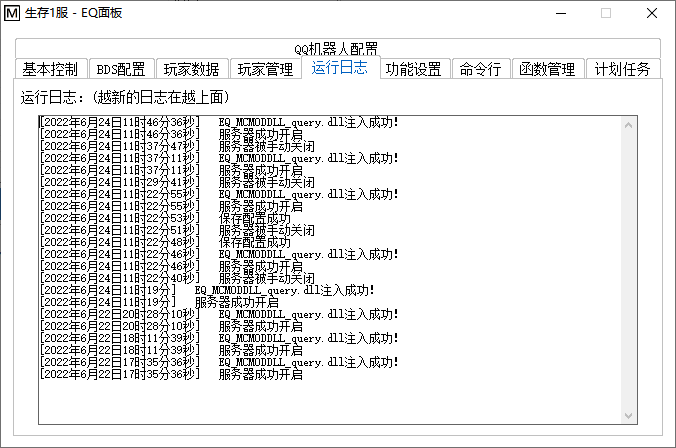

<!-- no toc -->
- [EQ-BDS面板用户手册](./旧版专用EQ面板用户手册.md)
  - [一、面板的安装](./一面板的安装.md)
  - [二、面板的基本结构](./二面板的基本结构.md)
  - [三、面板的基本控制](./三面板的基本控制.md)
  - [四、BDS配置](./四bds配置.md)
  - [五、玩家数据](./五玩家数据.md)
  - [六、玩家管理(查熊篇)](./六玩家管理查熊篇.md)
  - [六、玩家管理(白名单篇)](./六玩家管理白名单篇.md)
  - [七、日志与命令行](./七日志与命令行.md)
    - [1.运行日志](#1运行日志)
    - [2.命令行](#2命令行)
  - [八、函数管理(几乎用不上了，时代的眼泪)](./八函数管理几乎用不上了时代的眼泪.md)
  - [九、功能设置](./九功能设置.md)
  - [十、计划任务](./十计划任务.md)
  - [十一、QQ机器人](./十一qq机器人.md)
  - [十二、QQ机器人指令](./十二qq机器人指令.md)
  - [十三、同机器多面板支持](./十三同机器多面板支持.md)
  - [十四、正则命令](./十四正则命令.md)

## 七、日志与命令行

### 1.运行日志

这里显示面板运行时的日志，比如服务器启动、服务器崩溃、DLL插件加载失败

### 2.命令行

这里是手动操作的区域，您可以通过本界面直接输入BDS指令，按回车或"向服务器输入"按钮输入命令。

命令行会存储您上一次输入的内容，可以通过键盘的"上箭头"键直接调出您上一次输入的内容

如果服务器未开始，除了去基本控制区，您也可以输入start启动服务器，相应的，stop也能停止服务器

输入save可以让面板自动关服备份

此外，您可以通过上面的"输入命令后是否清空输入框内容"来设置您的输入喜好，默认是像命令行一样，输入命令后就会清空输入框。

"清空""滚至底部"的作用顾名思义，这里不赘述。

**暂停输出框刷新：**当输出框在不断刷新您又想停下来看历史输出流时，可以点击本按钮。再点击一次可以恢复显示

## 下一节

[八、函数管理(几乎用不上了，时代的眼泪)](./八函数管理几乎用不上了时代的眼泪.md)

## 上一节

[六、玩家管理(白名单篇)](./六玩家管理白名单篇.md)