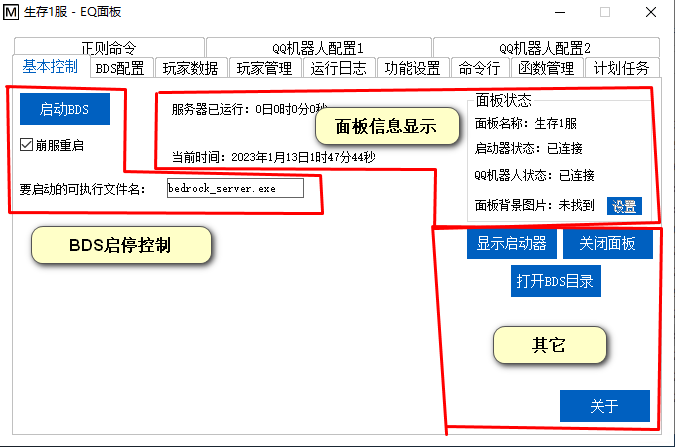
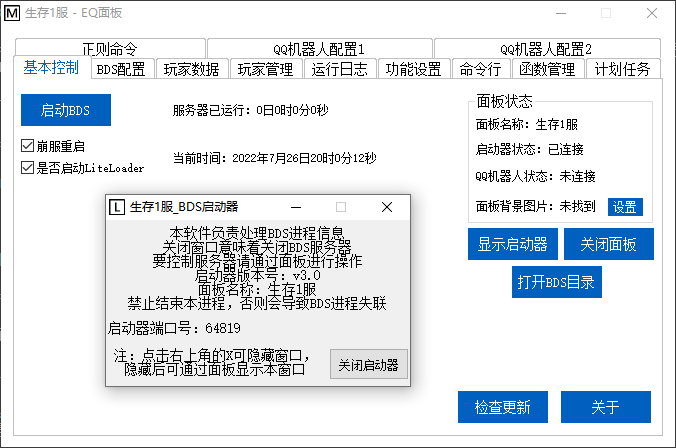
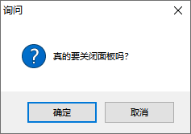
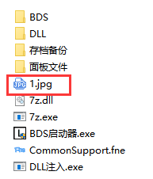
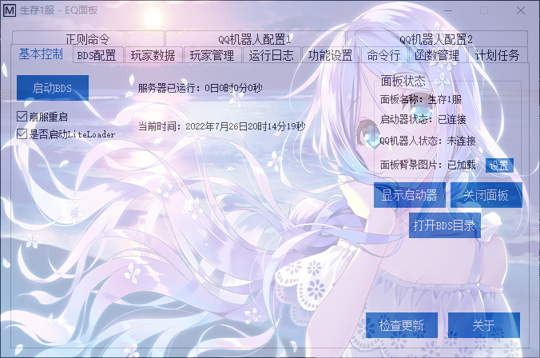
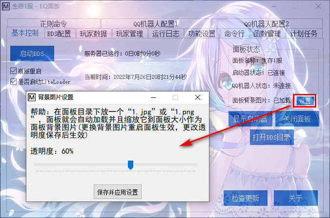

<!-- no toc -->
- [EQ-BDS面板用户手册](./旧版专用EQ面板用户手册.md)
  - [一、面板的安装](./一面板的安装.md)
  - [二、面板的基本结构](./二面板的基本结构.md)
  - [三、面板的基本控制](./三面板的基本控制.md)
    - [1.BDS启停控制](#1bds启停控制)
    - [2.面板状态指示](#2面板状态指示)
    - [3.其他](#3其他)
  - [四、BDS配置](./四bds配置.md)
  - [五、玩家数据](./五玩家数据.md)
  - [六、玩家管理(查熊篇)](./六玩家管理查熊篇.md)
  - [六、玩家管理(白名单篇)](./六玩家管理白名单篇.md)
  - [七、日志与命令行](./七日志与命令行.md)
  - [八、函数管理(几乎用不上了，时代的眼泪)](./八函数管理几乎用不上了时代的眼泪.md)
  - [九、功能设置](./九功能设置.md)
  - [十、计划任务](./十计划任务.md)
  - [十一、QQ机器人](./十一qq机器人.md)
  - [十二、QQ机器人指令](./十二qq机器人指令.md)
  - [十三、同机器多面板支持](./十三同机器多面板支持.md)
  - [十四、正则命令](./十四正则命令.md)

## 三、面板的基本控制

### 1.BDS启停控制

点击"启动BDS"即可启动BDS服务器，在启动前您可以修改下面两个选择框的选中状态。

勾上"崩服重启"后，一旦检测到服务器崩溃，那么会自动重启BDS

“要启动的可执行文件名”里面填写BDS的exe文件名

### 2.面板状态指示

显示BDS的单次运行时长、面板名称、各组件连接状态

### 3.其他

+ "显示启动器"：启动器在已经连接上面板的状态下默认是隐藏的，本按钮可以显示启动器窗口(本功能没什么用，仅方便排查故障)

+ "关闭面板"：点击右上角的"X"只能最小化面板到托盘，本按钮能真正地关闭面板，两个都选"是"即可

+ "打开BDS目录"：该按钮相当于一个快捷方式，让您可以快速进入BDS文件夹。

+ "关于"：显示本面板的相关信息。

+ "背景图片设置"：在面板目录下放一个叫``1.jpg``或``1.png``的图片，重启面板后面板就会载入背景图片

> ⚠注意：面板会缩放图片到面板大小，而且不是等比例缩放，长比宽尽可能为1.5。\
> 上图演示的背景图片是1920:1080的尺寸(564KB)，尽可能不要使用太大的图片，图片太大没有意义并且浪费性能。

点击背景图片状态显示旁边的``设置``按钮，可以设置透明度，透明度范围``1``至``100``，点击``保存并应用设置``后设置立即生效

## 下一节

[四、BDS配置](./四bds配置.md)

## 上一节

[二、面板的基本结构](./二面板的基本结构.md)