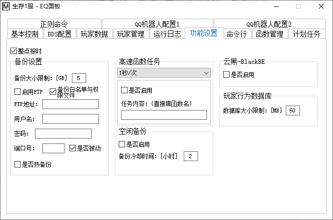
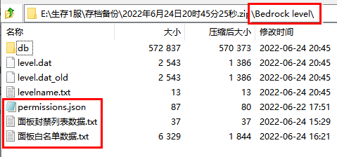

<!-- no toc -->
- [EQ-BDS面板用户手册](./旧版专用EQ面板用户手册.md)
  - [一、面板的安装](./一面板的安装.md)
  - [二、面板的基本结构](./二面板的基本结构.md)
  - [三、面板的基本控制](./三面板的基本控制.md)
  - [四、BDS配置](./四bds配置.md)
  - [五、玩家数据](./五玩家数据.md)
  - [六、玩家管理(查熊篇)](./六玩家管理查熊篇.md)
  - [六、玩家管理(白名单篇)](./六玩家管理白名单篇.md)
  - [七、日志与命令行](./七日志与命令行.md)
  - [八、函数管理(几乎用不上了，时代的眼泪)](./八函数管理几乎用不上了时代的眼泪.md)
  - [九、功能设置](./九功能设置.md)
    - [1.整点报时](#1整点报时)
    - [2.备份大小限制](#2备份大小限制)
    - [3.备份白名单和权限文件](#3备份白名单和权限文件)
    - [4.FTP](#4ftp)
    - [5.热备份](#5热备份)
    - [6.高速函数任务](#6高速函数任务)
    - [7.空闲备份](#7空闲备份)
    - [8.云黑](#8云黑)
    - [9.玩家行为数据库大小限制](#9玩家行为数据库大小限制)
  - [十、计划任务](./十计划任务.md)
  - [十一、QQ机器人](./十一qq机器人.md)
  - [十二、QQ机器人指令](./十二qq机器人指令.md)
  - [十三、同机器多面板支持](./十三同机器多面板支持.md)
  - [十四、正则命令](./十四正则命令.md)

## 九、功能设置

### 1.整点报时

开启本功能后，会根据服务器上的系统时间，到整点后提醒用户

### 2.备份大小限制

存档文件的文件夹大小上限，如果超过限制，将自动删除最旧的存档(这一项请不要设置的太小，如果备份大小限制小于存档大小，那么将自动删除备份好的存档！)

### 3.备份白名单和权限文件

开启这一项将自动备份白名单及权限文件(记录服务器OP的文件)，如下图

### 4.FTP

如果启用并且设置了FTP，那么备份完成后将自动上传备份好的存档到服务器

### 5.热备份

**建议开启，开启本功能后，就可以在不停服的情况下完成存档备份。配合面板的计划任务，可以实现按一定周期自动备份**

### 6.高速函数任务

如果您有函数想由服务器后台以较高频率(1秒/次)执行，那么只需要选择对应频率，输入函数名，勾上"是否启用"，重启BDS后应用将生效。如果要定时执行或更慢频率(比1分钟/次更慢)执行，那么可以使用面板计划任务中的"定时任务_循环""周期任务"执行function指令。

### 7.空闲备份

(如果您开启了热备份，请不要开启空闲备份)开启本功能后，面板将在无人情况持续3分钟且不在冷却时间时自动备份，建议根据服务器情况设置不同的冷却时间。个人认为小服4小时，大服8小时比较好。

### 8.云黑

白名单部分有介绍，控制服务器是否启用云黑检查。

### 9.玩家行为数据库大小限制

控制单个玩家行为数据库的文件大小，如果超过这个大小，将会分出不同的数据库文件保存。这么做的好处是：避免数据库文件过大导致查熊时间过长

## 下一节

[十、计划任务](./十计划任务.md)

## 上一节

[八、函数管理(几乎用不上了，时代的眼泪)](./八函数管理几乎用不上了时代的眼泪.md)