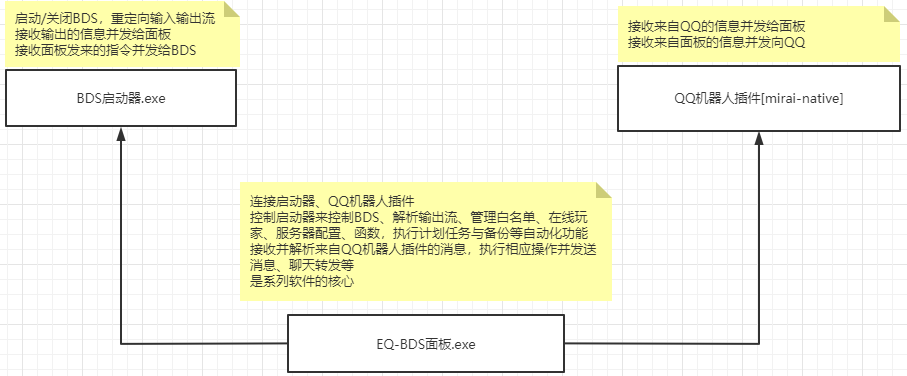
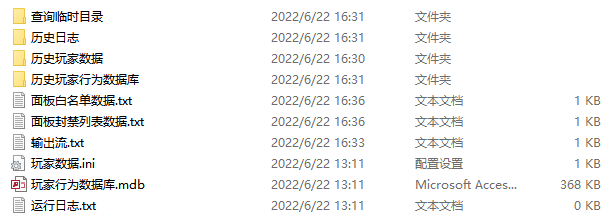

<!-- no toc -->
- [EQ-BDS面板用户手册](./旧版专用EQ面板用户手册.md)
  - [一、面板的安装](./一面板的安装.md)
  - [二、面板的基本结构](./二面板的基本结构.md)
    - [文件夹结构](#文件夹结构)
  - [三、面板的基本控制](./三面板的基本控制.md)
  - [四、BDS配置](./四bds配置.md)
  - [五、玩家数据](./五玩家数据.md)
  - [六、玩家管理(查熊篇)](./六玩家管理查熊篇.md)
  - [六、玩家管理(白名单篇)](./六玩家管理白名单篇.md)
  - [七、日志与命令行](./七日志与命令行.md)
  - [八、函数管理(几乎用不上了，时代的眼泪)](./八函数管理几乎用不上了时代的眼泪.md)
  - [九、功能设置](./九功能设置.md)
  - [十、计划任务](./十计划任务.md)
  - [十一、QQ机器人](./十一qq机器人.md)
  - [十二、QQ机器人指令](./十二qq机器人指令.md)
  - [十三、同机器多面板支持](./十三同机器多面板支持.md)
  - [十四、正则命令](./十四正则命令.md)

## 二、面板的基本结构

面板采用分体式架构，相比一体化设计，稳定性更强。各模块间使用TCP组件进行连接

启动器与面板的连接是本机通讯，全自动完成连接

QQ机器人插件和面板间支持跨主机通讯，采用自研加密算法加密，因此需要手动输入IP和token(您可以把token理解成密码)

除了mirai框架的QQ机器人，我们还支持go-cqhttp框架(更简便)，默认提供的整合包内置了go-cqhttp框架的QQ机器人

### 文件夹结构

1."BDS"文件夹：顾名思义，存放着BDS

面板不附带BDS，您可以把您以前用的端复制进去

如果您是纯小白，您需要先下载👉[BDS](https://www.minebbs.com/bds/)👈

如果这一步遇到了问题，欢迎进入👉[QQ群](https://jq.qq.com/?_wv=1027&k=jPV9ohWe)👈提问

2."DLL"文件夹：这里面存放着DLL插件，如果需要加载DLL插件，放入此文件夹，重启BDS后面板会自动加载。

这里的DLL插件指的是类似梦之故里的注入式DLL插件

**不要往这里放LL插件的DLL版本，否则崩服**

3."存档备份"文件夹：保存EQ面板自动备份的存档，均为zip格式,您可以用里面的备份回档，如果配置好了QQ机器人，也可以用QQ机器人回档。

4."面板文件"文件夹：保存EQ面板的各项文件

>"输出流.txt"中保存着命令行的输出，如果文件大于5MB，会自动切片放入"历史日志"文件夹，"运行日志.txt"同理。

>"玩家数据.ini"中保存着当天在线的玩家信息，可以通过面板的在线玩家分析功能调出指定时间在线的玩家，该文件以日为单位，每过一天都会把前一天的文件重命名并放入"历史玩家数据"文件夹内。

>"玩家行为数据库.mdb"中保存着玩家的所有行为信息\
包括破坏方块、放置方块、操作物品(使用物品，比如说放方块，点火)、置箱子物品(往哪里的箱子的哪一个槽位放入多少个哪一种物品)、取空物品(从箱子里面拿东西，比如说偷东西)、聊天信息(公开的、悄悄话都记录)、有名字的实体死亡(比如说玩家死亡、被命名牌命名的生物死亡)\
可用于查熊

>"面板白名单数据.txt"中保存着白名单列表，您可以直接打开并且复制粘贴到WPS/Excel表格内进行编辑，编辑后复制粘贴回去。如果您要手动修改，需要先关闭面板，否则您的修改不会被识别，甚至可能会被面板的自动保存替换。

>"面板封禁列表数据.txt"中保存着封禁列表，您可以通过面板查看修改封禁列表。

>"查询临时目录"文件夹存放的是查熊(玩家行为数据库查询)时的临时文件，您完全可以忽略它。

## 下一节

  - [三、面板的基本控制](./三面板的基本控制.md)

## 上一节

  - [一、面板的安装](./一面板的安装.md)