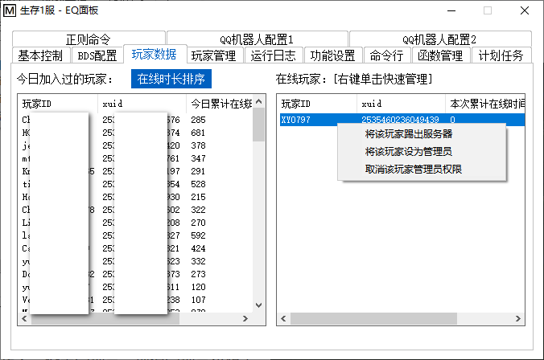

<!-- no toc -->
- [EQ-BDS面板用户手册](./旧版专用EQ面板用户手册.md)
  - [一、面板的安装](./一面板的安装.md)
  - [二、面板的基本结构](./二面板的基本结构.md)
  - [三、面板的基本控制](./三面板的基本控制.md)
  - [四、BDS配置](./四bds配置.md)
  - [五、玩家数据](./五玩家数据.md)
  - [六、玩家管理(查熊篇)](./六玩家管理查熊篇.md)
  - [六、玩家管理(白名单篇)](./六玩家管理白名单篇.md)
  - [七、日志与命令行](./七日志与命令行.md)
  - [八、函数管理(几乎用不上了，时代的眼泪)](./八函数管理几乎用不上了时代的眼泪.md)
  - [九、功能设置](./九功能设置.md)
  - [十、计划任务](./十计划任务.md)
  - [十一、QQ机器人](./十一qq机器人.md)
  - [十二、QQ机器人指令](./十二qq机器人指令.md)
  - [十三、同机器多面板支持](./十三同机器多面板支持.md)
  - [十四、正则命令](./十四正则命令.md)

## 五、玩家数据

本界面显示今日在线玩家及其今日的累计在线时间，也可以查看在线玩家和玩家单次在线时间。

选中一个在线玩家，右键可以弹出上图的菜单，快速执行踢人、设置管理员、取消管理员权限等

默认情况下不会对今日在线玩家进行排序，如果您想以在线时长对玩家列表进行排序，请点击"在线时长排序"按钮

## 下一节

[四、BDS配置](./四bds配置.md)

## 上一节

[六、玩家管理(查熊篇)](./六玩家管理查熊篇.md)