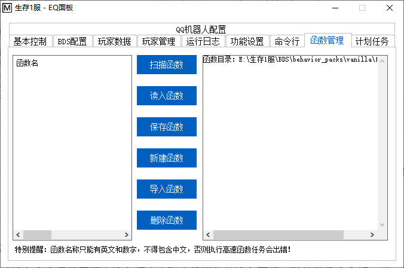

<!-- no toc -->
- [EQ-BDS面板用户手册](./旧版专用EQ面板用户手册.md)
  - [一、面板的安装](./一面板的安装.md)
  - [二、面板的基本结构](./二面板的基本结构.md)
  - [三、面板的基本控制](./三面板的基本控制.md)
  - [四、BDS配置](./四bds配置.md)
  - [五、玩家数据](./五玩家数据.md)
  - [六、玩家管理(查熊篇)](./六玩家管理查熊篇.md)
  - [六、玩家管理(白名单篇)](./六玩家管理白名单篇.md)
  - [七、日志与命令行](./七日志与命令行.md)
  - [八、函数管理(几乎用不上了，时代的眼泪)](./八函数管理几乎用不上了时代的眼泪.md)
    - [1.扫描函数](#1扫描函数)
    - [2.读入函数](#2读入函数)
    - [3.保存函数](#3保存函数)
    - [4.新建函数](#4新建函数)
    - [5.导入函数](#5导入函数)
    - [6.删除函数](#6删除函数)
  - [九、功能设置](./九功能设置.md)
  - [十、计划任务](./十计划任务.md)
  - [十一、QQ机器人](./十一qq机器人.md)
  - [十二、QQ机器人指令](./十二qq机器人指令.md)
  - [十三、同机器多面板支持](./十三同机器多面板支持.md)
  - [十四、正则命令](./十四正则命令.md)

## 八、函数管理(几乎用不上了，时代的眼泪)

函数：就是".mcfunction"文件。如果您从未听说这种文件，可以阅读下面的简介。

(mcfunction文件：存储一系列命令方块代码的文件，文件名是区分函数文件的唯一标识，在游戏内输入以下指令就能执行mcfunction文件的内容：function <函数文件名>。每个function中的指令都按顺序执行，仅需一个命令方块就可以执行原本需要大量命令方块的命令(使用本面板甚至可以不需要命令方块)，可以缓解命令方块过多带来的卡顿)

### 1.扫描函数

使用本功能前需要先点击本按钮，否则即使有函数，左侧列表也不会有任何内容

### 2.读入函数

您选中了左边的一项后，为了防止误操作，面板并不会读入内容，需要您点击本按钮才能载入

### 3.保存函数

您修改了函数后，为了防止误操作，面板并不会自动保存，需要您手动点击本按钮才能应用您的更改

### 4.新建函数

如果您要新建一个函数，首先在右边的编辑框输入您想放入新函数的内容，然后点击本按钮，输入函数名称后就能新建一个函数了

### 5.导入函数

如果您之前已经做了一些函数文件，点击本按钮，选中函数文件，就会自动复制您的函数文件到函数目录内(支持多选)

### 6.删除函数

在左侧选中您想要删除的函数，点击本按钮即可删除这个函数

## 下一节

[九、功能设置](./九功能设置.md)

## 上一节

[七、日志与命令行](./七日志与命令行.md)