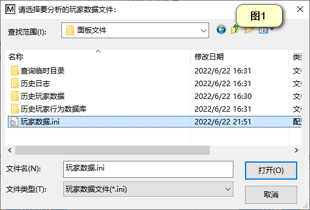

<!-- no toc -->
- [EQ-BDS面板用户手册](./旧版专用EQ面板用户手册.md)
  - [一、面板的安装](./一面板的安装.md)
  - [二、面板的基本结构](./二面板的基本结构.md)
  - [三、面板的基本控制](./三面板的基本控制.md)
  - [四、BDS配置](./四bds配置.md)
  - [五、玩家数据](./五玩家数据.md)
  - [六、玩家管理(查熊篇)](./六玩家管理查熊篇.md)
    - [1.在线玩家分析](#1在线玩家分析)
    - [2.玩家行为数据库提取](#2玩家行为数据库提取)
  - [六、玩家管理(白名单篇)](./六玩家管理白名单篇.md)
  - [七、日志与命令行](./七日志与命令行.md)
  - [八、函数管理(几乎用不上了，时代的眼泪)](./八函数管理几乎用不上了时代的眼泪.md)
  - [九、功能设置](./九功能设置.md)
  - [十、计划任务](./十计划任务.md)
  - [十一、QQ机器人](./十一qq机器人.md)
  - [十二、QQ机器人指令](./十二qq机器人指令.md)
  - [十三、同机器多面板支持](./十三同机器多面板支持.md)
  - [十四、正则命令](./十四正则命令.md)

## 六、玩家管理(查熊篇)

本界面可以打开白名单管理，操作玩家行为分析、玩家行为数据库提取

### 1.在线玩家分析

本功能可以获取某个时间段的在线玩家，首先您得选择一个玩家数据文件，点击"选择"按钮

先进入面板的目录，进入"面板文件"文件夹，里面的\"玩家数据.ini\"就是当天的玩家数据文件了，如下图①。

玩家数据文件以天为单位保存，如果您要查询以前的玩家数据文件，可以进一步进入"历史玩家数据"文件夹，您可以看到里面全是玩家数据文件，每一个文件后面就是其日期，如上图②。

假设您需要获取2022年6月21日0:00到23:02的在线玩家，那么您就需要先选中2022年6月21日的玩家数据文件，如上图②，然后输入时间范围，点击开始分析按钮，最后就能看到结果。

您也可以利用本功能，一个一个时间段的尝试来确定某一玩家不在线的时间。

### 2.玩家行为数据库提取(已弃用)

> 很遗憾，由于该部分代码过于古老，已经跟不上时代了，所以已经被弃用。未来会给出替代解决方案

本功能是查熊的主力，使用本面板会自动加载玩家行为记录插件，面板会自动解析内容并且保存到数据库

会记录的玩家行为包括：破坏方块、放置方块、操作物品(使用物品，比如说放方块，点火)

置箱子物品(往哪里的箱子的哪一个槽位放入多少个哪一种物品)、取空物品(从箱子里面拿东西，比如说偷东西)

聊天信息(公开的、悄悄话都记录)、有名字的实体死亡(比如说玩家死亡、被命名牌命名的生物死亡)

输入时间范围后点击"一键提取"就会自动把时间范围内的玩家行为数据库提取到\"面板文件\\查询临时目录\"下，并且自动打开查熊工具。下面是一个实际例子的展示：

假如，玩家XY0791报告他在2022/6/24 11:30下线了，然后11:40回来，发现自己箱子里面的钻石块、铁块、下界合金锭都不见了。

首先我们进入游戏，查看该玩家指出的事发地点，取左下角和右上角的坐标

如果您服务器的"显示坐标"无法开启，请输入指令"/gamerule showcoordinates true"

假如测得的坐标值为(-56,107,108)(-48,112,116)

我们记录下这个坐标。

然后我们输入时间范围，由于这个事件的作案时间段是2022/6/24 11:30到2022/6/24 11:40，都在2022/6/24当天，所以说我们都填2022年6月24日。

如果是2022/6/24 11:30到2022/6/25 11:40，那么时间min就填2022年6月24日，时间max就填2022年6月25日，其他情况依此类推。

选好日期后我们点击一键提取按钮，等待一段时间，面板会自动打开玩家行为数据库分析程序：

我们先输入时间范围，本示例的案发时间是2022/6/24 11:30到2022/6/24 11:40，所以我们就填上去

案件是有人偷了东西，所以说我们选择"取空物品"

我们先输入之前记录的坐标范围

然后我们要排除这个箱子拥有者"XY0791"的操作，看看其他人是否有取空箱子的行为，因此我们输入箱子拥有者的名字，勾上取反。

最后我们点击"开始搜索"

我们可以看到，是玩家"XY0797"偷走了东西，查熊结束。

如果搜索结果过多，您可以进一步排除玩家，比如说玩家"XY0792"是他小号，我们要进一步排除他：

如图，先选择数据源为"来自上一次的搜索结果"，然后输入"XY0792"，勾上取反以排除他，最后点击"开始搜索"，这样子就能进一步缩小搜索范围。

如果您要查询其他信息，依次类推。

## 下一节

[六、玩家管理(白名单篇)](./六玩家管理白名单篇.md)

## 上一节

[五、玩家数据](./五玩家数据.md)