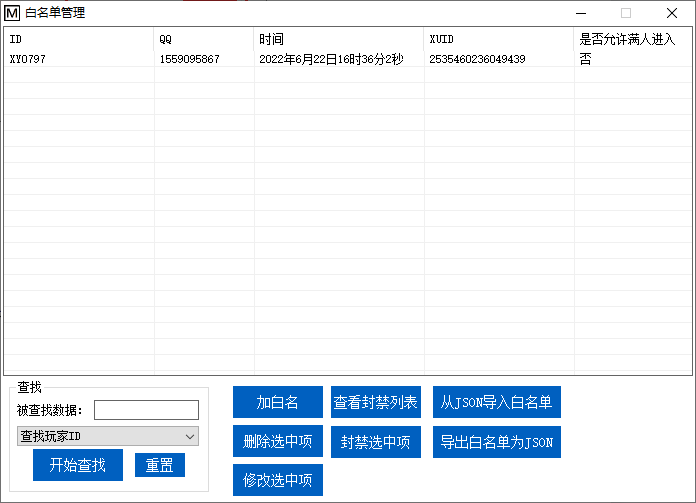
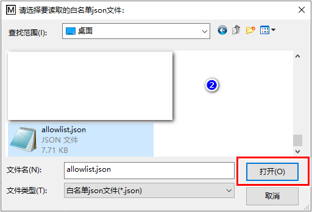
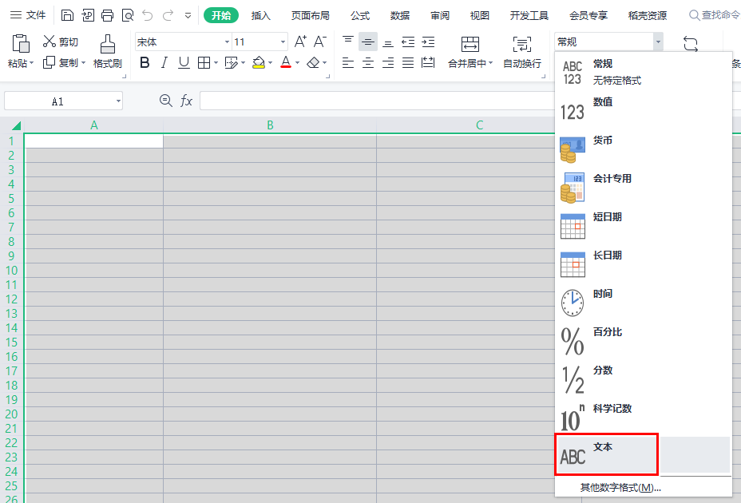
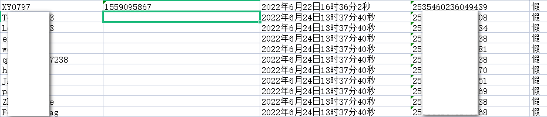
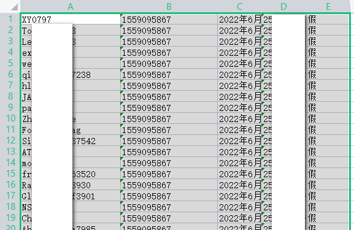
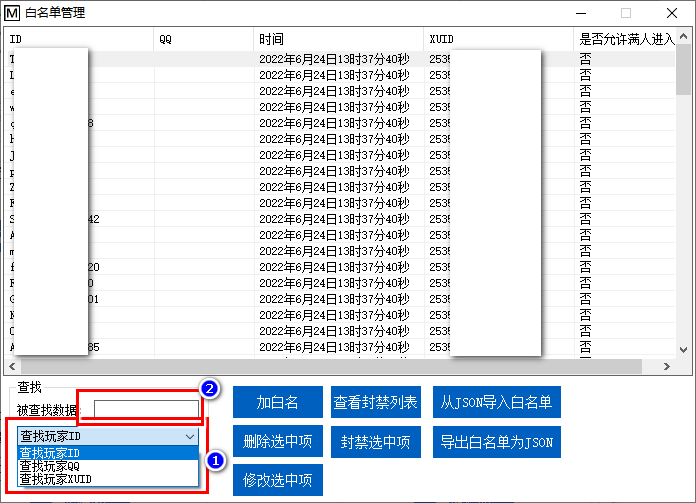
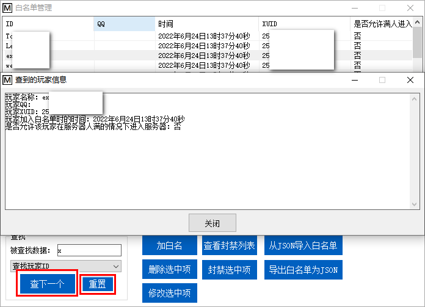
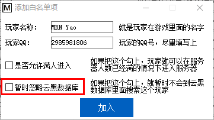
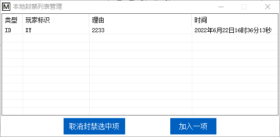

<!-- no toc -->
- [EQ-BDS面板用户手册](./旧版专用EQ面板用户手册.md)
  - [一、面板的安装](./一面板的安装.md)
  - [二、面板的基本结构](./二面板的基本结构.md)
  - [三、面板的基本控制](./三面板的基本控制.md)
  - [四、BDS配置](./四bds配置.md)
  - [五、玩家数据](./五玩家数据.md)
  - [六、玩家管理(查熊篇)](./六玩家管理查熊篇.md)
  - [六、玩家管理(白名单篇)](./六玩家管理白名单篇.md)
    - [1.从json导入白名单](#1从json导入白名单)
    - [2.导出白名单为JSON](#2导出白名单为json)
    - [3.查找](#3查找)
    - [4.加白名单](#4加白名单)
    - [5.修改选中项](#5修改选中项)
    - [6.删除选中项](#6删除选中项)
    - [7.封禁选中项](#7封禁选中项)
    - [8.查看封禁列表](#8查看封禁列表)
  - [七、日志与命令行](./七日志与命令行.md)
  - [八、函数管理(几乎用不上了，时代的眼泪)](./八函数管理几乎用不上了时代的眼泪.md)
  - [九、功能设置](./九功能设置.md)
  - [十、计划任务](./十计划任务.md)
  - [十一、QQ机器人](./十一qq机器人.md)
  - [十二、QQ机器人指令](./十二qq机器人指令.md)
  - [十三、同机器多面板支持](./十三同机器多面板支持.md)
  - [十四、正则命令](./十四正则命令.md)

## 六、玩家管理(白名单篇)

我们点击"玩家管理"选项卡内的"白名单管理"按钮后，可以打开白名单管理界面。

对于日常加白名单等操作，支持使用QQ机器人指令控制

详见[十二、QQ机器人指令](./十二qq机器人指令.md)

### 1.从json导入白名单

如果您原本就有白名单，您可以点击"从JSON导入白名单"

这些导入的白名单项没有QQ号，因此您需要逐个选中，然后单击"修改选中项"以绑定QQ号。

您也可以等1分钟(等待自动保存)，然后关闭面板，进入"面板文件\\面板白名单数据.txt"，复制文件内的内容，粘贴到WPS表格或Excel表格进行编辑。

⚠注意：粘贴前请全选表格内容，设置为文本类型，否则XUID这一栏会被转化为科学计数法！

编辑完成后，全选表格内容，复制并粘贴回"面板白名单数据.txt"中，这样子也能完成QQ绑定。

### 2.导出白名单为JSON

顾名思义，把白名单数据库导出成json，一般用不上。

### 3.查找

先选择您要查询什么,再输入您要查询的数据，然后点击"开始查找"，面板会弹出查询结果

如果您要查询下一个，点击"查下一个"，如果您要查询其他信息，请点击"重置"

### 4.加白名单

在介绍加白名单之前，建议您开启云黑功能，这样子在加白名前面板会自动在云黑中查询，从而减少遇到熊孩子的概率。

(云黑简介：云黑是一个完全免费的联合封禁项目，联合了大量服务器共享熊孩子信息，并且有专人审核，可以在一定程度上预防您遇到熊孩子。云黑官方网站：https://blackbe.xyz/)

点击"加白名"后，会弹出白名单添加窗口，输入玩家信息后点击"加入"按钮即可完成白名单的加入

如果您开启了云黑功能，可能会看到以下窗口，您可以点击"确定"键查看相关细节

根据云黑数据库内的详细信息，您可以自己做出决定，放弃加入或忽略云黑数据库信息加入

如果您要忽略云黑数据库信息加入，先关闭提示框，回到添加白名单的界面，会多出"暂时忽略云黑数据库"的选项

勾上后就能忽略这一次的云黑数据库查询结果，将该玩家加入白名单。

### 5.修改选中项

先在上面的表格中选中一个白名单项，然后点击这个按钮就修改选中的白名单。本选项一般用于补充玩家的QQ信息，或者修改加白名时输入错误的内容。

### 6.删除选中项

先在上面的表格中选中一个白名单项，然后点击这个按钮就能删除您选中的白名单项

### 7.封禁选中项

先在上面的表格中选中一个白名单项，然后点击这个按钮就能封禁您选中的白名单

### 8.查看封禁列表

点击本按钮可以打开本地封禁列表的查看编辑界面

您可以选中其中一项，然后点击"取消封禁选中项"就能解封

您也可以点击"加入一项"来手动封禁玩家(甚至是不在白名单列表的玩家)

## 下一节

[七、日志与命令行](./七日志与命令行.md)

## 上一节

[六、玩家管理(查熊篇)](./六玩家管理查熊篇.md)