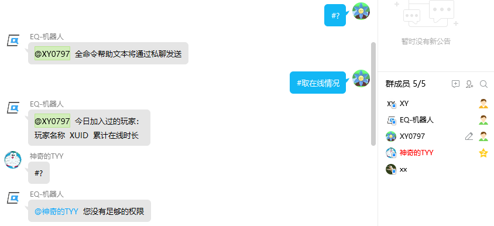
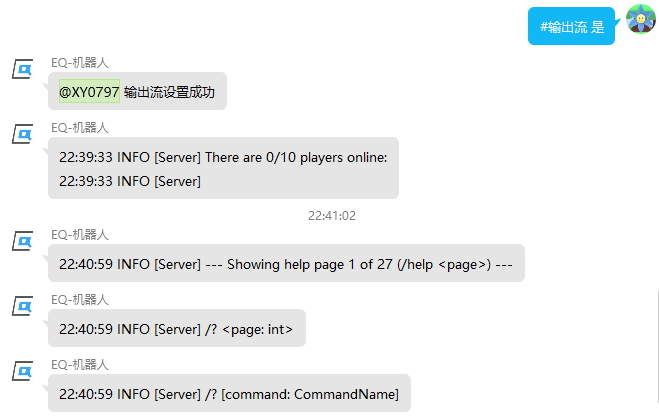

<!-- no toc -->
- [EQ-BDS面板用户手册](./旧版专用EQ面板用户手册.md)
  - [一、面板的安装](./一面板的安装.md)
  - [二、面板的基本结构](./二面板的基本结构.md)
  - [三、面板的基本控制](./三面板的基本控制.md)
  - [四、BDS配置](./四bds配置.md)
  - [五、玩家数据](./五玩家数据.md)
  - [六、玩家管理(查熊篇)](./六玩家管理查熊篇.md)
  - [六、玩家管理(白名单篇)](./六玩家管理白名单篇.md)
  - [七、日志与命令行](./七日志与命令行.md)
  - [八、函数管理(几乎用不上了，时代的眼泪)](./八函数管理几乎用不上了时代的眼泪.md)
  - [九、功能设置](./九功能设置.md)
  - [十、计划任务](./十计划任务.md)
  - [十一、QQ机器人](./十一qq机器人.md)
    - [1.部署](#1部署)
    - [2.聊天转发(群服互通)](#2聊天转发群服互通)
    - [3.主群群号](#3主群群号)
    - [4.管理群号](#4管理群号)
    - [5.私聊权限配置](#5私聊权限配置)
    - [6.私聊指令头](#6私聊指令头)
    - [7.自助白名单](#7自助白名单)
  - [十二、QQ机器人指令](./十二qq机器人指令.md)
  - [十三、同机器多面板支持](./十三同机器多面板支持.md)
  - [十四、正则命令](./十四正则命令.md)

## 十一、QQ机器人

EQ-BDS面板的QQ机器人是分体式设计，mirai框架上的插件负责接收和发送信息，EQ-BDS面板负责处理mirai插件接收到的信息并且把要发送的信息发给mirai插件。

同时面板也支持了go-cqhttp框架，go-cqhttp框架的操作更简便

关于mirai框架和go-cqhttp框架如果有问题欢迎加入QQ群提问：1072180746

得益于分体式设计，多个EQ-BDS面板可以共享同一个QQ机器人

### 1.部署

mirai框架或go-cqhttp框架的部署，详见我们的图文教程"部署QQ机器人.pdf"。

关于QQ机器人框架如果有问题欢迎加入QQ群提问：1072180746

### 2.聊天转发(群服互通)

启用该功能后，QQ机器人会把游戏内玩家说的话转发到所有聊天转发群，同时所有聊天转发群的消息都会转发到游戏内，效果如下图

群里面说话：

游戏里看得到：

游戏里说话：

群里面看得到：

使用``#``分割多个群号，例如：``12345#678910``表示``12345``和``678910``两个群

### 3.主群群号

主群就是全体玩家都在的QQ群，使用#号分割多个群号。

与主群相关的功能目前只有两个：

一：QQ机器人配置2的管理群号上面有一个选择框"启用退主群封禁白名单"，启用该功能后如果有玩家从主群退出，那么就会根据玩家的QQ吊销其所有白名单，避免玩家其脱离管理。

二：QQ机器人配置1的私聊指令头上面有一个编辑框"主群查服命令"，您可以自定义玩家发送什么查询服务器状态

### 4.管理群号

QQ机器人只会解析在管理群内的指令，使用#号分割多个群号。

默认情况下管理群内只有群管理员才能执行所有指令，其他成员需要检测其私聊权限才能执行命令。

推荐独立建个指令群，然后面板里面设置它为管理群，然后群内输入"#输出流"开启回显，这样子就能在显示回显的同时尽可能减少对其他管理的打扰。(开服的1分钟内不会发送输出流，避免刷屏现象)

如果您设置了多个管理群，输出流只会被发到第一个管理群，这么设计是为了减少打扰

如果要实现精确的权限控制，请使用私聊权限设置功能，然后开启(默认开启的)。

如果您不想给管理员最高权限，想要自己配置，请在保持开启的同时，关闭。

如果您想给管理群内所有成员最高权限，只需要关闭即可。

### 5.私聊权限配置

管理群内的成员可以执行所有指令，为了更精确地控制权限，设计了本功能

在右侧输入QQ号、权限，您可以选择一些预设，或者自定义权限。"#"可以分割多个QQ，用于给多个QQ赋予同样的权限

自定义权限：不需要输入命令的"#"前缀，一个命令一行，"\*"代表最高权限，一般给能进服务器后台的管理员，"%"表示所有的BDS指令(就是give一类的游戏内指令)，一般给游戏内的op

### 6.私聊指令头

**如果您有多个EQ-BDS面板共享一个机器人**，那么为了区分信息发给哪个面板，需要给指令加个头(指令头最多两个字,可以是英文、数字、中文的任意一项或多项组合)

正常情况下输入"#""%"就能执行命令和BDS指令，假设您指定了私聊指令头为"1"，那么您就必须输入"1#""1%"才能在这个服务器执行命令和BDS指令

例如，您设置私聊指令头为，那么私聊情况下必须输入"1#取在线情况"才能获取服务器的在线情况，私聊情况下必须输入"1%op XY0797"才能给XY0797一个op权限

⚠注意：管理群不受私聊指令头的影响，如果您的一个机器人下只有一个EQ-BDS面板，留空即可

### 7.自助白名单

开启本功能后，玩家只需要直接在群里发送"#申请白名"，即可自助完成白名单添加

如果玩家名字有空格，也不需要加双引号括起来

管理群：

⚠注意：无论是谁，都会同意白名单申请(您可以开启，这样子就会拒绝云黑内的玩家)

如果您要管理员人工审核，请
**不要**
开启本功能

## 下一节

[十二、QQ机器人指令](./十二qq机器人指令.md)

## 上一节

[十、计划任务](./十计划任务.md)