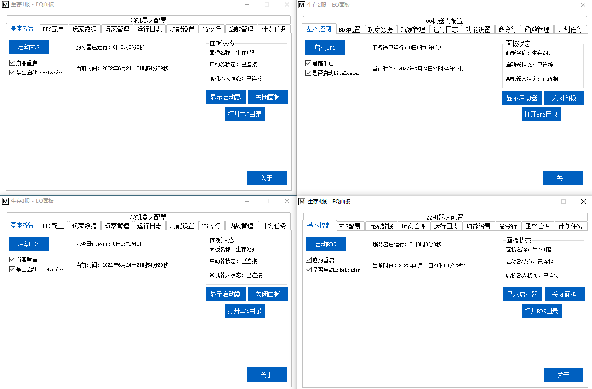
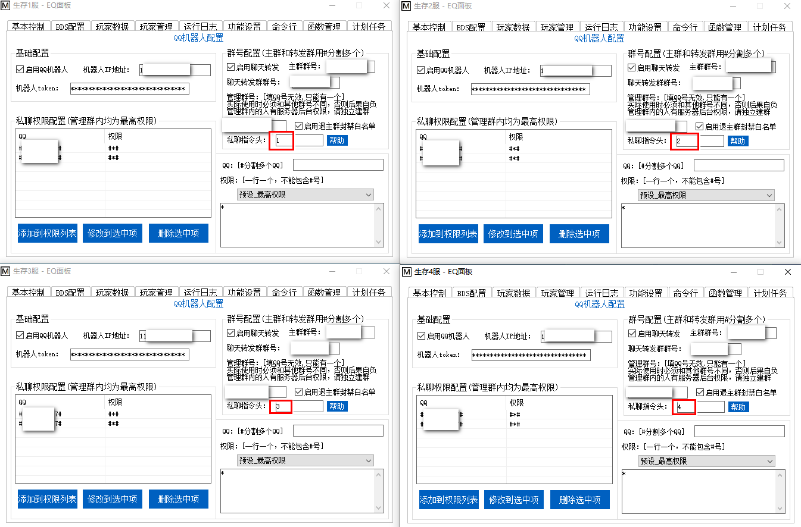

<!-- no toc -->
- [EQ-BDS面板用户手册](./旧版专用EQ面板用户手册.md)
  - [一、面板的安装](./一面板的安装.md)
  - [二、面板的基本结构](./二面板的基本结构.md)
  - [三、面板的基本控制](./三面板的基本控制.md)
  - [四、BDS配置](./四bds配置.md)
  - [五、玩家数据](./五玩家数据.md)
  - [六、玩家管理(查熊篇)](./六玩家管理查熊篇.md)
  - [六、玩家管理(白名单篇)](./六玩家管理白名单篇.md)
  - [七、日志与命令行](./七日志与命令行.md)
  - [八、函数管理(几乎用不上了，时代的眼泪)](./八函数管理几乎用不上了时代的眼泪.md)
  - [九、功能设置](./九功能设置.md)
  - [十、计划任务](./十计划任务.md)
  - [十一、QQ机器人](./十一qq机器人.md)
  - [十二、QQ机器人指令](./十二qq机器人指令.md)
  - [十三、同机器多面板支持](./十三同机器多面板支持.md)
  - [十四、正则命令](./十四正则命令.md)

## 十三、同机器多面板支持

本面板支持在同一台机器上运行多个面板。再次安装面板，每次都取不同的面板名字，然后确保BDS的ipv4及ipv6端口号均不同(如果有相同的，那么会一启动就崩服)，这样子就能在同一台机器上运行多个面板。

如果您启用了QQ机器人，带EQ插件的QQ机器人不能在同一台服务器上运行多个，但是多个面板可以共享一个机器人，只需要设置好私聊指令头，然后管理群设置不同的群。

如图所示，我在同一台机器上开了四个服务器，分别是"生存1服""生存2服""生存3服""生存4服"

我把它们连接到同一台机器人上，分别设置指令头为"1""2""3""4"

那么如果我想私聊给生存1服发查服指令，只需要输入"1#查服"即可，如果在管理群内，仅需正常地发送"#查服"即可

同理，如果我想私聊给生存2服发查服指令，只需要输入"2#查服"即可，因为我的指令头设置的是这个。指令头可以自定义，私聊的"#"前加什么完全取决于您设置的指令头，因此指令头不能重复。

否则会出现给机器人发一个指令，同时下发到多个面板的情况！

## 下一节

[十二、QQ机器人指令](./十二qq机器人指令.md)

## 上一节

[十四、正则命令](./十四正则命令.md)