<!-- no toc -->
- [EQ-BDS面板用户手册](./旧版专用EQ面板用户手册.md)
  - [一、面板的安装](./一面板的安装.md)
  - [二、面板的基本结构](./二面板的基本结构.md)
  - [三、面板的基本控制](./三面板的基本控制.md)
  - [四、BDS配置](./四bds配置.md)
  - [五、玩家数据](./五玩家数据.md)
  - [六、玩家管理(查熊篇)](./六玩家管理查熊篇.md)
  - [六、玩家管理(白名单篇)](./六玩家管理白名单篇.md)
  - [七、日志与命令行](./七日志与命令行.md)
  - [八、函数管理(几乎用不上了，时代的眼泪)](./八函数管理几乎用不上了时代的眼泪.md)
  - [九、功能设置](./九功能设置.md)
  - [十、计划任务](./十计划任务.md)
  - [十一、QQ机器人](./十一qq机器人.md)
  - [十二、QQ机器人指令](./十二qq机器人指令.md)
    - [获得QQ机器人命令帮助](#获得qq机器人命令帮助)
    - [启动服务器](#启动服务器)
    - [关闭服务器](#关闭服务器)
    - [重启服务器](#重启服务器)
    - [获取在线玩家与服务器状态](#获取在线玩家与服务器状态)
    - [获得今日玩家在线排行榜](#获得今日玩家在线排行榜)
    - [获取BDS的配置(server.properties)](#获取bds的配置serverproperties)
    - [修改BDS的配置(server.properties)](#修改bds的配置serverproperties)
    - [查看worlds下的存档列表](#查看worlds下的存档列表)
    - [获取面板的功能设置信息](#获取面板的功能设置信息)
    - [修改面板的功能设置信息](#修改面板的功能设置信息)
    - [备份存档](#备份存档)
    - [获取面板自动备份的文件列表](#获取面板自动备份的文件列表)
    - [自动从面板的备份列表恢复存档](#自动从面板的备份列表恢复存档)
    - [执行BDS控制台的命令](#执行bds控制台的命令)
    - [设置是否转发BDS控制台的信息](#设置是否转发bds控制台的信息)
    - [查找指定时间段的在线玩家](#查找指定时间段的在线玩家)
    - [查找白名单里面是否有指定的玩家](#查找白名单里面是否有指定的玩家)
    - [查找某QQ绑定的白名单](#查找某qq绑定的白名单)
    - [把玩家加入白名单内](#把玩家加入白名单内)
    - [把玩家从白名单中移除](#把玩家从白名单中移除)
    - [删除并禁止某玩家加入白名单](#删除并禁止某玩家加入白名单)
    - [删除并禁止某QQ加入白名单](#删除并禁止某qq加入白名单)
    - [解禁某玩家加入白名单](#解禁某玩家加入白名单)
    - [解禁某QQ加入白名单](#解禁某qq加入白名单)
  - [十三、同机器多面板支持](./十三同机器多面板支持.md)
  - [十四、正则命令](./十四正则命令.md)

## 十二、QQ机器人指令

(添加权限后，私聊发送#?，或者在管理群发送#?也可获取)

命令列表：

### 获得QQ机器人命令帮助

``#?``

获取命令列表,如果您对下面的带参数的命令有疑问,只需要输入命令头即可

比如说您对 #加白名 有疑问,只需要输入"#加白名"就能获得详细的解释


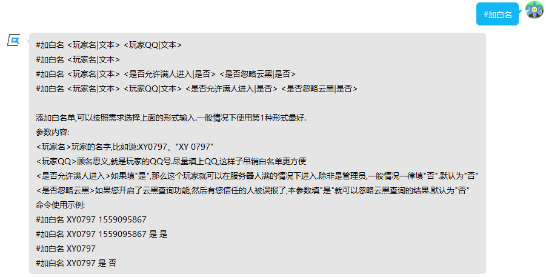

### 启动服务器

``#开服``

输入本命令可以启动BDS

⚠注意：运行日志是发到管理群的，不会发到私聊里面


``#自定义开服 <是否崩服重启|是否> <是否启动LiteLoader|是否>``

自定义开服的参数,会同步修改面板上的选择框状态,本命令仅供特殊情况使用,一般情况下用 #开服 就可以了

参数内容:

><是否崩服重启>顾名思义,填"是""否"

><是否启动LiteLoader>顾名思义,填"是""否".如果没有安装LiteLoader您却填了是,那么会启动原版服.

命令使用示例:

``#自定义开服 是 是``


``#自定义开服 否 是``


``#自定义开服 是 否``


``#自定义开服 否 否``


### 关闭服务器

``#关服``

输入本命令可以关闭BDS


### 重启服务器

``#重启``

输入本命令可以重启BDS(不是重启电脑)


### 获取在线玩家与服务器状态

``#查服``

获取BDS是否启动,如果BDS启动会同时提供运行时间、在线玩家列表

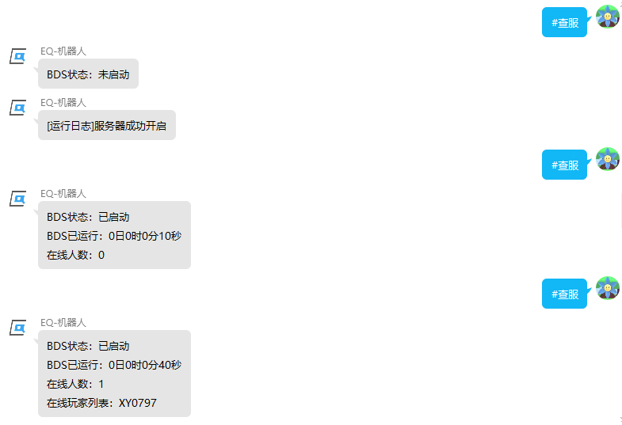


### 获得今日玩家在线排行榜

``#取在线情况[ <页码>]``

获取今日进过服务器的玩家以及在线时长

>参数<页码>不是必须的，省略<页码>即为默认其为1

例如：

``#取在线情况``


``#取在线情况 1``


``#取在线情况 2``


### 获取BDS的配置(server.properties)

``#取BDS配置``

获取BDS的配置(比如说默认游戏模式、ipv4端口)


### 修改BDS的配置(server.properties)

``#改BDS配置 <配置项|文本> <内容|文本>``

修改BDS配置,建议先执行 #取BDS配置 再使用本指令

参数内容:

><配置项>就是 #取BDS配置 获取到的配置名字,比如说"默认游戏模式""游戏难度""欲载入的地图名称"之类的

><内容>就是您想修改成的内容,如果 #取BDS配置 显示的是"开""关",那么这里就必须输入"开""关"

命令使用示例:

``#改BDS配置 BDS玩家上限 20``

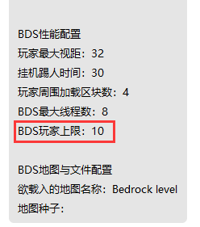


``#改BDS配置 BDS欢迎文本 "欢迎来到xx服 S5"``


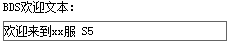

``#改BDS配置 作弊 开``


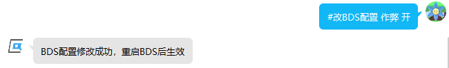

### 查看worlds下的存档列表

``#查看存档列表``

获取worlds目录下的文件夹,方便用 #改BDS配置 修改BDS当前加载的存档


### 获取面板的功能设置信息

``(只能私聊发送)#取功能设置状态``

获取面板的各项设置(比如说整点报时是否开启、备份大小限制)

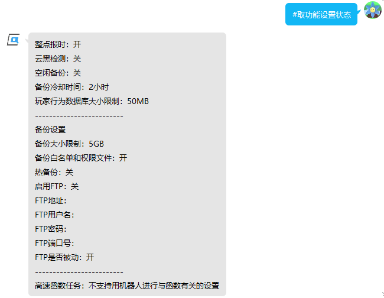

### 修改面板的功能设置信息

``(只能私聊发送)#修改功能设置 <设置项名称|文本> <内容|文本>``

修改面板的各项功能,建议使用前先执行 #取功能设置状态

参数内容:

><设置项名称>#取功能设置状态 获得的设置项名称,比如说:"整点报时""备份大小限制"

><内容>就是您想修改成的内容,如果 #取功能设置状态 显示的是"开""关",那么这里就必须输入"开""关"

命令使用示例:

``#修改功能设置 整点报时 开``


``#修改功能设置 备份大小限制 6``


``#修改功能设置 FTP地址 "192.168.0.3"``


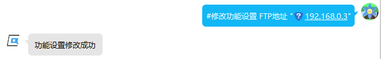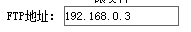

### 备份存档

``#备份``

执行关服备份


### 获取面板自动备份的文件列表

``#查看备份列表``

查看备份文件夹下的zip文件，方便使用 #回档 指令


### 自动从面板的备份列表恢复存档

``#回档 <备份名称|文本> <是否保留当前存档|是否>``

从备份列表里面恢复服务器以前的存档,请先使用 #查看备份列表 命令获取存档文件的名称

存档文件必须是压缩包，压缩包内必须是一个和地图名称一致的文件夹，有且只能有这一个文件夹

存档文件不符合要求会造成不可估计的后果！建议使用服务器自动备份的文件

参数内容:

><备份名称>备份文件名,#查看备份列表 命令显示的存档文件名

><是否保留当前存档>如果填"是",那么就会先执行一次压缩备份再删除存档文件夹,否则直接删除存档文件夹开始回档

命令使用示例:

``#回档 2022年7月5日14时43分5秒.zip 是``


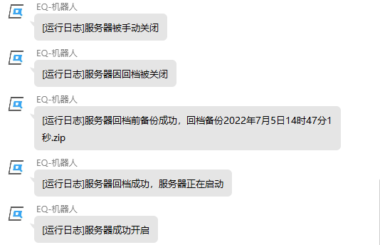

``#回档 "奇奇怪怪的 手动创建的 存档备份.zip" 否``


### 执行BDS控制台的命令

``%<BDS命令>``

执行BDS指令，相当于在服务器后台输入指令，只不过需要%作为前缀


### 设置是否转发BDS控制台的信息

``#输出流 <是否订阅|是否>``

如果订阅了输出流,每当BDS后台有信息都发到管理群.就是把下面这种信息发到管理群:
```
00:05:13 INFO [Server] Player connected: playername, xuid: 22332232233223223
00:06:25 INFO [Server] Player disconnected: playername, xuid: 22332232233223223
```
参数内容:

><是否订阅>就是您想把输出流状态设置成的状态,如果您想启用,就填"是".如果您想关闭,就填"否"

命令使用示例:

``#输出流 是``

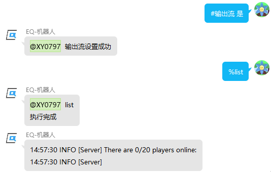

``#输出流 否``


### 查找指定时间段的在线玩家

``#分析在线玩家 <日期|文本> <时间开始|文本> <时间结束|文本>``

快速锁定事发时间段在线的玩家,比如说有玩家报告自己东西被偷了,就可以通过本命令调出他不在线时间有哪些玩家在服务器里面

本命令只能查询一天内的.如果要跨天,请多次调用本命令,每一天0时0分0秒到23时59分59秒,依次查清每一天的人然后人工合并即可

参数内容:

><日期>要查询的日期,比如说"2022年6月18日""2022年6月19日"

><时间开始>当天的开始时间,比如说您要查清当天``13时12分1秒-21时0分0秒``有哪些人,这里填``13时12分1秒``即可\
\
⚠注意:时间必须以这种固定方式写入,``时 分 秒``一个都不能少\
\
一天的开始是``0时0分0秒``,一天的结束是``23时59分59秒``\
不支持12小时制,请用24小时制表示时间

><时间结束>当天的结束时间,如果是查``13时12分1秒-21时0分0秒``有哪些人,这里填``21时0分0秒``即可.

命令使用示例:

假设您的玩家在2022年6月18日报告自己在上午9点下的线,下午3点21分上线就发现东西被偷了

您就可以输入：``#分析在线玩家 2022年6月18日 9时0分0秒 15时21分0秒``

这样子就能初步排查哪些玩家是嫌疑人,后面可以结合事发地的坐标使用本面板提供的查熊功能精确锁定到底是谁偷的东西


### 查找白名单里面是否有指定的玩家

``#查白名 <玩家名|文本>``

找指定的玩家在不在白名单里面，返回所有的结果

参数内容:

><玩家名>就是玩家的名字,比如说:XY0797、"XY 0797"

命令使用示例:

``#查白名 XY0797``


``#查白名 "XY 0797"``


### 查找某QQ绑定的白名单

``#QQ查白名 <QQ号|文本>``

找指定的QQ在白名单里面有哪些玩家，返回所有的结果

参数内容:

><QQ号>顾名思义,就是玩家的QQ号

命令使用示例:

``#QQ查白名 1559095867``

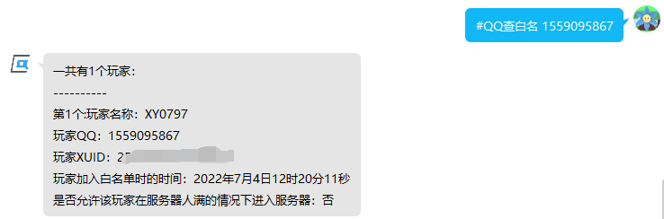

``#QQ查白名 22332233``


### 把玩家加入白名单内

```
#加白名 <玩家名|文本> <玩家QQ|文本>
#加白名 <玩家名|文本>
#加白名 <玩家名|文本> <是否允许满人进入|是否> <是否忽略云黑|是否>
#加白名 <玩家名|文本> <玩家QQ|文本> <是否允许满人进入|是否> <是否忽略云黑|是否>
```

添加白名单,可以按照需求选择上面的形式输入.一般情况下使用第1种形式最好.

参数内容:

><玩家名>玩家的名字,比如说:XY0797、"XY 0797"

><玩家QQ>顾名思义,就是玩家的QQ号.尽量填上QQ,这样子吊销白名单更方便

><是否允许满人进入>如果填"是",那么这个玩家就可以在服务器人满的情况下进入.除非是管理员,一般情况一律填"否".\
默认为"否"

><是否忽略云黑>如果您开启了云黑查询功能,然后有您信任的人被误报了,本参数填"是"就可以忽略云黑查询的结果.\
默认为"否"

命令使用示例:

``#加白名 XY0797 1559095867``


``#加白名 XY0797 1420379105 是 是``


``#加白名 XY0797``


``#加白名 XY0797 是 否``


### 把玩家从白名单中移除

``#删白名 <玩家名|文本>``

删除一个玩家的白名单.比如说不小心加错了.如果遇到熊孩子,请使用``#封QQ``或``#封号``

参数内容:

><玩家名>玩家的名字,比如说:XY0797、"XY 0797"

命令使用示例:

``#删白名 XY0797``


``#删白名 "XY 0797"``


### 删除并禁止某玩家加入白名单

```
#封号 <玩家名|文本>
#封号 <玩家名|文本> <理由|文本>
```

把指定玩家名字的玩家封禁掉,同时以后加白名会拒绝被封禁的玩家加入.个人建议用``#封QQ``,彻底封杀这个人QQ下的所有白名单

如果您加入了云黑项目,您需要手动提交证据材料,本面板不会把您封禁的玩家发给云黑团队

参数内容:

><玩家名>玩家的名字,比如说:XY0797、"XY 0797"

><理由>封禁的理由,建议用双引号括起来

命令使用示例:

``#封号 XY0797``


``#封号 "XY 0797" "熊服、偷东西 同时还炸服"``


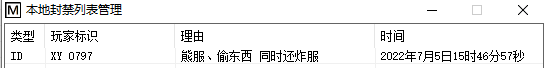


### 删除并禁止某QQ加入白名单

```
#封QQ <QQ号|文本>
#封QQ <QQ号|文本> <理由|文本>
```

彻底封杀这个人QQ下的所有白名单,同时以后加白名如果附上了QQ号就会拒绝被封禁的玩家加入

如果您加入了云黑项目,您需要手动提交证据材料,本面板不会把您封禁的玩家发给云黑团队

参数内容:

><QQ号>顾名思义,就是玩家的QQ号

><理由>封禁的理由,建议用双引号括起来

命令使用示例:

``#封QQ 1559095867``


``#封QQ 1559095867 "熊服、偷东西 同时还炸服"``


### 解禁某玩家加入白名单

``#解封 <玩家名|文本>``

把被封禁的玩家名解封.如果提示未找到可以试试 #解封QQ

参数内容:

><玩家名>玩家的名字,比如说:XY0797、"XY 0797"

命令使用示例:

``#解封 XY0797``


``#解封 "XY 0797"``


### 解禁某QQ加入白名单

``#解封QQ <QQ号|文本>``

把被封禁的QQ解封.如果提示未找到可以试试 #解封

参数内容:

><QQ号>顾名思义,就是玩家的QQ号

命令使用示例:

``#解封QQ 1559095867``


## 下一节

[十三、同机器多面板支持](./十三同机器多面板支持.md)

## 上一节

[十一、QQ机器人](./十一qq机器人.md)