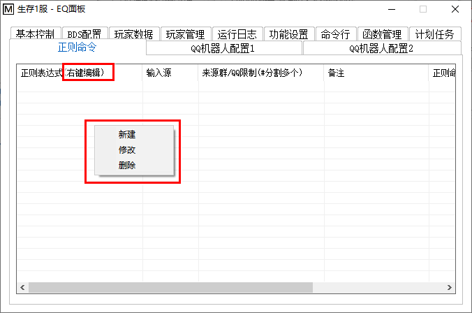

<!-- no toc -->
- [EQ-BDS面板用户手册](./旧版专用EQ面板用户手册.md)
  - [一、面板的安装](./一面板的安装.md)
  - [二、面板的基本结构](./二面板的基本结构.md)
  - [三、面板的基本控制](./三面板的基本控制.md)
  - [四、BDS配置](./四bds配置.md)
  - [五、玩家数据](./五玩家数据.md)
  - [六、玩家管理(查熊篇)](./六玩家管理查熊篇.md)
  - [六、玩家管理(白名单篇)](./六玩家管理白名单篇.md)
  - [七、日志与命令行](./七日志与命令行.md)
  - [八、函数管理(几乎用不上了，时代的眼泪)](./八函数管理几乎用不上了时代的眼泪.md)
  - [九、功能设置](./九功能设置.md)
  - [十、计划任务](./十计划任务.md)
  - [十一、QQ机器人](./十一qq机器人.md)
  - [十二、QQ机器人指令](./十二qq机器人指令.md)
  - [十三、同机器多面板支持](./十三同机器多面板支持.md)
  - [十四、正则命令](./十四正则命令.md)
    - [1.在BDS命令行中执行命令](#1在bds命令行中执行命令)
    - [2.发送私聊消息](#2发送私聊消息)
    - [3.发送群聊消息](#3发送群聊消息)
    - [4.作为QQ机器人指令执行](#4作为qq机器人指令执行)
    - [5.执行远程正则命令](#5执行远程正则命令)
    - [6.执行js命令](#6执行js命令)
      - [调试输出](#调试输出)
      - [获取日期](#获取日期)
      - [eq类](#eq类)
        - [输出文本到控制台](#输出文本到控制台)
        - [发送QQ私聊消息](#发送qq私聊消息)
        - [发送QQ群聊消息](#发送qq群聊消息)
        - [获取操作系统名称](#获取操作系统名称)
        - [获取CPU占用率](#获取cpu占用率)
        - [获取内存占用率](#获取内存占用率)
        - [获取总内存大小](#获取总内存大小)
        - [获取已经使用的内存大小](#获取已经使用的内存大小)
        - [获取CPU名称](#获取cpu名称)
        - [获取BDS启动状态](#获取bds启动状态)
        - [获取当前加载的地图名称](#获取当前加载的地图名称)
        - [获取BDS配置项(server.properties内容)](#获取bds配置项serverproperties内容)
        - [执行BDS控制台命令](#执行bds控制台命令)
        - [执行QQ机器人命令](#执行qq机器人命令)

## 十四、正则命令



本功能为高级用户提供，其具体内容是：

您指定一个文本输入源(一共4种：禁用\|命令行\|QQ群消息\|QQ私聊消息)，并且提供正则表达式，如果匹配成功，那么将会执行您输入的正则命令。

如果正则匹配到多个结果，面板会根据"是否允许多次匹配"的设置，只对第一个匹配项执行正则命令，或者对每一个匹配项执行正则命令(默认为否，即只对第一个匹配项执行正则命令)。

正则命令遵循一定的语法，并且正则命令里面可以用``$<子匹配项索引>``引用子匹配项

也就是"()"里面的子表达式匹配到的内容

例如``$1``、``$2``分别表示第一个子匹配项和第二个子匹配项。

EQ面板的正则命令大体上遵循Serein(https://zaitonn.github.io/Serein/Command.html)的命令制式

**但是有一些增加、删除、修改**
，下面是EQ正则命令相比Serein正则命令的变化：

1. 删除了调用cmd.exe的支持，为了安全性，此高危功能不提供支持

2. 支持执行EQ面板特有的自动备份命令

3. 支持把匹配到的文本当做QQ机器人的指令执行

4. ***不支持*** Serein的环境变量(%\<变量名\>%)，所有的环境变量均可使用js脚本实现

5. 提供了js脚本执行支持，并且提供了与面板对接的API

6. 部分正则命令(实际上只有一个)提供"\$0"来代替Serein的环境变量(%\<变量名\>%)

7. 支持对"QQ群消息/QQ私聊消息"的来源限定，也就是说，您可以让面板只对某个群内(某个QQ号发送)的信息做正则匹配，大大扩展了正则命令的用途

所有命令格式为``<命令名称>|<执行内容>``或``<命令名称>:<参数>|<执行内容>``

建议先在``正则表达式测试.exe``里面进行测试，确定能匹配后再输入到面板里面

这个测试器就在面板目录里面，双击运行即可

⚠注意：

>命令的前半部分不区分大小写

>禁止输入的字符(会干扰面板保存正则命令)： （\t，即Tab键打出来的制表符)

>``|``为竖线（分隔线）（U+007C，不是中文的``丨``gǔn）

>``<>``表示参数，您实际输命令时不需要输入``<>``

关键字(这些字符有特殊含义)：``$``

跨行匹配：支持list指令的跨行匹配，值得注意的是：**换行符是``\r\n``，而不是单独的一个``\n``**，请务必使用``\r\n``去匹配

并且，匹配list的主要用途是查服，面板已经集成该功能，设置主群后，任何人都能在主群使用``#查服``命令获得服务器状态+在线玩家（您也可以自定义查服命令，面板允许您修改查服命令）

### 1.在BDS命令行中执行命令

``s|<命令>``

``server|<命令>``

在BDS命令行中执行命令

>⚠注意：\
1.若BDS未启动则不执行\
2.新增服务器内置指令：start 启动服务器(服务器未启动时才会执行)\
save 启动面板的自动备份(任意时刻均能执行)

示例：

``s|say 测试``

``s|save``

更多语法：

``s:u|<命令>``

``server:u|<命令>``

``s:unicode|<命令>``

``server:unicode|<命令>``

本命令的该语法专为聊天转发设计，会将命令中的非ASCII的字符转换为Unicode字符转义的UTF8文本(也就是usc2,例如\u0000)的输出(适用于tellraw等使用json文本的命令)，然后再执行命令

>⚠注意：\
1.若BDS未启动则不执行\
2.如果来源是群消息，那么特别提供“$0”匹配项，这里提供的$0并不是来源于正则表达式，而是代表来源QQ的昵称\
(如果有群昵称则提供群昵称，同时提供的昵称会自动去除非法字符：§k、实体选择器、CQ码)\
3.如果来源是群消息，会自动去除来源文本中的非法字符：§k、实体选择器、CQ码

示例：

QQ群输入源，填写群号限制123456#654321，正则表达式：``\.(.+?)$``

``s:u|tellraw @a {"rawtext":[{"text":"[§6聊天群§r]<$0§r> $1"}]}``

这条正则命令将把QQ群123456和QQ群654321中以“.”开头的群聊信息的第一行转义并且加上群成员名称一并发送给游戏内的玩家，您可以把该示例作为聊天转发的模板。

### 2.发送私聊消息

``p|<消息>``

``private|<消息>``

发送一条消息给触发此命令的用户

>⚠注意：\
1.以上两项只能由正则匹配到私聊或群聊消息时触发，发送对象为触发这项正则的用户\
2.若触发对象不是机器人好友或账号不存在，则可能无法发送\
3.若未连接QQ机器人则不处理

更多语法：

``p:<QQ号>|<消息>``

``private:<QQ号>|<消息>``

发送一条消息给指定用户，支持用#分割多个QQ号以同时发送给多个用户

>注意：\
1.若触发对象不是机器人好友或账号不存在，则可能无法发送\
2.若未连接QQ机器人则不处理\
3.别往参数里输入群号

示例：

命令行输入源，正则表达式：``Player connected:\s(.+?), xuid:\s(.+?)$``

``p:123456789#987654321|[服务器]玩家$1进入了服务器``

这条正则命令将在玩家进服时发送示例信息给123456789和987654321两个QQ

### 3.发送群聊消息

``g|<消息>``

``group|<消息>``

>⚠注意：\
1.当输入源是群聊消息时，发送对象为触发这条消息的群聊\
2.当输入源是私聊消息时，不发送消息，请用下面的扩展语法指定发送群号\
3.其他情况下，发送至管理群的第一项，若管理群为空则不发送\
4.若机器人未入群或被禁言则发送失败\
5.若未连接QQ机器人则不发送

更多语法：

``g:<QQ群号>|<消息>``

``group:<QQ群号>|<消息>``

发送一条消息给指定群聊，对输入源没有限制，支持用#分割多个群号以同时发送给多个QQ群

>⚠注意：\
1.若机器人未入群或被禁言则发送失败\
2.若未连接QQ机器人则不发送\
3.输入QQ号无效，必须是QQ群号

``gs:<QQ群号>|<消息>``

``groupsafe:<QQ群号>|<消息>``

本命令的该语法专为聊天转发设计，发送一条消息给指定群聊，本命令也支持用#分割多个群号以同时发送给多个QQ群。

与``g:<QQ群号>|<消息>``不同的是，该命令会自动去除消息中的非法字符：§k、实体选择器、CQ码。

>⚠注意：\
1.若机器人未入群或被禁言则发送失败\
2.若未连接QQ机器人则不发送\
3.输入QQ号无效，必须是QQ群号

示例：

控制台输入源，正则表达式：``\[Chat]\s<(.+?)>\s(.+?)$``

``gs:123456789#11121314|[生存1服]<$1>$2``

这条正则命令会匹配LL输出的聊天信息并且发送到QQ群123456和11121314，您可以把该示例作为聊天转发的模板。

如果您安装了PTitle，正则表达式换成``\[ChatCH]\s<(.+?)>\s(.+?)$``即可。

### 4.作为QQ机器人指令执行

``q|<QQ机器人命令>``

``qqcmd|<QQ机器人命令>``

把``<QQ机器人命令>``将当做拥有最高权限、处于私聊状态下发送的QQ机器人指令执行，因此可以执行例如“#加白名”一类的指令。返回值(包括报错)将发送给来源方(来自QQ群/私聊消息就发送回去)，即使未连接QQ机器人也能执行该命令。

>⚠注意：\
1.当来源是命令行时，没有返回值\
2.本命令将以最高权限运行指令，无法做到精确的权限控制\
3.如果来源是QQ群消息，那么会把``<QQ机器人命令>``将当做拥有最高权限、处于群聊状态下发送的QQ机器人指令执行\
4.⚠不要直接解析游戏内消息来执行QQ机器人命令⚠，请使用聊天解析加本机rc来带权限执行(第5节有例子)，否则非常容易被普通玩家伪造身份！\
5.``<QQ机器人命令>``不需要加上私聊指令头，直接#<命令>或%<命令>即可，如：``#查服，%kill @e[type=item]``

示例：

QQ群输入源，填写群号限制123456#654321，正则表达式：``查服$``

``q|#查服``

这样子QQ群123456和QQ群654321中的任何人只需要说包含“查服”的消息，就能获得“#查服”命令的执行结果，而且不会检查其权限。

这里只是举一个例子，我们不建议这么做，因为面板有主群查服的相关设置，您可以直接自定义不检查权限的查服指令。

更多语法：

``q:<QQ号>|<QQ机器人命令>``

``qqcmd:<QQ号>|<QQ机器人命令>``

把``<QQ机器人命令>``将当做拥有指定``<QQ号>``对应的私聊权限、处于私聊状态下发送的QQ机器人指令执行，因此可以执行例如“#加白名”一类的指令(前提是有对应权限)。返回值(包括报错)将发送给来源方(来自QQ群/私聊消息就发送回去)，未连接QQ机器人就不能执行该命令(因为没有有效的来源)。

>⚠注意：\
1.当来源是命令行时，没有返回值\
2.如果来源是QQ群消息，那么会把``<QQ机器人命令>``将当做拥有指定``<QQ号>``对应的私聊权限、处于群聊状态下发送的QQ机器人指令执行\
3.不支持用#分割多个QQ号\
4.QQ号不一定得真实存在，只要它在权限列表内即可\
5.不要直接解析游戏内消息来执行QQ机器人命令，请使用聊天解析加本机rc来带权限执行(***第5节有例子***)，否则非常容易被普通玩家伪造身份！\
6.``<QQ机器人命令>``不需要加上私聊指令头，直接#<命令>或%<命令>即可，如：``#查服``，``%kill @e[type=item]``

更多语法：

``q|Ex<QQ机器人命令>``

``qqcmd|Ex<QQ机器人命令>``

``q:<QQ号>|Ex<QQ机器人命令>``

``qqcmd:<QQ号>Ex|<QQ机器人命令>``

如果来源是命令行，执行结果将以类型聊天转发的显示发送到游戏内，其他的含义、效果与上面的完全相同

>⚠注意：\
1.“Ex”对大小写有要求，必须是严格的大写E小写x\
2.“Ex”位置必须在竖线右边，不能位于其他地方\
3.其他的注意事项和不带Ex的版本相同\
4.不要直接解析游戏内消息来执行QQ机器人命令，请使用聊天解析加本机rc来带权限执行(第5节有例子)，否则非常容易被普通玩家伪造身份！

### 5.执行远程正则命令

``rc:<面板名称>|<要执行的正则命令>``

``remotecmd:<面板名称>|<要执行的正则命令>``

本命令将会把右侧的命令进行子匹配处理后发送到其他面板上，并且尽可能模拟各方面的输入状态，就像是对应面板有这么一个正则命令一样

>⚠注意：\
1.若未连接QQ机器人则不执行\
2.指定的远程面板要处于运行状态并且连接到同一个QQ机器人\
3.面板支持多级嵌套本命令，但是需要注意时间和带宽消耗\
4.您可以面板名称填本机，这样子就能实现更复杂的参数填写，满足您的需求。填本机的情况下不需要连接QQ机器人就能执行\
5.如果该命令有执行结果要返回到默认管理群，这个默认管理群是参数里面指定的面板上的，而不是当前面板上

示例：

(假如执行本命令的面板名称为“生存1服”)

控制台输入源，正则表达式：``\[Chat]\s<(.+?)>\s(.+?)$``

``rc:生存2服|s:u|tellraw @a {"rawtext":[{"text":"[§6生存1服§r]<$1§r> $2"}]}``

这条正则命令能将本服的聊天信息转发到生存2服从而实现跨服聊天

控制台输入源，正则表达式：``\[Chat]\s<(.+?)>\s#(.+?)$``

``rc:生存1服|q:$1|Ex#$2``

这条正则命令可以在把指定玩家名当成QQ号赋予私聊权限后，将其在游戏内说的QQ机器人指令以其所拥有的权限解析并执行，返回值发回游戏内

### 6.执行js命令

``js|<js脚本>``

本命令将在匹配后运行js脚本

建议事先使用``mujs调试器.exe``进行调试，确认能运行后再输入到面板里面

这个调试器就在面板目录下，直接双击打开

>⚠注意：\
1.js引擎支持的语法为ES5。\
2.setInterval()setTimeout()等Window对象下的语句均不支持(因为需要尽快执行完脚本)。\
3.为了避免死循环，尽量避免使用while循环，如要使用，务必加上计数变量并且在循环的开头加上计数break的判断！\
4.正则匹配到的文本将保存在全局文本变量regularTxt里面，正则匹配到的子匹配项保存在一个全局数组regularTxtList里面。\
5.换行符是``\r\n``\
6.js引擎为严格模式，每一个命令后面需要加分号，请不要使用隐式变量声明等操作，if等代码块无论多短都必须使用{}括起来。\
7.js引擎天然阻止混淆后的代码运行，请不要混淆你的js代码。

下面是详细的API和接口：

#### 调试输出

``console.log``、``eq.log``，这两个命令都能将文本输出到命令行

``eq.log("hello world!");``

>⚠注意：\
输出的信息会被当成由BDS产生的信息处理，并且会被正则匹配！\
一定要注意，⚠不要形成死循环！！！

#### 获取日期

见下面的示例程序
```
var t=new Date();
eq.log("日期:"+t.toLocaleDateString());
eq.log("年:"+t.getFullYear());
eq.log("月:"+t.getMonth());
eq.log("日:"+t.getDate());
eq.log("时间:"+t.toLocaleTimeString());
eq.log("星期:"+t.getDay());
eq.log("小时:"+t.getHours());
eq.log("分钟:"+t.getMinutes());
eq.log("秒:"+t.getSeconds());
eq.log("毫秒:"+t.getMilliseconds());
eq.log("13位时间戳:"+t.getTime());
```
输出结果：
```
日期:2022-07-19
年:2022
月:6
日:19
时间:12:05:03.498+08:00
星期:2
小时:12
分钟:5
秒:3
毫秒:498
13位时间戳:1658203503498
```

#### eq类

##### 输出文本到控制台

``eq.log(text);``

+ 参数：
  + text: ``String``

    待输出的文本

+ 返回值：无

+ 返回值类型：``Null``

##### 发送QQ私聊消息

``eq.sendQQP(qqnumber,text);``

+ 参数：
  + qqnumber: String

    发送目标的QQ号文本
  + text: String
    需要发送的文本

+ 返回值：无

+ 返回值类型：``Null``

##### 发送QQ群聊消息

``eq.sendQQG(groupnumber,text,atQQnumber);``

+ 参数：
  + groupnumber: ``String``

    发送目标的QQ群号文本
  + text: ``String``

    需要发送的文本
  + atQQnumber: ``String``

    需要@群成员的QQ号文本，填"0"或不填表示不@，填"-1"@全体成员(需要是群管理员才能@全体成员)

+ 返回值：无

+ 返回值类型：``Null``

##### 获取操作系统名称

``eq.getOS();``

+ 参数：无

+ 返回值：返回操作系统名称，如：``Microsoft Windows 10 专业版``

+ 返回值类型：``String``

##### 获取CPU占用率

``eq.getCPUUsage();``

+ 参数：无

+ 返回值：返回CPU占用率，精确到两位小数的百分比，如：``28``

+ 返回值类型：``Integer``

##### 获取内存占用率

``eq.getMemoryUsage();``

+ 参数：无

+ 返回值：返回内存占用率，整数百分比，如：``60.66``

+ 返回值类型：``Float``

##### 获取总内存大小

``eq.getTotalRAM();``

+ 参数：无

+ 返回值：返回总内存大小，单位**KB**，如：``8320280``

+ 返回值类型：``Integer``

##### 获取已经使用的内存大小

``eq.getUsedRAM();``

+ 参数：无

+ 返回值：返回已经使用的内存大小，单位**KB**，如：``5156176``

+ 返回值类型：``Integer``

##### 获取CPU名称

``eq.getCPUName();``

+ 参数：无

+ 返回值：返回CPU的名称信息，如：``Intel(R) Core(TM) i5-9400F CPU @ 2.90GHz``

+ 返回值类型：``String``

##### 获取BDS启动状态

``eq.getStatus();``

+ 参数：无

+ 返回值：返回BDS启动状态的文本，只有两种值：``已启动/未启动``

+ 返回值类型：``String``

##### 获取当前加载的地图名称

``eq.getLevelName();``

+ 参数：无

+ 返回值：返回当前加载的地图名称文本，如：``Bedrock level``

+ 返回值类型：``String``

##### 获取BDS配置项(server.properties内容)

``eq.getBDSconfig(configName);``

+ 参数：
  + configName: ``String``

    server.properties文件配置项等号左边的部分，如：``server-name``、``allow-list``、``difficulty``

    

+ 返回值：返回对应配置项的内容文本，如：``Dedicated Server``、``true``、``10``。失败返回``null``

+ 返回值类型：``String/null``

##### 执行BDS控制台命令

相当于你在BDS的控制台输入指令

``eq.runcmd(cmd);``

+ 参数：

  + cmd: ``String``

    想要执行的控制台命令

+ 返回值：无

+ 返回值类型：``null``

##### 执行QQ机器人命令

``eq.runQQcmd(cmd);``

+ 参数：

  + cmd: ``String``

    想要执行的QQ机器人命令,以最高权限运行

+ 返回值：返回QQ机器人命令的执行结果文本，就像私聊QQ机器人执行命令一样

+ 返回值类型：``String``

## 下一节

[目录](./旧版专用EQ面板用户手册.md)

## 上一节

[十三、同机器多面板支持](./十三同机器多面板支持.md)