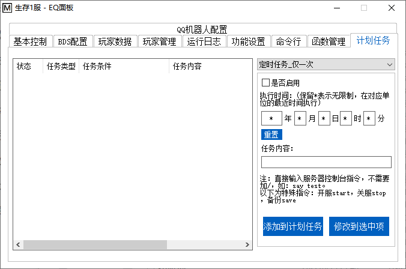
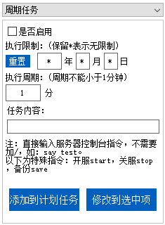

<!-- no toc -->
- [EQ-BDS面板用户手册](./旧版专用EQ面板用户手册.md)
  - [一、面板的安装](./一面板的安装.md)
  - [二、面板的基本结构](./二面板的基本结构.md)
  - [三、面板的基本控制](./三面板的基本控制.md)
  - [四、BDS配置](./四bds配置.md)
  - [五、玩家数据](./五玩家数据.md)
  - [六、玩家管理(查熊篇)](./六玩家管理查熊篇.md)
  - [六、玩家管理(白名单篇)](./六玩家管理白名单篇.md)
  - [七、日志与命令行](./七日志与命令行.md)
  - [八、函数管理(几乎用不上了，时代的眼泪)](./八函数管理几乎用不上了时代的眼泪.md)
  - [九、功能设置](./九功能设置.md)
  - [十、计划任务](./十计划任务.md)
    - [1.定时任务\_仅一次](#1定时任务_仅一次)
    - [2.定时任务\_循环](#2定时任务_循环)
    - [3.周期任务](#3周期任务)
  - [十一、QQ机器人](./十一qq机器人.md)
  - [十二、QQ机器人指令](./十二qq机器人指令.md)
  - [十三、同机器多面板支持](./十三同机器多面板支持.md)
  - [十四、正则命令](./十四正则命令.md)

## 十、计划任务

计划任务可以让面板定时为您执行指令，下面讲解计划任务的三个种类及选择器的用法：

### 1.定时任务_仅一次

**这种计划任务定时执行，且执行完一次后自动删除。**

2022年表示限制在2022年执行，*年表示年份不限

6月表示限制在6月份执行，*月表示月份不限

其他依次类推，当"年月日时分秒"的条件均满足时，计划任务就会被执行

### 2.定时任务_循环

**这种计划任务大体与"定时任务_仅一次"一样，但是执行完一次后不会删除，能反复执行。**

执行周期和执行时间的填写方法与"定时任务_仅一次"中的一样

当"年月日时分秒"的条件均满足时，计划任务就会被执行

### 3.周期任务

**当时间满足时，按一定周期执行计划任务**

执行限制部分的填写方法与"定时任务_仅一次"中的一样，当"年月日"的条件均满足时才会按周期执行

周期就是执行计划任务的间隔，按照需要选择。

比如说：执行限制保持\*年\*月\*日不变，执行周期填60，任务内容填save，那么面板就会每隔1小时自动备份一次(推荐在"功能设置"里面开启)

## 下一节

[十一、QQ机器人](./十一qq机器人.md)

## 上一节

[九、功能设置](./九功能设置.md)