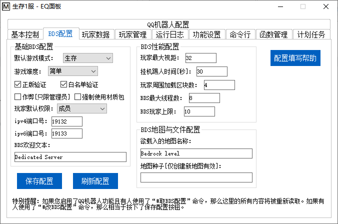

<!-- no toc -->
- [EQ-BDS面板用户手册](./旧版专用EQ面板用户手册.md)
  - [一、面板的安装](./一面板的安装.md)
  - [二、面板的基本结构](./二面板的基本结构.md)
  - [三、面板的基本控制](./三面板的基本控制.md)
  - [四、BDS配置](./四bds配置.md)
    - [1.基础BDS配置](#1基础bds配置)
    - [2.BDS性能配置](#2bds性能配置)
    - [3.BDS地图与文件配置](#3bds地图与文件配置)
  - [五、玩家数据](./五玩家数据.md)
  - [六、玩家管理(查熊篇)](./六玩家管理查熊篇.md)
  - [六、玩家管理(白名单篇)](./六玩家管理白名单篇.md)
  - [七、日志与命令行](./七日志与命令行.md)
  - [八、函数管理(几乎用不上了，时代的眼泪)](./八函数管理几乎用不上了时代的眼泪.md)
  - [九、功能设置](./九功能设置.md)
  - [十、计划任务](./十计划任务.md)
  - [十一、QQ机器人](./十一qq机器人.md)
  - [十二、QQ机器人指令](./十二qq机器人指令.md)
  - [十三、同机器多面板支持](./十三同机器多面板支持.md)
  - [十四、正则命令](./十四正则命令.md)

## 四、BDS配置

本界面可以修改BDS的配置文件"server.properties"

### 1.基础BDS配置

**默认生存模式：**
这个是玩家一进入服务器的游戏模式，除非您有特殊需求，一般设置为生存即可。

**游戏难度：**
顾名思义，游戏存档的难度，如果您不了解建议自行上网查询和平、简单、普通、困难的区别，生存服建议设置困难。

**正版验证：**
实际上这玩意开不开都要验证Xbox账号，如果关闭了可能会引发一系列问题，所以说保持它开启。

**白名单验证：**
尽量开启它，不然的话任何人都能进服务器。为了管理玩家、封杀熊孩子，务必开启它。

本面板也设计了大量白名单管理的功能，可以让您的管理更加高效、自动化。

建议和功能设置界面中的同时开启，这样子就可以在加白名单的时候由面板自动判断它是否在云黑数据库里面

(云黑简介：云黑是一个完全免费的联合封禁项目，联合了大量服务器共享熊孩子信息，并且有专人审核，可以在一定程度上预防您遇到熊孩子。云黑官方网站：https://blackbe.xyz/)

**作弊：**
按需求开启，这个选项会影响能否获得成就，一般情况都不会开启(不开启后台依然可以执行指令)

**强制使用材质包：**
您可以百度查询如何为服务器添加材质包，或者进群讨论。如果开启这一项，那么在服务器有材质包的情况下，就会强制玩家下载材质包而不是询问是否加载材质包。

**玩家默认权限：**
玩家一进服务器的权限，除非您有特殊需求，否则请确保这一项是\"成员\"

**ipv4端口号：**
决定了BDS的端口号，默认为19132，一般不用修改。

**ipv6端口号：**
现在都是ipv4，用不上，一般不用修改。

如果您同一台主机上有多个BDS服务器，请务必确保它们的ipv4端口号和ipv6端口号用的都是不同的，否则会互相冲突开服失败。

**BDS欢迎文本：**
就是在玩家的服务器列表里面看到的服务器名称下面的小字，您可以自定义一个，比如说：§6XY生存1服迎您

### 2.BDS性能配置

**玩家最大视距：**
默认即可，不要修改，除非您真的对您的服务器CPU性能非常有信心。

**挂机踢人时间\[秒\]：**
BDS检测到玩家在挂机后踢人的等待时间，一般默认即可。

**玩家周围加载区块数：**
默认即可，不要修改，除非您真的对您的服务器CPU性能非常有信心。

**BDS最大线程数：**
一般情况不要改，除非您的CPU足够强劲且BDS已经开始卡顿，不然不要增大\
如果真的要增大，一般设置成核心数量X2+2。

**BDS玩家上限：**
这个决定了您的服务器最多允许多少玩家同时在线，一般情况保持默认。如果人太多并且您的服务器性能充足，可以适当增大.

### 3.BDS地图与文件配置

**欲载入的地图名称：**
本选项决定了服务器加载BDS的worlds目录下的哪个地图文件夹，如果地图不存在，就会开新存档。如果您要移植您的地图，在启动BDS前务必设置好这一项。

**地图种子：**
如果您在欲载入的地图名称中填了个不存在的地图名称，那么BDS将根据这里填写的种子生成地图。

## 下一节

[五、玩家数据](./五玩家数据.md)

## 上一节

[三、面板的基本控制](./三面板的基本控制.md)